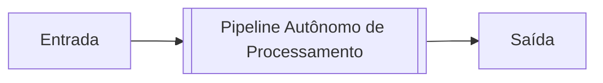
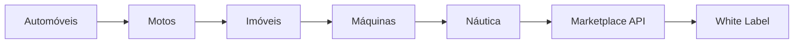

# Documento 000 — Project Charter

**Status:** Aprovado e Congelado (Constituição do Projeto)
**Última Atualização:** 21 de Julho de 2026
**Versão:** 1.0.0 (Final)
**Responsável:** Engenharia de Produto (AutoMedia AI)
**Resumo:** Constituição oficial do projeto estabelecendo as diretrizes fundamentais, a visão da plataforma e o problema real a ser resolvido, sem acoplamento de especificações técnicas profundas.

---

## 1. Introdução
Este **Project Charter** atua como a constituição inegociável do projeto **AutoMedia AI**. Ele define a alma do produto, o problema real que estamos resolvendo e os princípios universais que guiarão nosso desenvolvimento. 

> [!NOTE]
> Detalhes específicos de arquitetura de software, infraestrutura e modelos de Inteligência Artificial propositalmente não pertencem a este documento; eles serão explorados em documentos subsequentes (ex: *007 AI Architecture* e *008 System Architecture*). O foco exclusivo deste documento é responder: **O que estamos construindo?** e **Por quê?**.

## 2. O Coração do Projeto: Autonomous Media Pipeline
O AutoMedia AI **não é** uma IA. **Não é** um editor de imagens. **Não é** um sistema de templates.

O projeto é, em sua essência, uma **Autonomous Media Pipeline** (Esteira Autônoma de Mídia).
O produto atua como uma linha de montagem industrial autônoma invisível, que toma decisões por si própria:

Cada etapa da esteira é independente, isolada e substituível. O valor inestimável do produto reside na orquestração perfeita e inteligente dessa esteira, não na posse das ferramentas individuais. A arquitetura inteira será moldada em torno dessa abstração.

> [!IMPORTANT]
> **A IA nunca inventa.**
> Ela apenas interpreta. Ela apenas melhora. Ela apenas organiza. Ela apenas padroniza. 
> Ela *nunca* cria informações inexistentes sobre o veículo.

## 3. Core Values (A Cultura do Projeto)
Os valores a seguir não são apenas guias; eles formam a cultura e os mandamentos absolutos de engenharia e produto do ecossistema AutoMedia.

* **Zero Manual Work:** Todo trabalho repetitivo deve ser automatizado. Se um humano fizer a mesma ação duas vezes, existe uma oportunidade crítica de automação.
* **Invisible Software:** Quanto menos o usuário perceber que está usando um software, melhor. O fluxo ideal não possui telas, menus ou curva de aprendizado: Enviar Fotos (Telegram) → Receber Anúncio. Fim.
* **Engine First:** O projeto nunca será desenvolvido pensando primeiramente em telas. Primeiro nasce a Engine (motor). Depois nascem as interfaces (Telegram, WhatsApp, API, Discord, Apps), todas consumindo o mesmo coração estrutural.
* **Open Source First:** Antes de qualquer decisão, pergunta-se: "Existe solução open source madura?". Se sim, utiliza-se. Isso preserva capital e acelera o go-to-market.
* **AI is Replaceable:** A Inteligência Artificial é um utilitário temporário, não o produto. A troca do motor de visão/texto (OpenAI, Anthropic, Open Source) deve ocorrer de forma invisível.
* **Brand Consistency:** O reconhecimento visual da marca da empresa cliente é muito mais importante que a criatividade artística do layout. A marca permanece, a geometria varia.
* **Human Approval:** A IA deve atuar como conselheira e executora condicional. Ela pode sugerir e classificar (ex: "Acredito que esta seja a melhor foto capa"), mas nunca impõe como verdade absoluta antes de validações ou regras predefinidas de aprovação (implícitas ou explícitas).
* **Customer Owns the Data:** O cliente é o único dono dos dados. O sistema apenas processa de forma efêmera. Nunca utilizamos imagens privadas para treinar modelos; nunca reaproveitamos ativos e não compartilhamos catálogos. A confiança é absoluta.

## 4. O Verdadeiro Problema de Mercado
O problema principal **não é** o fato de lojistas e vendedores perderem tempo editando fotos. Perder tempo é apenas um sintoma.
O problema real é a **Guerra pela Atenção**.

O mercado automotivo disputa a atenção visual do consumidor. Em um portal de classificados, o comprador decide se clica ou não em um anúncio em **menos de 1 segundo**.
Se a foto do veículo é escura, poluída, despadronizada ou transmite amadorismo, o clique é perdido para o concorrente.

Portanto, o AutoMedia AI existe estritamente para **aumentar o CTR (Click-Through Rate)** dos anúncios automotivos. A economia de tempo e a eliminação do esforço manual são apenas os veículos brilhantes através dos quais entregamos esse aumento de performance.

## 5. O Conceito Central: Identidade Comercial
Nossa plataforma **não gera anúncios**; ela gera **Identidade Comercial**.
Isso significa que, ao utilizar o sistema, o vendedor não está apenas publicando um carro, ele está projetando a *força e a credibilidade de sua marca* na internet. Todo veículo processado pela plataforma herda, de maneira forçada e elegante, a assinatura visual da loja, transformando um inventário caótico em uma vitrine premium e inconfundível.

## 6. Missão e Propósito
* **Missão:** Vencer a disputa pela atenção do consumidor no ambiente digital por meio da engenharia visual automatizada.
* **Propósito:** Devolver o tempo do vendedor. Vendedores existem para vender, prospectar e criar relacionamento. O trabalho criativo, braçal e de edição gráfica não deve existir na rotina de um vendedor.

## 7. Visão de Longo Prazo (The Platform)
Nascemos hoje para resolver o nicho automotivo, mas o produto foi desenhado como uma fundação universal.
O AutoMedia AI é a primeira instância funcional da **AutoMedia Platform**.

O roadmap existencial do projeto segue a expansão da esteira:

Toda a arquitetura, a partir da Linha 1 de código, será concebida para suportar esse crescimento lateral, apenas plubando novos pipelines adequados para novos nichos.

## 8. Design System vs Templates
O projeto rechaça o uso de templates monolíticos estáticos. A geração de ativos visuais será construída em cima da filosofia de **Design Tokens**.

A construção visual obedece à hierarquia sistêmica:
`Design Tokens` → `Componentes` → `Layouts` → `Variações` → `Brand Identity`

Essa abordagem garante que uma simples alteração na cor primária de um cliente reflita atomicamente em todas as variações e componentes geométricos possíveis, permitindo escalar o volume criativo ao infinito sem reescrever templates físicos.

## 9. Princípio da Especialização (Single Responsibility Pipeline)
Cada módulo dentro da esteira faz apenas **UMA** coisa e a executa com excelência absoluta. Não há sobreposição ou vazamento de escopo.
* **Vision** → Entende a imagem. *Nunca altera a imagem.*
* **Image** → Melhora e trata a imagem. *Nunca cria layouts.*
* **Layout** → Cria a composição gráfica. *Nunca gera texto.*
* **Marketing** → Cria o copywriting. *Nunca toca na imagem.*
* **Delivery** → Entrega ao usuário final. *Nunca processa dados.*

> [!TIP]
> **Por que isso importa?**
> Este princípio é o segredo para mantermos o sistema absurdamente escalável e resiliente, permitindo trocar o motor de Vision por outro no futuro sem sequer encostar no código de Image ou Layout.

## 10. Definição do Escopo do MVP
O MVP (Minimum Viable Product) deve ser cirúrgico e avesso ao inchaço de funcionalidades. O limite da entrega é estritamente o descrito abaixo:

### 10.1. Entrada (Input)
* **Canal:** Telegram.
* **Payload:** Envio de fotos brutas do veículo pelo celular + Dados básicos do veículo via chat.

### 10.2. Processamento (Pipeline Interno)
1. Selecionar a melhor foto (Capa).
2. Tratar e editar as fotos.
3. Gerar a arte da Capa (Aplicando a *Identidade Comercial*).
4. Gerar artes das fotos secundárias.
5. Gerar Textos (Descrição, Títulos, Copy).
6. Compactar o pacote gerado.

### 10.3. Saída (Output)
* **Ativos Visuais:** Imagens otimizadas para Feed (Instagram/Facebook, Marketplace) e Stories.
* **Ativos de Copy:** Títulos otimizados e descrições formatadas.
* **Canal de Entrega:** Bot do Telegram devolvendo as mídias prontas e um arquivo ZIP opcional.

## 11. Objetivos Mensuráveis (Metas de Sucesso)
Substituímos o jargão "melhorar anúncios" por SLAs claros e matemáticos. O MVP só será aprovado no mundo real se atingir:
* **Tempo Máximo de Geração:** 90 segundos cravados (entre o último upload de foto e a devolução do ZIP).
* **Tempo de Configuração Inicial (Setup):** Menos de 5 minutos para uma nova loja estar pronta para uso.
* **Esforço Conversacional:** Máximo de 6 perguntas/interações de input no Telegram.

## 12. O que NÃO faz parte do MVP
> [!WARNING]
> Para proteger o foco da equipe, os seguintes itens estão categoricamente fora do V1:
> * Edição manual do usuário (qualquer forma de drag and drop).
> * Dashboard web ou aplicativo mobile dedicado.
> * Integração de publicação via API com portais (Webmotors, Mercado Livre, etc).
> * Integrações via WhatsApp.
> * Armazenamento persistente (A efemeridade é lei: gerou, entregou, apagou).

## 13. Governança e Congelamento (Freeze)
Este Project Charter (Versão 1.0.0 aprovada) consolida a constituição do AutoMedia AI.

> [!CAUTION]
> **Regra de Governança Estrita**
> A partir deste momento, o Documento 000 está **CONGELADO**. 
> Nenhuma alteração direta no Project Charter é permitida. Qualquer mudança futura estrutural ou de escopo deverá ser proposta unicamente por meio de um **RFC (Request for Change)** oficial, documentando a justificativa técnica/negocial, o impacto esperado e submetida à aprovação formal. Isso preserva a coerência e imuniza o projeto contra o desvio de foco ("Feature Creep").

**Signatários Virtuais:**
- Arquiteto de Software Sênior
- [Nome do Fundador/Product Manager]

---
*Fim do Documento 000.*
