# Documento 000B — Glossário Oficial

**Status:** Em revisão  
**Versão:** 0.4.0  

---

## 1. Introdução

O objetivo deste **Glossário Oficial** é estabelecer a linguagem canônica do ecossistema AutoMedia AI, eliminando ambiguidades entre produto, negócio, arquitetura, inteligência artificial, processamento de imagens, identidade visual, infraestrutura e operação. Uma linguagem comum evita erros de interpretação que causam bugs e desalinhamentos estratégicos.

**Quem deve utilizá-lo:** Arquitetos, engenheiros, PMs, designers e Agentes de Inteligência Artificial. Este documento será obrigatório para documentação, código, nomes de módulos, contratos, APIs, eventos, banco de dados, backlog, UX e prompts.

**Atualização e Relacionamento:** Este glossário consolida termos; não toma decisões arquiteturais. A relação com ADRs e RFCs é restrita: definições terminológicas são registradas aqui, mas decisões tecnológicas exigem documentos específicos.

---

## 2. Regras de Nomenclatura

*   **Idioma principal da documentação:** Português Brasileiro (pt-BR).
*   **Termos técnicos em Inglês:** Permitidos e encorajados para jargões de software (ex: *Pipeline, Gateway, Adapter*).
*   **Capitalização oficial:** Termos próprios do projeto sempre capitalizados no texto.
*   **Convenções de Código:** As regras estritas de nomenclatura no código (ex: DTO, pluralidade de rotas, eventos no passado, snake_case) são definidas no documento **013 - Development Standards**. O glossário mapeia o significado, mas não impõe a sintaxe física do repositório antes de uma decisão formal de implementação aprovada.

---

## 3. Formato das Entradas do Glossário

Cada termo documentado apresenta obrigatoriamente 12 campos: Categoria, Nome oficial, Nome técnico, Definição, Uso no AutoMedia AI, O que não significa, Sinônimos aceitáveis, Termos desencorajados ou proibidos, Exemplo correto, Exemplo incorreto, Documentos relacionados e Termos relacionados.

---

## 4. Conceitos de Produto e Negócio

### AutoMedia AI
* **Categoria:** Produto
* **Nome oficial:** AutoMedia AI
* **Nome técnico:** AutoMedia Platform
* **Definição:** Plataforma focada na otimização de CTR via automação de mídia no setor automotivo.
* **Uso no AutoMedia AI:** 'O AutoMedia AI finalizou o processamento.'
* **O que não significa:** Não é um simples editor de fotos online.
* **Sinônimos aceitáveis:** Plataforma, Esteira
* **Termos desencorajados ou proibidos:** A IA, A Plataforma
* **Exemplo correto:** Integrar a concessionária ao AutoMedia AI.
* **Exemplo incorreto:** Usar o AutoMedia AI para gerenciar folha de pagamento.
* **Documentos relacionados:** 000
* **Termos relacionados:** Pipeline, Engine

### Anúncio Automotivo
* **Categoria:** Negócio
* **Nome oficial:** Anúncio Automotivo
* **Nome técnico:** Ad
* **Definição:** Unidade comercial de oferta de um veículo publicada para atração de compradores.
* **Uso no AutoMedia AI:** 'Melhorar a performance do anúncio automotivo.'
* **O que não significa:** Não é apenas a foto do carro, envolve o pacote comercial completo.
* **Sinônimos aceitáveis:** Oferta
* **Termos desencorajados ou proibidos:** Postagem
* **Exemplo correto:** O anúncio automotivo recebeu 100 cliques.
* **Exemplo incorreto:** O anúncio automotivo é a foto do pneu.
* **Documentos relacionados:** 000
* **Termos relacionados:** Criativo

### Material Publicitário
* **Categoria:** Produto
* **Nome oficial:** Material Publicitário
* **Nome técnico:** Marketing Asset
* **Definição:** Ativo visual ou textual gerado para divulgação comercial do veículo.
* **Uso no AutoMedia AI:** 'O sistema entregou o material publicitário.'
* **O que não significa:** Não é um documento de texto interno.
* **Sinônimos aceitáveis:** Criativo, Arte
* **Termos desencorajados ou proibidos:** Panfleto digital
* **Exemplo correto:** Baixar o material publicitário gerado.
* **Exemplo incorreto:** Assinar o material publicitário.
* **Documentos relacionados:** N/A
* **Termos relacionados:** Criativo, Capa do Anúncio

### Criativo
* **Categoria:** Produto
* **Nome oficial:** Criativo
* **Nome técnico:** Creative
* **Definição:** A peça final de comunicação gráfica (imagem processada + identidade + informações).
* **Uso no AutoMedia AI:** 'Renderizando o criativo.'
* **O que não significa:** Não é um rascunho em desenvolvimento.
* **Sinônimos aceitáveis:** Arte, Material Publicitário
* **Termos desencorajados ou proibidos:** Template estático
* **Exemplo correto:** O criativo foi otimizado para o feed.
* **Exemplo incorreto:** O criativo é o código fonte.
* **Documentos relacionados:** N/A
* **Termos relacionados:** Layout

### Capa do Anúncio
* **Categoria:** Produto
* **Nome oficial:** Capa do Anúncio
* **Nome técnico:** Cover Image
* **Definição:** Imagem principal e mais importante da oferta, responsável direta pelo clique inicial.
* **Uso no AutoMedia AI:** 'A capa do anúncio foi gerada.'
* **O que não significa:** Não são as fotos do interior do porta-malas.
* **Sinônimos aceitáveis:** Foto principal
* **Termos desencorajados ou proibidos:** Thumbnail
* **Exemplo correto:** Escolher a melhor frente para a capa do anúncio.
* **Exemplo incorreto:** Usar a foto do painel como capa do anúncio.
* **Documentos relacionados:** N/A
* **Termos relacionados:** Galeria, Seleção da Melhor Foto

### Galeria
* **Categoria:** Produto
* **Nome oficial:** Galeria
* **Nome técnico:** Gallery
* **Definição:** Coleção completa de fotos processadas do veículo, acompanhando a capa.
* **Uso no AutoMedia AI:** 'Exportando a galeria.'
* **O que não significa:** Não é um vídeo.
* **Sinônimos aceitáveis:** Carrossel
* **Termos desencorajados ou proibidos:** Álbum
* **Exemplo correto:** A galeria contém 10 imagens.
* **Exemplo incorreto:** A galeria tem apenas a capa.
* **Documentos relacionados:** N/A
* **Termos relacionados:** Capa do Anúncio

### Carrossel
* **Categoria:** Produto
* **Nome oficial:** Carrossel
* **Nome técnico:** Carousel
* **Definição:** Formato de galeria adaptada para rolagem horizontal contínua.
* **Uso no AutoMedia AI:** 'Layout adaptado para carrossel.'
* **O que não significa:** Não é uma única imagem panorâmica.
* **Sinônimos aceitáveis:** Galeria
* **Termos desencorajados ou proibidos:** Slide
* **Exemplo correto:** Publicar um carrossel de 5 fotos.
* **Exemplo incorreto:** Imprimir o carrossel.
* **Documentos relacionados:** N/A
* **Termos relacionados:** Galeria

### Formato de Publicação
* **Categoria:** Produto
* **Nome oficial:** Formato de Publicação
* **Nome técnico:** Publishing Format
* **Definição:** Propriedades dimensionais e físicas do artefato final produzido pela plataforma.
* **Uso no AutoMedia AI:** 'O formato de publicação selecionado foi 1:1.'
* **O que não significa:** Não é a rede social em si (Canal).
* **Sinônimos aceitáveis:** Proporção de saída
* **Termos desencorajados ou proibidos:** Canal
* **Exemplo correto:** Adaptar o criativo para o formato de publicação 16:9.
* **Exemplo incorreto:** O formato de publicação é o Facebook.
* **Documentos relacionados:** N/A
* **Termos relacionados:** Canal de Publicação, Preset

### Canal de Publicação
* **Categoria:** Negócio
* **Nome oficial:** Canal de Publicação
* **Nome técnico:** Publishing Channel
* **Definição:** O destino final externo de mídia onde o anúncio será consumido pelo público.
* **Uso no AutoMedia AI:** 'Otimizado para o canal de publicação Instagram.'
* **O que não significa:** Não é a proporção matemática da imagem.
* **Sinônimos aceitáveis:** Plataforma de destino
* **Termos desencorajados ou proibidos:** Formato
* **Exemplo correto:** O WebMotors é um canal de publicação suportado.
* **Exemplo incorreto:** O canal de publicação é 1080x1080.
* **Documentos relacionados:** N/A
* **Termos relacionados:** Formato de Publicação

### Loja de Veículos
* **Categoria:** Negócio
* **Nome oficial:** Loja de Veículos
* **Nome técnico:** Dealer
* **Definição:** Entidade comercial física ou digital que detém o estoque e negocia os veículos.
* **Uso no AutoMedia AI:** 'Configurando a marca da loja de veículos.'
* **O que não significa:** Não é o cliente final que compra o veículo.
* **Sinônimos aceitáveis:** Concessionária, Revendedor Independente
* **Termos desencorajados ou proibidos:** Agência
* **Exemplo correto:** A loja de veículos cadastrou seu Brand Kit.
* **Exemplo incorreto:** A loja de veículos comprou o carro do vendedor.
* **Documentos relacionados:** N/A
* **Termos relacionados:** Tenant, Cliente

### Concessionária
* **Categoria:** Negócio
* **Nome oficial:** Concessionária
* **Nome técnico:** Franchised Dealer
* **Definição:** Loja de veículos autorizada de uma montadora automotiva específica.
* **Uso no AutoMedia AI:** 'Regras restritas de marca para concessionárias.'
* **O que não significa:** Não engloba revendedores multimarcas independentes.
* **Sinônimos aceitáveis:** Autorizada
* **Termos desencorajados ou proibidos:** Revenda
* **Exemplo correto:** A concessionária exige aprovação de marca central.
* **Exemplo incorreto:** O vendedor autônomo é uma concessionária.
* **Documentos relacionados:** N/A
* **Termos relacionados:** Loja de Veículos

### Revendedor Independente
* **Categoria:** Negócio
* **Nome oficial:** Revendedor Independente
* **Nome técnico:** Independent Dealer
* **Definição:** Lojista multimarcas ou vendedor autônomo sem filiação exclusiva a uma montadora.
* **Uso no AutoMedia AI:** 'O revendedor independente tem liberdade visual total.'
* **O que não significa:** Não é uma concessionária autorizada.
* **Sinônimos aceitáveis:** Lojista multimarcas
* **Termos desencorajados ou proibidos:** Concessionária
* **Exemplo correto:** O revendedor independente cadastrou 5 marcas hoje.
* **Exemplo incorreto:** O revendedor independente responde à fábrica.
* **Documentos relacionados:** N/A
* **Termos relacionados:** Loja de Veículos

### Cliente
* **Categoria:** Negócio
* **Nome oficial:** Cliente
* **Nome técnico:** Customer / Client
* **Definição:** A organização ou indivíduo (B2B), que contrata, paga e detém a relação comercial com o AutoMedia AI.
* **Uso no AutoMedia AI:** 'Faturar a assinatura do cliente.'
* **O que não significa:** Não é o consumidor final que compra o carro, nem obrigatoriamente quem opera o Telegram.
* **Sinônimos aceitáveis:** Contratante, Organização
* **Termos desencorajados ou proibidos:** Consumidor, Usuário Genérico
* **Exemplo correto:** O cliente renovou a assinatura anual.
* **Exemplo incorreto:** O cliente mandou a foto pelo chat ontem.
* **Documentos relacionados:** N/A
* **Termos relacionados:** Tenant, Usuário

### Usuário
* **Categoria:** Negócio
* **Nome oficial:** Usuário
* **Nome técnico:** User
* **Definição:** Qualquer pessoa autorizada a acessar, visualizar ou operar alguma parte do sistema associado a um Cliente.
* **Uso no AutoMedia AI:** 'Gerenciar permissões do usuário.'
* **O que não significa:** Não é a entidade pagante.
* **Sinônimos aceitáveis:** Colaborador
* **Termos desencorajados ou proibidos:** Cliente
* **Exemplo correto:** O usuário perdeu a senha de acesso.
* **Exemplo incorreto:** O usuário é a pessoa jurídica pagante.
* **Documentos relacionados:** N/A
* **Termos relacionados:** Operador, Administrador do Workspace

### Administrador do Workspace
* **Categoria:** Negócio
* **Nome oficial:** Administrador do Workspace
* **Nome técnico:** Workspace Admin
* **Definição:** Usuário com privilégios para gerenciar configurações, faturamento e acessos da empresa no sistema.
* **Uso no AutoMedia AI:** 'O administrador do workspace configurou o Brand Kit.'
* **O que não significa:** Não é o suporte técnico do AutoMedia.
* **Sinônimos aceitáveis:** Manager
* **Termos desencorajados ou proibidos:** Chefe
* **Exemplo correto:** O administrador do workspace adicionou um novo operador.
* **Exemplo incorreto:** O administrador do workspace aprovou a foto do carro.
* **Documentos relacionados:** N/A
* **Termos relacionados:** Usuário, Workspace

### Operador
* **Categoria:** Operação
* **Nome oficial:** Operador
* **Nome técnico:** Operator
* **Definição:** O usuário que efetivamente executa o fluxo operacional, dialogando com o bot no dia a dia.
* **Uso no AutoMedia AI:** 'O operador enviou as fotos.'
* **O que não significa:** Não é necessariamente quem configurou a conta.
* **Sinônimos aceitáveis:** Usuário ativo
* **Termos desencorajados ou proibidos:** Robô
* **Exemplo correto:** O operador confirmou os dados do veículo.
* **Exemplo incorreto:** O operador comprou a licença do software.
* **Documentos relacionados:** N/A
* **Termos relacionados:** Usuário, Vendedor

### Vendedor
* **Categoria:** Negócio
* **Nome oficial:** Vendedor
* **Nome técnico:** Salesperson
* **Definição:** Papel comercial encarregado de negociar com o comprador final do veículo.
* **Uso no AutoMedia AI:** 'O pacote ZIP vai agilizar a rotina do vendedor.'
* **O que não significa:** Não é obrigatoriamente quem opera a plataforma AutoMedia.
* **Sinônimos aceitáveis:** Consultor de vendas
* **Termos desencorajados ou proibidos:** Cliente
* **Exemplo correto:** O vendedor recebeu o arquivo para publicar nas suas redes.
* **Exemplo incorreto:** O vendedor configura o DNS do domínio.
* **Documentos relacionados:** N/A
* **Termos relacionados:** Operador

### Tenant
* **Categoria:** Arquitetura
* **Nome oficial:** Tenant
* **Nome técnico:** Tenant
* **Definição:** Entidade lógica de mais alto nível representando o Cliente B2B no isolamento de dados. A relação com Workspace pendencia modelagem final.
* **Uso no AutoMedia AI:** 'O Tenant ID assegura a privacidade dos dados.'
* **O que não significa:** Não é a assinatura comercial em si.
* **Sinônimos aceitáveis:** Organização
* **Termos desencorajados ou proibidos:** Inquilino
* **Exemplo correto:** Todos os dados são isolados por Tenant.
* **Exemplo incorreto:** O Tenant enviou uma mensagem no Telegram.
* **Documentos relacionados:** 003
* **Termos relacionados:** Workspace, Cliente

### Workspace
* **Categoria:** Arquitetura
* **Nome oficial:** Workspace
* **Nome técnico:** Workspace
* **Definição:** Ambiente lógico agrupador de recursos, membros e identidades sob a guarda de um Tenant.
* **Uso no AutoMedia AI:** 'Configurar o fluxo do workspace secundário.'
* **O que não significa:** Não é a organização pagante mãe.
* **Sinônimos aceitáveis:** Espaço de trabalho
* **Termos desencorajados ou proibidos:** Projeto
* **Exemplo correto:** O usuário foi convidado para o Workspace.
* **Exemplo incorreto:** Faturar o Workspace desconsiderando o Tenant.
* **Documentos relacionados:** 003
* **Termos relacionados:** Tenant

### Assinatura
* **Categoria:** Negócio
* **Nome oficial:** Assinatura
* **Nome técnico:** Subscription
* **Definição:** O contrato de serviço contínuo que confere direitos de uso ao Cliente B2B.
* **Uso no AutoMedia AI:** 'Validar o status da assinatura.'
* **O que não significa:** Não é o registro de banco de dados do Tenant.
* **Sinônimos aceitáveis:** Contrato ativo
* **Termos desencorajados ou proibidos:** Mensalidade
* **Exemplo correto:** A assinatura limita 500 processos por mês.
* **Exemplo incorreto:** O usuário fez login na assinatura.
* **Documentos relacionados:** N/A
* **Termos relacionados:** Plano, Tenant

### Plano
* **Categoria:** Negócio
* **Nome oficial:** Plano
* **Nome técnico:** Plan / Tier
* **Definição:** A parametrização de limites e recursos vinculada a uma Assinatura específica.
* **Uso no AutoMedia AI:** 'O plano Enterprise libera renderização de vídeo.'
* **O que não significa:** Não é o faturamento recorrente.
* **Sinônimos aceitáveis:** Tier, Pacote de benefícios
* **Termos desencorajados ou proibidos:** Taxa
* **Exemplo correto:** O cliente realizou o upgrade de plano.
* **Exemplo incorreto:** O plano acessou o bot.
* **Documentos relacionados:** N/A
* **Termos relacionados:** Assinatura

### Identidade Comercial
* **Categoria:** Negócio
* **Nome oficial:** Identidade Comercial
* **Nome técnico:** Commercial Identity
* **Definição:** A presença visual estruturada da marca nas mídias, voltada fundamentalmente à conversão e credibilidade.
* **Uso no AutoMedia AI:** 'O sistema aplica a identidade comercial no veículo.'
* **O que não significa:** Não é o arquivo solto do logotipo.
* **Sinônimos aceitáveis:** Presença de Marca
* **Termos desencorajados ou proibidos:** Roupa do anúncio
* **Exemplo correto:** A identidade comercial melhorou o engajamento.
* **Exemplo incorreto:** O criativo tem três identidades comerciais misturadas.
* **Documentos relacionados:** N/A
* **Termos relacionados:** Identidade Visual

### Identidade Visual
* **Categoria:** Design
* **Nome oficial:** Identidade Visual
* **Nome técnico:** Visual Identity
* **Definição:** O subconjunto estético-visual da Identidade Comercial (cores, tipografia, geometria).
* **Uso no AutoMedia AI:** 'Renderizando baseando-se na identidade visual.'
* **O que não significa:** Não abrange a estratégia de texto ou preço.
* **Sinônimos aceitáveis:** Brand
* **Termos desencorajados ou proibidos:** Tema, Template
* **Exemplo correto:** A identidade visual usa azul e laranja.
* **Exemplo incorreto:** A identidade visual dura 90 segundos.
* **Documentos relacionados:** N/A
* **Termos relacionados:** Brand Kit

### Reconhecimento de Marca
* **Categoria:** Negócio
* **Nome oficial:** Reconhecimento de Marca
* **Nome técnico:** Brand Awareness
* **Definição:** A capacidade do consumidor de identificar a loja apenas batendo o olho na foto processada, gerando familiaridade.
* **Uso no AutoMedia AI:** 'Manter as margens altas auxilia no reconhecimento de marca.'
* **O que não significa:** Não é uma métrica puramente de cliques.
* **Sinônimos aceitáveis:** Brand Awareness
* **Termos desencorajados ou proibidos:** Fama
* **Exemplo correto:** O reconhecimento de marca cresceu com o novo layout.
* **Exemplo incorreto:** O reconhecimento de marca editou a foto.
* **Documentos relacionados:** N/A
* **Termos relacionados:** Consistência de Marca

### Consistência de Marca
* **Categoria:** Design
* **Nome oficial:** Consistência de Marca
* **Nome técnico:** Brand Consistency
* **Definição:** Aplicação rigorosa e contínua das mesmas regras de design em todas as mídias para não descaracterizar a loja.
* **Uso no AutoMedia AI:** 'A Engine de Brand garante a consistência de marca.'
* **O que não significa:** Não significa engessar e usar exatamente a mesma foto para tudo.
* **Sinônimos aceitáveis:** Padronização visual
* **Termos desencorajados ou proibidos:** Engessamento
* **Exemplo correto:** A consistência de marca impede uso de fontes não oficiais.
* **Exemplo incorreto:** A consistência de marca apagou o carro.
* **Documentos relacionados:** N/A
* **Termos relacionados:** Brand DNA

### Brand DNA
* **Categoria:** Design
* **Nome oficial:** Brand DNA
* **Nome técnico:** Brand DNA
* **Definição:** A essência conceitual inegociável da estética do cliente que os layouts devem preservar.
* **Uso no AutoMedia AI:** 'O layout adapta-se sem quebrar o Brand DNA.'
* **O que não significa:** Não é o manual de marca em PDF.
* **Sinônimos aceitáveis:** Essência da marca
* **Termos desencorajados ou proibidos:** Vibe
* **Exemplo correto:** O Brand DNA exige comunicação minimalista.
* **Exemplo incorreto:** Fazer upload do Brand DNA.
* **Documentos relacionados:** N/A
* **Termos relacionados:** Identidade Visual

### Brand Kit
* **Categoria:** Produto
* **Nome oficial:** Brand Kit
* **Nome técnico:** Brand Kit
* **Definição:** O pacote de recursos cadastrados na plataforma (logotipos, cores HEX, tipografia), que compõe a marca.
* **Uso no AutoMedia AI:** 'O operador fez o setup do Brand Kit.'
* **O que não significa:** Não é o criativo gerado.
* **Sinônimos aceitáveis:** Ativos de Marca
* **Termos desencorajados ou proibidos:** Pasta de imagens
* **Exemplo correto:** O Brand Kit foi atualizado com a nova fonte.
* **Exemplo incorreto:** O Brand Kit está publicando os anúncios.
* **Documentos relacionados:** N/A
* **Termos relacionados:** Identidade Visual

### CTA
* **Categoria:** Produto
* **Nome oficial:** CTA
* **Nome técnico:** Call to Action
* **Definição:** Elemento textual ou contextual destinado a induzir o comprador a tomar uma atitude imediata.
* **Uso no AutoMedia AI:** 'Inserir CTA de financiamento na imagem.'
* **O que não significa:** Não é um botão clicável dentro da imagem exportada.
* **Sinônimos aceitáveis:** Chamada para ação
* **Termos desencorajados ou proibidos:** Botão mágico
* **Exemplo correto:** O CTA diz 'Fale Conosco'.
* **Exemplo incorreto:** O carro é um CTA.
* **Documentos relacionados:** N/A
* **Termos relacionados:** CTA Visual

### Dados do Veículo
* **Categoria:** Dados
* **Nome oficial:** Dados do Veículo
* **Nome técnico:** Vehicle Data
* **Definição:** Características descritivas formais sobre o automóvel em negociação.
* **Uso no AutoMedia AI:** 'Buscar ano e modelo nos dados do veículo.'
* **O que não significa:** Não são os dados do lojista.
* **Sinônimos aceitáveis:** Informações técnicas
* **Termos desencorajados ou proibidos:** Suposições do carro
* **Exemplo correto:** O chassi é um dado do veículo vital.
* **Exemplo incorreto:** O preço foi inventado pelo dado do veículo.
* **Documentos relacionados:** N/A
* **Termos relacionados:** Informação Confirmada

### Informação Confirmada
* **Categoria:** Dados
* **Nome oficial:** Informação Confirmada
* **Nome técnico:** Confirmed Information
* **Definição:** Dado sobre o veículo provido e validado por origem humana, isento de suposições algorítmicas, seguro para gerar a oferta.
* **Uso no AutoMedia AI:** 'Basear o título apenas em informação confirmada.'
* **O que não significa:** Não é o chute ou alucinação do LLM.
* **Sinônimos aceitáveis:** Dado confiável
* **Termos desencorajados ou proibidos:** Dado extraído da IA
* **Exemplo correto:** A quilometragem digitada é informação confirmada.
* **Exemplo incorreto:** O modelo lido pela foto é imediatamente informação confirmada.
* **Documentos relacionados:** 000A
* **Termos relacionados:** Sugestão da IA

### Sugestão da IA
* **Categoria:** IA
* **Nome oficial:** Sugestão da IA
* **Nome técnico:** AI Suggestion
* **Definição:** Previsão probabilística oriunda do modelo computacional aguardando aceite para virar fato.
* **Uso no AutoMedia AI:** 'Mostrar a sugestão da IA para revisão.'
* **O que não significa:** Não é um fato jurídico atestado.
* **Sinônimos aceitáveis:** Predição
* **Termos desencorajados ou proibidos:** Dado detectado, Informação concreta
* **Exemplo correto:** A sugestão da IA apontou banco de couro.
* **Exemplo incorreto:** Publicar a sugestão da IA diretamente na loja.
* **Documentos relacionados:** N/A
* **Termos relacionados:** Informação Confirmada

### Aprovação Humana
* **Categoria:** Fluxo
* **Nome oficial:** Aprovação Humana
* **Nome técnico:** Human Approval
* **Definição:** Confirmação ativa de um operador validando dados, encerrando incertezas da IA e destravando a automação.
* **Uso no AutoMedia AI:** 'O processo pausou aguardando aprovação humana.'
* **O que não significa:** Não é o servidor aguardando ping.
* **Sinônimos aceitáveis:** Validação manual
* **Termos desencorajados ou proibidos:** Autorização automática
* **Exemplo correto:** A aprovação humana garantiu a validade do preço.
* **Exemplo incorreto:** A aprovação humana ocorreu via API de terceiros de forma oculta.
* **Documentos relacionados:** N/A
* **Termos relacionados:** Operador, Sugestão da IA

### Lote Padrão
* **Categoria:** Operação
* **Nome oficial:** Lote Padrão
* **Nome técnico:** Standard Batch
* **Definição:** Volumetria de referência de itens usada puramente para medir, auditar e garantir SLAs arquiteturais.
* **Uso no AutoMedia AI:** 'O tempo do lote padrão está dentro de 90 segundos.'
* **O que não significa:** Não é o limite operacional máximo por requisição.
* **Sinônimos aceitáveis:** Pacote de referência
* **Termos desencorajados ou proibidos:** Limite de upload
* **Exemplo correto:** Testar a carga usando o lote padrão de 12 fotos.
* **Exemplo incorreto:** O sistema bloqueou porque excedeu o lote padrão.
* **Documentos relacionados:** 000A
* **Termos relacionados:** Benchmark

### MVP
* **Categoria:** Gestão
* **Nome oficial:** MVP
* **Nome técnico:** Minimum Viable Product
* **Definição:** O recorte mínimo de funcionalidades puras necessário para validar a aderência e compra do produto no mercado.
* **Uso no AutoMedia AI:** 'Recursos como painel web denso estão fora do MVP.'
* **O que não significa:** Não é sinônimo de código sujo ou arquitetura instável.
* **Sinônimos aceitáveis:** Versão 1
* **Termos desencorajados ou proibidos:** Beta test
* **Exemplo correto:** O MVP usará o Telegram como canal central.
* **Exemplo incorreto:** O MVP tem arquitetura de microsserviços pesada.
* **Documentos relacionados:** 000
* **Termos relacionados:** Validação Comercial

### Validação Comercial
* **Categoria:** Gestão
* **Nome oficial:** Validação Comercial
* **Nome técnico:** Commercial Validation
* **Definição:** A comprovação financeira ou por adoção de que a dor solucionada pelo produto justifica sua sustentabilidade.
* **Uso no AutoMedia AI:** 'Nosso foco é atingir a validação comercial.'
* **O que não significa:** Não é validação de escalabilidade técnica de banco de dados.
* **Sinônimos aceitáveis:** Market fit
* **Termos desencorajados ou proibidos:** Teste de tecnologia
* **Exemplo correto:** Conseguimos a validação comercial após vender os planos.
* **Exemplo incorreto:** A validação comercial confirmou que o Postgres está rápido.
* **Documentos relacionados:** 000
* **Termos relacionados:** MVP

## 5. Conceitos de Experiência e Fluxo

### Onboarding
* **Categoria:** Experiência
* **Nome oficial:** Onboarding
* **Nome técnico:** Onboarding
* **Definição:** A jornada inicial orientada onde o cliente/usuário adentra à plataforma e compreende sua premissa e regras.
* **Uso no AutoMedia AI:** 'O onboarding converteu bem hoje.'
* **O que não significa:** Não é um tutorial de 20 páginas.
* **Sinônimos aceitáveis:** Integração do usuário
* **Termos desencorajados ou proibidos:** Manual de uso
* **Exemplo correto:** O onboarding recolheu os dados básicos de contrato.
* **Exemplo incorreto:** O onboarding é rodado toda vez que enviam foto.
* **Documentos relacionados:** N/A
* **Termos relacionados:** Configuração Inicial

### Configuração Inicial
* **Categoria:** Fluxo
* **Nome oficial:** Configuração Inicial
* **Nome técnico:** Initial Setup
* **Definição:** Os passos técnicos obrigatórios no sistema para habilitar um Workspace a rodar as pipelines.
* **Uso no AutoMedia AI:** 'A configuração inicial capturou a paleta de cores.'
* **O que não significa:** Não é instalar aplicativos no computador.
* **Sinônimos aceitáveis:** Setup
* **Termos desencorajados ou proibidos:** Instalação
* **Exemplo correto:** Completar a configuração inicial antes do primeiro anúncio.
* **Exemplo incorreto:** A configuração inicial apaga os dados antigos.
* **Documentos relacionados:** N/A
* **Termos relacionados:** Onboarding

### Conexão com Telegram
* **Categoria:** Integração
* **Nome oficial:** Conexão com Telegram
* **Nome técnico:** Telegram Connection
* **Definição:** O vínculo de autorização entre o chat de um usuário no aplicativo externo e seu registro no AutoMedia AI.
* **Uso no AutoMedia AI:** 'A conexão com Telegram expira se houver troca de chaves.'
* **O que não significa:** Não é a interface inteira.
* **Sinônimos aceitáveis:** Vinculação de bot
* **Termos desencorajados ou proibidos:** Download do Telegram
* **Exemplo correto:** Gerar o PIN para a conexão com Telegram.
* **Exemplo incorreto:** A conexão com Telegram é feita pelo correio.
* **Documentos relacionados:** N/A
* **Termos relacionados:** Sessão Conversacional

### Sessão Conversacional
* **Categoria:** Experiência
* **Nome oficial:** Sessão Conversacional
* **Nome técnico:** Conversational Session
* **Definição:** O estado de continuidade lógico de um diálogo ativo entre o operador e o sistema via bot.
* **Uso no AutoMedia AI:** 'O contexto foi preservado na sessão conversacional.'
* **O que não significa:** Não é uma conexão de soquete de banco.
* **Sinônimos aceitáveis:** Sessão de chat
* **Termos desencorajados ou proibidos:** Janela
* **Exemplo correto:** A sessão conversacional lembra o veículo que está sendo editado.
* **Exemplo incorreto:** A sessão conversacional compila o monólito.
* **Documentos relacionados:** N/A
* **Termos relacionados:** Fluxo

### Etapa
* **Categoria:** Fluxo
* **Nome oficial:** Etapa
* **Nome técnico:** Step / Stage
* **Definição:** Um bloco de execução singular e delimitado que deve ser completado dentro de um fluxo maior.
* **Uso no AutoMedia AI:** 'Passamos para a etapa de Marketing.'
* **O que não significa:** Não é a aplicação inteira.
* **Sinônimos aceitáveis:** Passo
* **Termos desencorajados ou proibidos:** Nível
* **Exemplo correto:** A etapa falhou e notificou o orquestrador.
* **Exemplo incorreto:** A etapa tem um banco de dados próprio.
* **Documentos relacionados:** N/A
* **Termos relacionados:** Fluxo

### Fluxo
* **Categoria:** Fluxo
* **Nome oficial:** Fluxo
* **Nome técnico:** Flow
* **Definição:** O mapeamento orquestrado e cronológico de etapas pelas quais o negócio transita.
* **Uso no AutoMedia AI:** 'O fluxo de aprovação fotográfica.'
* **O que não significa:** Não é o fluxograma desenhado no papel.
* **Sinônimos aceitáveis:** Flow
* **Termos desencorajados ou proibidos:** Caminho genérico
* **Exemplo correto:** O fluxo aguarda a revisão do operador.
* **Exemplo incorreto:** O fluxo é um servidor da AWS.
* **Documentos relacionados:** N/A
* **Termos relacionados:** Jornada, Pipeline

### Jornada
* **Categoria:** Experiência
* **Nome oficial:** Jornada
* **Nome técnico:** Journey
* **Definição:** A experiência ponta-a-ponta vivenciada pelo usuário, abarcando múltiplos fluxos ao longo de sua vida no software.
* **Uso no AutoMedia AI:** 'Otimizar a jornada do cliente.'
* **O que não significa:** Não é um percurso de código.
* **Sinônimos aceitáveis:** User Journey
* **Termos desencorajados ou proibidos:** Roteiro
* **Exemplo correto:** A jornada deve conter o mínimo de fricção possível.
* **Exemplo incorreto:** A jornada é rodar um teste unitário.
* **Documentos relacionados:** N/A
* **Termos relacionados:** Fluxo

### Comando
* **Categoria:** Experiência
* **Nome oficial:** Comando
* **Nome técnico:** Command
* **Definição:** Intenção disparada ativamente pelo usuário no chat para invocar uma funcionalidade.
* **Uso no AutoMedia AI:** 'O comando `/reprocessar` reiniciou a engine.'
* **O que não significa:** Não é um comando de terminal Linux de servidor.
* **Sinônimos aceitáveis:** Ação do usuário
* **Termos desencorajados ou proibidos:** Ordem
* **Exemplo correto:** Registrar que o comando não foi compreendido.
* **Exemplo incorreto:** O comando formatou o servidor principal.
* **Documentos relacionados:** N/A
* **Termos relacionados:** Mensagem

### Mensagem
* **Categoria:** Integração
* **Nome oficial:** Mensagem
* **Nome técnico:** Message
* **Definição:** O pacote unitário de comunicação de ida ou volta trocado fisicamente entre Bot e Operador.
* **Uso no AutoMedia AI:** 'Recebemos a mensagem de confirmação.'
* **O que não significa:** Não é o Domain Event do RabbitMQ.
* **Sinônimos aceitáveis:** Chat Message
* **Termos desencorajados ou proibidos:** Evento interno
* **Exemplo correto:** A mensagem continha três imagens anexadas.
* **Exemplo incorreto:** A mensagem disparou um trigger na database diretamente.
* **Documentos relacionados:** N/A
* **Termos relacionados:** Comando

### Upload
* **Categoria:** Fluxo
* **Nome oficial:** Upload
* **Nome técnico:** Upload
* **Definição:** O evento de transmissão onde o usuário despacha suas mídias originais aos portões do AutoMedia.
* **Uso no AutoMedia AI:** 'Iniciando o upload da galeria do lojista.'
* **O que não significa:** Não é a gravação eterna no banco.
* **Sinônimos aceitáveis:** Transferência de entrada
* **Termos desencorajados ou proibidos:** Inserção
* **Exemplo correto:** O tempo de upload variou com o 4G do operador.
* **Exemplo incorreto:** O upload envia do nosso servidor para o cliente.
* **Documentos relacionados:** N/A
* **Termos relacionados:** Entrega

### Entrega
* **Categoria:** Fluxo
* **Nome oficial:** Entrega
* **Nome técnico:** Delivery
* **Definição:** O repasse final e bem-sucedido dos artefatos processados ao lojista ou ao canal destino configurado.
* **Uso no AutoMedia AI:** 'A entrega foi efetuada via Telegram.'
* **O que não significa:** Não é o deploy do sistema.
* **Sinônimos aceitáveis:** Devolução
* **Termos desencorajados ou proibidos:** Dispatch
* **Exemplo correto:** Notificar o lojista após a entrega do anúncio.
* **Exemplo incorreto:** A entrega do banco de dados ao cliente.
* **Documentos relacionados:** N/A
* **Termos relacionados:** Pacote Final

### Pacote Final
* **Categoria:** Produto
* **Nome oficial:** Pacote Final
* **Nome técnico:** Final Package
* **Definição:** A consolidação lógica e amarrada de todas as mídias e textos que concluem a oferta de um carro específico.
* **Uso no AutoMedia AI:** 'O pacote final possui 5 fotos e 1 cópia textual.'
* **O que não significa:** Não é o código compilado da plataforma.
* **Sinônimos aceitáveis:** Kit de anúncio
* **Termos desencorajados ou proibidos:** Arte final
* **Exemplo correto:** O pacote final atende ao Brand Snapshot do cliente.
* **Exemplo incorreto:** O pacote final contém a senha do banco.
* **Documentos relacionados:** N/A
* **Termos relacionados:** Arquivo ZIP, Entrega

### Arquivo ZIP
* **Categoria:** Integração
* **Nome oficial:** Arquivo ZIP
* **Nome técnico:** ZIP Archive
* **Definição:** A forma física de transporte compactado para entregar múltiplas fotos de forma agrupada e íntegra.
* **Uso no AutoMedia AI:** 'Disponibilizar download pelo arquivo ZIP.'
* **O que não significa:** Não é a única forma, mas a principal forma pragmática móvel.
* **Sinônimos aceitáveis:** Pacote compactado
* **Termos desencorajados ou proibidos:** Pasta física
* **Exemplo correto:** O arquivo ZIP agiliza a postagem manual pelo vendedor.
* **Exemplo incorreto:** O sistema roda todo baseado em um arquivo ZIP.
* **Documentos relacionados:** N/A
* **Termos relacionados:** Pacote Final

### Reprocessamento
* **Categoria:** Fluxo
* **Nome oficial:** Reprocessamento
* **Nome técnico:** Reprocessing
* **Definição:** Ato de reengatilhar a esteira reaproveitando ativos já salvos após uma falha ou pedido de edição.
* **Uso no AutoMedia AI:** 'O reprocessamento do fundo foi solicitado.'
* **O que não significa:** Não é dar reboot no sistema web.
* **Sinônimos aceitáveis:** Regeneração
* **Termos desencorajados ou proibidos:** Refazer
* **Exemplo correto:** Acionar o reprocessamento gera um novo Job ID rastreável.
* **Exemplo incorreto:** Reprocessamento exclui a conta do cliente.
* **Documentos relacionados:** N/A
* **Termos relacionados:** Cancelamento

### Cancelamento
* **Categoria:** Fluxo
* **Nome oficial:** Cancelamento
* **Nome técnico:** Cancellation
* **Definição:** Interrupção explícita de um Job em curso, abortando o processamento antes do final.
* **Uso no AutoMedia AI:** 'O cancelamento poupou créditos do lojista.'
* **O que não significa:** Não é o churn da assinatura comercial.
* **Sinônimos aceitáveis:** Aborto técnico
* **Termos desencorajados ou proibidos:** Deleção
* **Exemplo correto:** O usuário acionou o cancelamento pelo menu.
* **Exemplo incorreto:** O cancelamento apagou o repositório Github.
* **Documentos relacionados:** N/A
* **Termos relacionados:** Reprocessamento

### Confirmação
* **Categoria:** Fluxo
* **Nome oficial:** Confirmação
* **Nome técnico:** Confirmation
* **Definição:** Ação delimitada do usuário chancelando a veracidade de uma hipótese ou predição (ex: sim, a placa é X).
* **Uso no AutoMedia AI:** 'Recebida a confirmação do chassi.'
* **O que não significa:** Não é confirmar recebimento de e-mail.
* **Sinônimos aceitáveis:** Validação
* **Termos desencorajados ou proibidos:** Clicar Sim
* **Exemplo correto:** A confirmação liberou a Marketing Engine.
* **Exemplo incorreto:** A confirmação comprou créditos.
* **Documentos relacionados:** N/A
* **Termos relacionados:** Aprovação, Aprovação Humana

### Aprovação
* **Categoria:** Fluxo
* **Nome oficial:** Aprovação
* **Nome técnico:** Approval
* **Definição:** Permissão final do usuário que autoriza a publicação, conclusão ou faturamento de um material publicitário já visto.
* **Uso no AutoMedia AI:** 'Após ver a prévia, ele deu a aprovação.'
* **O que não significa:** Não é apenas ratificar um dado de texto.
* **Sinônimos aceitáveis:** Autorização final
* **Termos desencorajados ou proibidos:** Liberação
* **Exemplo correto:** Sem a aprovação, o ZIP não é entregue.
* **Exemplo incorreto:** A aprovação rodou o linter no código.
* **Documentos relacionados:** N/A
* **Termos relacionados:** Confirmação

### Intervenção Manual
* **Categoria:** Experiência
* **Nome oficial:** Intervenção Manual
* **Nome técnico:** Manual Intervention
* **Definição:** Necessidade da plataforma paralisar a autonomia exigindo que um humano corrija ambiguidades não passíveis de cálculo exato.
* **Uso no AutoMedia AI:** 'O erro de OCR demandou intervenção manual do operador.'
* **O que não significa:** Não é um painel cheio de botões para edição de fotos à la Canva.
* **Sinônimos aceitáveis:** Resolução de conflito
* **Termos desencorajados ou proibidos:** Edição manual
* **Exemplo correto:** O sistema pede intervenção manual quando há duas placas diferentes lidas na galeria.
* **Exemplo incorreto:** A intervenção manual aplicou um filtro sepia.
* **Documentos relacionados:** N/A
* **Termos relacionados:** Zero Manual Work

### Software Invisível
* **Categoria:** Produto
* **Nome oficial:** Software Invisível
* **Nome técnico:** Invisible Software
* **Definição:** Filosofia de UX em que o usuário não aprende comandos, telas nem navega menus complexos; a ferramenta opera nos bastidores via interface familiar (chat).
* **Uso no AutoMedia AI:** 'Basear o MVP no Telegram garante a entrega de um software invisível.'
* **O que não significa:** Não é um código que ninguém consegue auditar ou ler.
* **Sinônimos aceitáveis:** UX Oculta
* **Termos desencorajados ou proibidos:** Software escondido
* **Exemplo correto:** O software invisível elimina a fadiga de treinamento da concessionária.
* **Exemplo incorreto:** O software invisível rouba dados do usuário em background.
* **Documentos relacionados:** 000
* **Termos relacionados:** Zero Manual Work

### Zero Manual Work
* **Categoria:** Produto
* **Nome oficial:** Zero Manual Work
* **Nome técnico:** Zero Manual Work
* **Definição:** Promessa nuclear de valor que exime o operador de tarefas rotineiras arrastadas, limitando a ação humana à governança (aprovar/rejeitar).
* **Uso no AutoMedia AI:** 'A edição visual segue o preceito de Zero Manual Work.'
* **O que não significa:** Não isenta a necessidade humana absoluta no loop (human-in-the-loop).
* **Sinônimos aceitáveis:** Automação total
* **Termos desencorajados ou proibidos:** Magia artificial
* **Exemplo correto:** A máscara transparente é gerada via Zero Manual Work, sem varinha mágica de mouse.
* **Exemplo incorreto:** O Zero Manual Work publicou sozinho na senha pessoal do usuário.
* **Documentos relacionados:** 000
* **Termos relacionados:** Software Invisível

## 6. Conceitos de Arquitetura

### Engine
* **Categoria:** Arquitetura
* **Nome oficial:** Engine
* **Nome técnico:** Engine
* **Definição:** Componente isolado focado em um domínio macro de orquestração de negócios, regido por DTOs formais.
* **Uso no AutoMedia AI:** 'A Image Engine não deve conhecer a Marketing Engine.'
* **O que não significa:** Não é obrigatoriamente um servidor separado.
* **Sinônimos aceitáveis:** Módulo Core
* **Termos desencorajados ou proibidos:** Microsserviço absoluto
* **Exemplo correto:** Declarar a interface da Brand Engine no Core.
* **Exemplo incorreto:** A Engine é o arquivo HTML.
* **Documentos relacionados:** 000A
* **Termos relacionados:** Módulo, Domínio

### Módulo
* **Categoria:** Arquitetura
* **Nome oficial:** Módulo
* **Nome técnico:** Module
* **Definição:** Agrupamento estrutural de código fortemente coeso operando dentro do mesmo escopo compilado.
* **Uso no AutoMedia AI:** 'Importar funções úteis do módulo compartilhado.'
* **O que não significa:** Não é um micro-frontend isolado.
* **Sinônimos aceitáveis:** Pacote
* **Termos desencorajados ou proibidos:** Componente
* **Exemplo correto:** O módulo de faturamento engloba três classes.
* **Exemplo incorreto:** O módulo foi acoplado no cabo de rede.
* **Documentos relacionados:** N/A
* **Termos relacionados:** Engine

### Serviço
* **Categoria:** Arquitetura
* **Nome oficial:** Serviço
* **Nome técnico:** Service
* **Definição:** Uma classe que coordena fluxos de aplicação, ou um artefato em execução contínua.
* **Uso no AutoMedia AI:** 'Injetar o serviço no handler REST.'
* **O que não significa:** Não é a interface visual.
* **Sinônimos aceitáveis:** Service Layer
* **Termos desencorajados ou proibidos:** Helper Genérico
* **Exemplo correto:** O serviço orquestra a lógica de salvar no banco.
* **Exemplo incorreto:** O serviço é o botão na interface.
* **Documentos relacionados:** N/A
* **Termos relacionados:** Aplicação

### Aplicação
* **Categoria:** Arquitetura
* **Nome oficial:** Aplicação
* **Nome técnico:** Application
* **Definição:** A camada que conduz casos de uso do usuário, acionando o domínio sem reter regras vitais.
* **Uso no AutoMedia AI:** 'O caso de uso reside na aplicação.'
* **O que não significa:** Não é o front-end mobile ou web consumido pelo usuário.
* **Sinônimos aceitáveis:** App Layer
* **Termos desencorajados ou proibidos:** Programa
* **Exemplo correto:** A aplicação responde ao evento web.
* **Exemplo incorreto:** A aplicação tem foreign keys configuradas.
* **Documentos relacionados:** N/A
* **Termos relacionados:** Camada de Aplicação

### Monólito Modular
* **Categoria:** Arquitetura
* **Nome oficial:** Monólito Modular
* **Nome técnico:** Modular Monolith
* **Definição:** Padrão arquitetural em que todas as Engines rodam no mesmo ambiente de deploy, porém com rígidas barreiras de dependência em código.
* **Uso no AutoMedia AI:** 'O MVP será viabilizado por um monólito modular ágil e barato.'
* **O que não significa:** Não é código espaguete sem divisão (Big Ball of Mud).
* **Sinônimos aceitáveis:** Monolito bem-estruturado
* **Termos desencorajados ou proibidos:** Monólito legado
* **Exemplo correto:** O monólito modular permite refatoração interna rápida com forte tipagem cruzada.
* **Exemplo incorreto:** O monólito modular usa chamadas HTTP de 5 segundos entre as próprias pastas locais.
* **Documentos relacionados:** 000A
* **Termos relacionados:** Microsserviço

### Microsserviço
* **Categoria:** Arquitetura
* **Nome oficial:** Microsserviço
* **Nome técnico:** Microservice
* **Definição:** Desdobramento físico independente de um módulo, acionado via rede, destinado a isolar carga computacional (como inferência de GPU).
* **Uso no AutoMedia AI:** 'Isolar a AI em um microsserviço no futuro.'
* **O que não significa:** Não é a prática padrão de Day 1 para tudo.
* **Sinônimos aceitáveis:** Serviço distribuído
* **Termos desencorajados ou proibidos:** Mini aplicação
* **Exemplo correto:** Migrar a Engine Pesada para um microsserviço se a CPU estrangular.
* **Exemplo incorreto:** Criar 30 microsserviços para um CRUD simples.
* **Documentos relacionados:** 000A
* **Termos relacionados:** Monólito Modular

### Domínio
* **Categoria:** Arquitetura
* **Nome oficial:** Domínio
* **Nome técnico:** Domain
* **Definição:** A área de expertise de negócios e o vocabulário real do mercado de automóveis modelado na solução.
* **Uso no AutoMedia AI:** 'Garantir que a regra faça sentido no domínio.'
* **O que não significa:** Não é o domínio DNS (URL).
* **Sinônimos aceitáveis:** Escopo de negócios
* **Termos desencorajados ou proibidos:** Área
* **Exemplo correto:** O especialista de domínio ajudou a validar a precificação.
* **Exemplo incorreto:** O domínio www.site.com venceu.
* **Documentos relacionados:** N/A
* **Termos relacionados:** Bounded Context

### Subdomínio
* **Categoria:** Arquitetura
* **Nome oficial:** Subdomínio
* **Nome técnico:** Subdomain
* **Definição:** Fatia segregada e secundária do Domínio principal que cuida de problemas periféricos ou acessórios.
* **Uso no AutoMedia AI:** 'Identidade Visual é um subdomínio de Marketing.'
* **O que não significa:** Não é api.site.com.
* **Sinônimos aceitáveis:** Área segregada
* **Termos desencorajados ou proibidos:** Setor
* **Exemplo correto:** O subdomínio de faturamento é Genérico.
* **Exemplo incorreto:** Registrar o subdomínio na Cloudflare.
* **Documentos relacionados:** N/A
* **Termos relacionados:** Domínio

### Bounded Context
* **Categoria:** Arquitetura
* **Nome oficial:** Bounded Context
* **Nome técnico:** Bounded Context
* **Definição:** A fronteira semântica onde um termo tem significado absoluto e modelos específicos não vazam ambiguidades.
* **Uso no AutoMedia AI:** 'No Bounded Context de Visual, veículo importa apenas como matriz de pixels.'
* **O que não significa:** Não significa que toda pasta do sistema é um Bounded Context perfeito.
* **Sinônimos aceitáveis:** Contexto Delimitado
* **Termos desencorajados ou proibidos:** Contexto de uso
* **Exemplo correto:** Mapear as interfaces entre dois Bounded Contexts distintos.
* **Exemplo incorreto:** O Bounded Context é o container do Docker.
* **Documentos relacionados:** N/A
* **Termos relacionados:** Domínio

### Core
* **Categoria:** Arquitetura
* **Nome oficial:** Core
* **Nome técnico:** Core Domain
* **Definição:** O domínio central onde reside o real diferencial competitivo e complexo da plataforma (Automação de mídia).
* **Uso no AutoMedia AI:** 'Manter a equipe sênior focada no Core.'
* **O que não significa:** Não é a parte que processa login e senha.
* **Sinônimos aceitáveis:** Núcleo estratégico
* **Termos desencorajados ou proibidos:** Miolo
* **Exemplo correto:** A geração de Brand Snapshot pertence ao Core.
* **Exemplo incorreto:** O gateway de pagamento é o nosso Core.
* **Documentos relacionados:** N/A
* **Termos relacionados:** Domínio

### Camada de Aplicação
* **Categoria:** Arquitetura
* **Nome oficial:** Camada de Aplicação
* **Nome técnico:** Application Layer
* **Definição:** Fronteira que recebe gatilhos da infraestrutura e despacha casos de uso, isenta de regras de negócios inegociáveis.
* **Uso no AutoMedia AI:** 'A camada de aplicação cuida de transações de banco atômicas.'
* **O que não significa:** Não é o Framework REST em si.
* **Sinônimos aceitáveis:** App Layer
* **Termos desencorajados ou proibidos:** Controller Gordo
* **Exemplo correto:** A camada de aplicação aciona o domínio puro.
* **Exemplo incorreto:** A camada de aplicação dita que carro sem roda não salva.
* **Documentos relacionados:** N/A
* **Termos relacionados:** Camada de Domínio, Use Case

### Camada de Domínio
* **Categoria:** Arquitetura
* **Nome oficial:** Camada de Domínio
* **Nome técnico:** Domain Layer
* **Definição:** Fronteira isolada e pura, independente de banco e nuvem, que valida invariações do negócio.
* **Uso no AutoMedia AI:** 'As entidades habitam a camada de domínio.'
* **O que não significa:** Não faz chamadas de rede externas.
* **Sinônimos aceitáveis:** Core Layer
* **Termos desencorajados ou proibidos:** Banco de dados
* **Exemplo correto:** A camada de domínio bloqueou a mudança de estado.
* **Exemplo incorreto:** A camada de domínio chamou o SDK da AWS.
* **Documentos relacionados:** N/A
* **Termos relacionados:** Entidade

### Camada de Infraestrutura
* **Categoria:** Arquitetura
* **Nome oficial:** Camada de Infraestrutura
* **Nome técnico:** Infrastructure Layer
* **Definição:** Fronteira externa que implementa adaptadores, comunica-se com bancos, barramentos, serviços de nuvem e roteadores web.
* **Uso no AutoMedia AI:** 'Colocar o driver do RabbitMQ na camada de infraestrutura.'
* **O que não significa:** Não deve conter regras sobre veículos e concessionárias.
* **Sinônimos aceitáveis:** Infra Layer
* **Termos desencorajados ou proibidos:** Baixo nível
* **Exemplo correto:** A camada de infraestrutura conecta via HTTP à OpenAI.
* **Exemplo incorreto:** A camada de infraestrutura reprovou a cor verde no Brand.
* **Documentos relacionados:** N/A
* **Termos relacionados:** Adapter

### Port
* **Categoria:** Arquitetura
* **Nome oficial:** Port
* **Nome técnico:** Port (Hexagonal).
* **Definição:** A interface ou assinatura metodológica definida no domínio que permite entrada ou dita necessidades de saída.
* **Uso no AutoMedia AI:** 'O domínio define o Port que será plugado.'
* **O que não significa:** Não é porta de rede TCP/IP.
* **Sinônimos aceitáveis:** Interface do domínio
* **Termos desencorajados ou proibidos:** Porta lógica
* **Exemplo correto:** Criar um Port para o envio de mensagens.
* **Exemplo incorreto:** Abrir a Port 80 no firewall.
* **Documentos relacionados:** N/A
* **Termos relacionados:** Adapter, Interface

### Adapter
* **Categoria:** Arquitetura
* **Nome oficial:** Adapter
* **Nome técnico:** Adapter
* **Definição:** O código da infraestrutura que encapsula SDKs e APIs de terceiros traduzindo-os para cumprir o contrato do Port.
* **Uso no AutoMedia AI:** 'O S3Adapter obedece ao StoragePort.'
* **O que não significa:** Não é o plugue físico do servidor.
* **Sinônimos aceitáveis:** Implementação concreta
* **Termos desencorajados ou proibidos:** Plugin (ambíguo).
* **Exemplo correto:** O adapter traduz o erro 500 do Telegram para uma Exception do domínio.
* **Exemplo incorreto:** O adapter tomou a decisão de que o cliente não tem saldo.
* **Documentos relacionados:** N/A
* **Termos relacionados:** Port, Provider

### Provider
* **Categoria:** Infraestrutura
* **Nome oficial:** Provider
* **Nome técnico:** Provider
* **Definição:** A empresa terceira real ou plataforma que provê uma capacidade computacional consumível.
* **Uso no AutoMedia AI:** 'Avaliar a OpenAI como provider primário.'
* **O que não significa:** Não é a interface que escrevemos no código.
* **Sinônimos aceitáveis:** Fornecedor de nuvem
* **Termos desencorajados ou proibidos:** Serviço terceiro genérico
* **Exemplo correto:** O provider sofreu uma interrupção global e ativamos o fallback.
* **Exemplo incorreto:** O provider foi instanciado dentro do Aggregate.
* **Documentos relacionados:** N/A
* **Termos relacionados:** Adapter

### Driver
* **Categoria:** Infraestrutura
* **Nome oficial:** Driver
* **Nome técnico:** Driver
* **Definição:** Código primário (em padrões Hexagonais, o ator de driving), que converte ações do usuário/rede em chamadas para o domínio.
* **Uso no AutoMedia AI:** 'O Driver REST repassou o payload.'
* **O que não significa:** Não é o driver de vídeo do Windows.
* **Sinônimos aceitáveis:** Controlador de entrada
* **Termos desencorajados ou proibidos:** Motorista
* **Exemplo correto:** O driver de Webhook captura as mensagens externas.
* **Exemplo incorreto:** O driver editou os pixels.
* **Documentos relacionados:** N/A
* **Termos relacionados:** Port

### Orchestrator
* **Categoria:** Arquitetura
* **Nome oficial:** Orchestrator
* **Nome técnico:** Orchestrator
* **Definição:** O maestro de código centralizado que invoca as diversas Engines passo a passo para construir a esteira.
* **Uso no AutoMedia AI:** 'O Orchestrator passa a imagem da Image Engine para a Layout Engine.'
* **O que não significa:** Não dita a lógica comercial local das Engines, apenas roteia.
* **Sinônimos aceitáveis:** Orquestrador
* **Termos desencorajados ou proibidos:** Controlador Monolítico
* **Exemplo correto:** O Orchestrator sabe a ordem do fluxo.
* **Exemplo incorreto:** O Orchestrator recorta a imagem removendo o fundo.
* **Documentos relacionados:** N/A
* **Termos relacionados:** Pipeline

### Pipeline
* **Categoria:** Arquitetura
* **Nome oficial:** Pipeline
* **Nome técnico:** Pipeline
* **Definição:** A sequência de estágios de processamento autônomo que transforma ativos iniciais em ofertas finais prontas.
* **Uso no AutoMedia AI:** 'O anúncio concluiu a pipeline de mídia.'
* **O que não significa:** Não é o fluxo do CI/CD de devops neste contexto.
* **Sinônimos aceitáveis:** Esteira Autônoma
* **Termos desencorajados ou proibidos:** Tubulação
* **Exemplo correto:** A pipeline abrange do Upload ao ZIP final.
* **Exemplo incorreto:** A pipeline fez o deploy no Kubernetes.
* **Documentos relacionados:** 000
* **Termos relacionados:** Workflow, Orchestrator

### Workflow
* **Categoria:** Arquitetura
* **Nome oficial:** Workflow
* **Nome técnico:** Workflow
* **Definição:** O arcabouço lógico e sequencial de dependências que determina quando etapas ocorrem e onde há pausas humanas.
* **Uso no AutoMedia AI:** 'Aprovação pausa o workflow da esteira.'
* **O que não significa:** Não é o fluxograma desenhado em PDF, é o código rodando.
* **Sinônimos aceitáveis:** Fluxo de Trabalho
* **Termos desencorajados ou proibidos:** Diagrama
* **Exemplo correto:** O workflow disparou notificações entre processos.
* **Exemplo incorreto:** O workflow é o mapa que o gerente imprime.
* **Documentos relacionados:** N/A
* **Termos relacionados:** State Machine

### State Machine
* **Categoria:** Arquitetura
* **Nome oficial:** State Machine
* **Nome técnico:** State Machine
* **Definição:** Máquina limitadora de estados finitos que rege rigidamente os status permitidos num ciclo, bloqueando transições impossíveis.
* **Uso no AutoMedia AI:** 'A State Machine não permite pular de Inicial para Final sem processar.'
* **O que não significa:** Não é Event Sourcing onde todo log é reidratado.
* **Sinônimos aceitáveis:** Máquina de Estados
* **Termos desencorajados ou proibidos:** Status livre
* **Exemplo correto:** A State Machine vetou a transição inválida.
* **Exemplo incorreto:** A State Machine permitiu o usuário digitar qualquer string de status.
* **Documentos relacionados:** N/A
* **Termos relacionados:** Workflow

### Event
* **Categoria:** Arquitetura
* **Nome oficial:** Event
* **Nome técnico:** Event
* **Definição:** Fato passado invariável transacionado em código, representando algo que já aconteceu e não pode ser desfeito.
* **Uso no AutoMedia AI:** 'Consumir o Event emitido.'
* **O que não significa:** Não é um comando pedindo para fazer algo.
* **Sinônimos aceitáveis:** Acontecimento
* **Termos desencorajados ou proibidos:** Ação ou Comando
* **Exemplo correto:** Eventos trafegam com o sufixo no passado (UserCreated).
* **Exemplo incorreto:** O Event manda deletar o usuário.
* **Documentos relacionados:** N/A
* **Termos relacionados:** Domain Event, Integration Event

### Domain Event
* **Categoria:** Arquitetura
* **Nome oficial:** Domain Event
* **Nome técnico:** Domain Event
* **Definição:** Evento disparado puramente no interior da Camada de Domínio e consumido pela Aplicação para avisar sobre mutações de estado.
* **Uso no AutoMedia AI:** 'A entidade Aggregate emite o Domain Event após validações passarem.'
* **O que não significa:** Não é o evento que voa pela internet entre microsserviços.
* **Sinônimos aceitáveis:** Evento de Domínio
* **Termos desencorajados ou proibidos:** Webhook Local
* **Exemplo correto:** Acumular Domain Events antes de salvar a Entidade.
* **Exemplo incorreto:** Disparar Domain Event contendo a Request do Express.
* **Documentos relacionados:** N/A
* **Termos relacionados:** Integration Event

### Integration Event
* **Categoria:** Arquitetura
* **Nome oficial:** Integration Event
* **Nome técnico:** Integration Event
* **Definição:** Evento público estabilizado trafegado pela Queue ou Event Bus entre Engines distintas (Cross-context).
* **Uso no AutoMedia AI:** 'A Marketing assina o Integration Event de layout fechado.'
* **O que não significa:** Não detalha lógicas secretas ou cruas da entidade originária.
* **Sinônimos aceitáveis:** Evento de Integração
* **Termos desencorajados ou proibidos:** Chamada de API
* **Exemplo correto:** Publicar o Integration Event serializado em JSON robusto.
* **Exemplo incorreto:** Mudar o schema do Integration Event silenciosamente.
* **Documentos relacionados:** N/A
* **Termos relacionados:** Domain Event, Event-driven

### Event-driven
* **Categoria:** Arquitetura
* **Nome oficial:** Event-driven
* **Nome técnico:** Event-Driven Architecture
* **Definição:** Padrão sistêmico regido por orquestração de fatos assíncronos (eventos), reduzindo acoplamento e dependência temporal rígida.
* **Uso no AutoMedia AI:** 'Event-driven nos permite desligar a Layout Engine para manutenção sem derrubar uploads.'
* **O que não significa:** Explicitamente não deve ser confundido com Event Sourcing no contexto atual.
* **Sinônimos aceitáveis:** Orientado a eventos
* **Termos desencorajados ou proibidos:** Event Sourcing
* **Exemplo correto:** Toda engine age reativamente orientada por design event-driven.
* **Exemplo incorreto:** Event-driven significa não salvar em tabelas relacionais clássicas.
* **Documentos relacionados:** 000A
* **Termos relacionados:** Integration Event

### Síncrono
* **Categoria:** Arquitetura
* **Nome oficial:** Síncrono
* **Nome técnico:** Synchronous
* **Definição:** Fluxo estrito e bloqueante onde a requisição espera passivamente o cálculo até a resposta chegar ou gerar timeout.
* **Uso no AutoMedia AI:** 'Busca textual no PostgreSQL interno é síncrona.'
* **O que não significa:** Não é proibido; é exigido para retornos que bloqueiam UI ou fluxos cruciais velozes.
* **Sinônimos aceitáveis:** Bloqueante
* **Termos desencorajados ou proibidos:** Tempo real
* **Exemplo correto:** Retornar resposta HTTP 200 síncrona pós-validação de payload leve.
* **Exemplo incorreto:** Fazer chamada síncrona para gerar modelo 3D travando todo o servidor web.
* **Documentos relacionados:** N/A
* **Termos relacionados:** Assíncrono

### Assíncrono
* **Categoria:** Arquitetura
* **Nome oficial:** Assíncrono
* **Nome técnico:** Asynchronous
* **Definição:** Fluxo delegativo não-bloqueante onde o serviço recebe o request, engatilha o worker, liberta o socket e notifica depois.
* **Uso no AutoMedia AI:** 'Render gráfico massivo em GPU é primordialmente assíncrono.'
* **O que não significa:** Não significa processamento 'instantâneo', muitas vezes demora bem mais na fila.
* **Sinônimos aceitáveis:** Não bloqueante
* **Termos desencorajados ou proibidos:** Imediato
* **Exemplo correto:** Fila assíncrona devolve apenas um Tracker ID no imediato.
* **Exemplo incorreto:** Assíncrono significa retorno em 0 milissegundos garantido.
* **Documentos relacionados:** 000A
* **Termos relacionados:** Síncrono, Job

### Idempotência
* **Categoria:** Arquitetura
* **Nome oficial:** Idempotência
* **Nome técnico:** Idempotency
* **Definição:** Atributo de uma operação que, se repetida infinitamente com o mesmo identificador, não gera efeitos danosos adicionais acumulados.
* **Uso no AutoMedia AI:** 'O insert tem chave de idempotência para não faturar duas vezes.'
* **O que não significa:** Não é mecanismo de cache.
* **Sinônimos aceitáveis:** Operação segura
* **Termos desencorajados ou proibidos:** Repetição cega
* **Exemplo correto:** Chamar a rota idempotente três vezes devido a lag cria apenas um recurso.
* **Exemplo incorreto:** Reenviar gera 3 cobranças separadas por falha de idempotência.
* **Documentos relacionados:** N/A
* **Termos relacionados:** Retry

### Retry
* **Categoria:** Resiliência
* **Nome oficial:** Retry
* **Nome técnico:** Retry
* **Definição:** Mecanismo reativo defensivo e automático (backoff), de re-tentativa quando redes ou serviços externos engasgam momentaneamente.
* **Uso no AutoMedia AI:** 'O Retry salvou a API instável da Cloudflare.'
* **O que não significa:** Não re-tenta quando o erro é gramatical (HTTP 400).
* **Sinônimos aceitáveis:** Retentativa
* **Termos desencorajados ou proibidos:** Loop infinito
* **Exemplo correto:** O Retry recua exponencialmente (1s, 2s, 4s).
* **Exemplo incorreto:** Retry em validação de email inválido quebrando rate limits.
* **Documentos relacionados:** N/A
* **Termos relacionados:** Circuit Breaker

### Fallback
* **Categoria:** Resiliência
* **Nome oficial:** Fallback
* **Nome técnico:** Fallback
* **Definição:** Degradação inteligente do fluxo para prover respostas vitais através de provedores reservas perante desastres.
* **Uso no AutoMedia AI:** 'Se o LLM primário cair, a AI Policy aciona o Fallback Open Source.'
* **O que não significa:** Explicitamente não deve ocultar a falha da engenharia de devops; deve ser audível.
* **Sinônimos aceitáveis:** Rota alternativa
* **Termos desencorajados ou proibidos:** Solução invisível, Fallback transparente
* **Exemplo correto:** O Fallback explícito gera alertas no Datadog e usa modelo mais barato e estável.
* **Exemplo incorreto:** O Fallback roda escondido falsificando que tudo está bem na métrica.
* **Documentos relacionados:** 000A
* **Termos relacionados:** Circuit Breaker, AI Policy

### Circuit Breaker
* **Categoria:** Resiliência
* **Nome oficial:** Circuit Breaker
* **Nome técnico:** Circuit Breaker
* **Definição:** Dispositivo lógico que abre (barrando requisições), ao notar provedor externo apresentando falhas seguidas, protegendo a fila interna.
* **Uso no AutoMedia AI:** 'O Circuit Breaker cortou a sangria da requisição que não respondia.'
* **O que não significa:** Não tenta salvar (Retry), ele cessa a tentativa.
* **Sinônimos aceitáveis:** Disjuntor de software
* **Termos desencorajados ou proibidos:** Corte absoluto permanente
* **Exemplo correto:** O Circuit Breaker abriu e ativou respostas de Fallback instantâneas.
* **Exemplo incorreto:** O Circuit Breaker derrubou toda a aplicação por um único erro 500.
* **Documentos relacionados:** N/A
* **Termos relacionados:** Fallback, Retry

### Correlation ID
* **Categoria:** Observabilidade
* **Nome oficial:** Correlation ID
* **Nome técnico:** Correlation ID
* **Definição:** Chave UUID canônica forjada na porta de entrada (Webhook), injetada sequencialmente em logs e eventos para montar rastros completos.
* **Uso no AutoMedia AI:** 'Puxar o Log via Correlation ID refaz os passos do anúncio no Kibana.'
* **O que não significa:** Não é a Primary Key física da tabela Vehicle.
* **Sinônimos aceitáveis:** Trace ID
* **Termos desencorajados ou proibidos:** Session ID, Chave solta
* **Exemplo correto:** Todo log assíncrono anexa o Correlation ID.
* **Exemplo incorreto:** Três containers usaram três Correlation IDs diferentes para a mesma ação original.
* **Documentos relacionados:** N/A
* **Termos relacionados:** Observabilidade, Trace ID

### Request ID
* **Categoria:** Observabilidade
* **Nome oficial:** Request ID
* **Nome técnico:** Request ID
* **Definição:** UUID atrelado exclusivamente à perna singular de uma requisição HTTP. Subjacente ao Correlation ID global.
* **Uso no AutoMedia AI:** 'O nginx marcou a entrada com um Request ID.'
* **O que não significa:** Não rege integrações de mensageria amplas.
* **Sinônimos aceitáveis:** Log Identifier
* **Termos desencorajados ou proibidos:** Correlation ID (Diferem em escopo).
* **Exemplo correto:** O Request ID 456 falhou na rota /upload.
* **Exemplo incorreto:** O Request ID persistiu por três dias no banco.
* **Documentos relacionados:** N/A
* **Termos relacionados:** Correlation ID

### Trace ID
* **Categoria:** Observabilidade
* **Nome oficial:** Trace ID
* **Nome técnico:** Trace ID
* **Definição:** Variação e jargão intercambiável com Correlation ID usado por ferramentas pesadas de tracing distribuído (Jaeger, OpenTelemetry).
* **Uso no AutoMedia AI:** 'Ver o Trace ID em cascata visual de microsserviços.'
* **O que não significa:** Não é uma variável de negócio.
* **Sinônimos aceitáveis:** Identificador de Tracing
* **Termos desencorajados ou proibidos:** Monitor ID
* **Exemplo correto:** Propagar Trace ID no cabeçalho W3C.
* **Exemplo incorreto:** O cliente informou o Trace ID no cadastro.
* **Documentos relacionados:** N/A
* **Termos relacionados:** Correlation ID

### Health Check
* **Categoria:** Operação
* **Nome oficial:** Health Check
* **Nome técnico:** Health Check
* **Definição:** Rotina isolada de diagnóstico (Ping HTTP `/health`), que assevera se a aplicação, portas ou bancos estão online e com tração.
* **Uso no AutoMedia AI:** 'O balanceador derrubou o container que falhou três Health Checks.'
* **O que não significa:** Não executa rotinas reais de banco alterando lógicas diárias (Teste unitário).
* **Sinônimos aceitáveis:** Ping de Saúde
* **Termos desencorajados ou proibidos:** Test de carga contínuo
* **Exemplo correto:** O Health Check confere a conectividade TCP ao PostgreSQL e Redis em milissegundos.
* **Exemplo incorreto:** O Health Check testa toda a pipeline de fotos gerando lentidão extrema.
* **Documentos relacionados:** N/A
* **Termos relacionados:** Observabilidade

### Observabilidade
* **Categoria:** Operação
* **Nome oficial:** Observabilidade
* **Nome técnico:** Observability
* **Definição:** Qualidade intrínseca desenvolvida no código (Métricas, Traces, Logs estruturados), propiciando total elucidação das anomalias ocultas em produção.
* **Uso no AutoMedia AI:** 'Sem observabilidade no Worker, caímos às cegas perante o OOM Kill (Out of Memory),.'
* **O que não significa:** Não significa lotar o disco servidor de prints `console.log(),` amadores soltos.
* **Sinônimos aceitáveis:** Telemetria estruturada
* **Termos desencorajados ou proibidos:** Monitoramento cego
* **Exemplo correto:** A observabilidade alertou para a degradação e escalou workers no P95 de 60s.
* **Exemplo incorreto:** A observabilidade exigiu logar a tela via VNC e olhar tabelas puras na unha.
* **Documentos relacionados:** N/A
* **Termos relacionados:** Correlation ID

### Vendor Lock-in
* **Categoria:** Engenharia
* **Nome oficial:** Vendor Lock-in
* **Nome técnico:** Vendor Lock-in
* **Definição:** Acoplamento forte de arquiteturas sistêmicas às lógicas de um provedor de nuvem ou API, dificultando migrações.
* **Uso no AutoMedia AI:** 'Fugir do Vendor Lock-in criando Adapters genéricos em cima da SDK pesada proprietária.'
* **O que não significa:** Não condena o uso e aluguel efêmero de Nuvem e PaaS, veta a osmose deles no Core.
* **Sinônimos aceitáveis:** Prisão tecnológica
* **Termos desencorajados ou proibidos:** Acoplamento sadio
* **Exemplo correto:** Isolar SDKs restritos do Storage apenas no Adapter infraestrutural contorna Vendor Lock-in.
* **Exemplo incorreto:** Injetar a lib nativa `boto3_aws_specific_model(),` em cada Entidade Core Domain irreversivelmente.
* **Documentos relacionados:** 000A
* **Termos relacionados:** Dependency Inversion, Model Adapter

### Dependency Inversion
* **Categoria:** Engenharia
* **Nome oficial:** Dependency Inversion
* **Nome técnico:** Dependency Inversion
* **Definição:** Princípio SOLID prescrevendo que lógicas altas regem e demandam abstrações (Interfaces), as quais as implementações baixas se submetem obedientemente.
* **Uso no AutoMedia AI:** 'Dependency Inversion viabiliza trocar PostgreSQL por MongoDB sem alterar um if no Domínio.'
* **O que não significa:** Não é somente Injeção de Dependências genérica do Framework Inversor (Ex: TSyringe).
* **Sinônimos aceitáveis:** Inversão de Dependência
* **Termos desencorajados ou proibidos:** Hardcode direto de Classes
* **Exemplo correto:** Declarar o Port no domínio e injetar o Adapter na camada web no arranque.
* **Exemplo incorreto:** Instanciar diretamente com operador `new MySQLDriver(),` no meio do Use Case crucial.
* **Documentos relacionados:** 000A
* **Termos relacionados:** Port, Adapter

### Plugin
* **Categoria:** Engenharia
* **Nome oficial:** Plugin
* **Nome técnico:** Plugin
* **Definição:** Componente estrito e intercambiável (Adapter configurável), ativando ou substituindo fatias vitais de serviço externo injetados dinamicamente no MVP base.
* **Uso no AutoMedia AI:** 'O plugin de LLM escolhido acionou Anthropic hoje.'
* **O que não significa:** Não acarreta infraestrutura assustadora de mercado de plugins de terceiros maliciosos rodando em tempo de execução à la CMS arcaico.
* **Sinônimos aceitáveis:** Configuração Injetável
* **Termos desencorajados ou proibidos:** Script solto perigoso
* **Exemplo correto:** Trocar o plugin via ambiente ENV injetando a classe compatível.
* **Exemplo incorreto:** O lojista instalou um plugin não aprovado no banco de dados livremente.
* **Documentos relacionados:** N/A
* **Termos relacionados:** Configuração de Provider

### Configuração de Provider
* **Categoria:** Engenharia
* **Nome oficial:** Configuração de Provider
* **Nome técnico:** Provider Configuration
* **Definição:** Roteamento determinístico (em deploy e via ENVs), comandando qual implementação (Adapter/Plugin), deve reger a interface.
* **Uso no AutoMedia AI:** 'A Configuração de Provider chaveou do Supabase Storage para o S3 direto pela latência.'
* **O que não significa:** Não obriga a compra e uso de infraestruturas únicas e rígidas eternas.
* **Sinônimos aceitáveis:** Seleção estática de Adapter
* **Termos desencorajados ou proibidos:** Hardcode inalterável
* **Exemplo correto:** Alterar a Configuração de Provider num arquivo YAML e fazer reload seguro e limpo.
* **Exemplo incorreto:** A configuração recompilou lógicas exclusivas e intransferíveis da camada de negócio inteira.
* **Documentos relacionados:** N/A
* **Termos relacionados:** Adapter, Plugin

## 6. Conceitos de Código

### Interface
* **Categoria:** Código
* **Nome oficial:** Interface
* **Nome técnico:** Interface
* **Definição:** Assinatura programática estrita exigindo a existência de certos métodos ou propriedades numa classe.
* **Uso no AutoMedia AI:** 'Programar orientado a interface diminui acoplamento.'
* **O que não significa:** Não é a tela do celular do usuário (UI).
* **Sinônimos aceitáveis:** Contrato de código
* **Termos desencorajados ou proibidos:** Tela
* **Exemplo correto:** A interface IStorage abstrai a nuvem.
* **Exemplo incorreto:** O botão vermelho fica na interface.
* **Documentos relacionados:** N/A
* **Termos relacionados:** Contrato

### Contrato
* **Categoria:** Arquitetura
* **Nome oficial:** Contrato
* **Nome técnico:** Contract
* **Definição:** Acordo estrutural inviolável que define a anatomia dos DTOs trafegados entre Engines ou via rede.
* **Uso no AutoMedia AI:** 'O contrato da API não pode quebrar sem aviso.'
* **O que não significa:** Não é um documento assinado fisicamente pelo cliente.
* **Sinônimos aceitáveis:** Schema
* **Termos desencorajados ou proibidos:** JSON solto
* **Exemplo correto:** O contrato valida que o Payload exige um ID.
* **Exemplo incorreto:** O cliente rasgou o contrato da empresa.
* **Documentos relacionados:** 000A
* **Termos relacionados:** DTO

### DTO
* **Categoria:** Código
* **Nome oficial:** DTO
* **Nome técnico:** Data Transfer Object
* **Definição:** Ojeto simples e passivo sem lógica comercial destinado exclusivamente ao transporte seguro de variáveis agrupadas.
* **Uso no AutoMedia AI:** 'As Engines só trocam informações via DTOs formais.'
* **O que não significa:** Não contém funções que salvam, validam ou mudam dados de domínio internamente.
* **Sinônimos aceitáveis:** Payload Object
* **Termos desencorajados ou proibidos:** Objeto modelo
* **Exemplo correto:** Retornar um DTO enxuto omitindo a senha para o front-end.
* **Exemplo incorreto:** O DTO executou um Select no banco de dados.
* **Documentos relacionados:** 000A
* **Termos relacionados:** Contrato

### Entidade
* **Categoria:** Código
* **Nome oficial:** Entidade
* **Nome técnico:** Entity
* **Definição:** Objeto do domínio que possui um Identificador único constante e abriga regras comerciais e estado que muda ao longo do tempo.
* **Uso no AutoMedia AI:** 'A entidade Job rastreia sua progressão.'
* **O que não significa:** Não é estritamente o ORM mapping ActiveRecord (embora possam se misturar de forma pragmática).
* **Sinônimos aceitáveis:** Entity
* **Termos desencorajados ou proibidos:** Registro do DB
* **Exemplo correto:** A entidade rejeita alterar o status para finalizado se faltarem dados.
* **Exemplo incorreto:** A entidade foi enviada inteira com senhas pelo endpoint.
* **Documentos relacionados:** N/A
* **Termos relacionados:** Value Object, Aggregate

### Value Object
* **Categoria:** Código
* **Nome oficial:** Value Object
* **Nome técnico:** Value Object
* **Definição:** Objeto encapsulado imutável rastreado e igualado por suas propriedades intrínsecas e não por ID (Ex: Moeda, Cor).
* **Uso no AutoMedia AI:** 'Representar o HEX Code da Brand como um Value Object.'
* **O que não significa:** Não tem ciclo de vida isolado fora de uma entidade.
* **Sinônimos aceitáveis:** Objeto de valor
* **Termos desencorajados ou proibidos:** Primitivo
* **Exemplo correto:** O Value Object de Coordenadas é imutável após ser criado.
* **Exemplo incorreto:** Atribuir um UUID exclusivo ao Value Object.
* **Documentos relacionados:** N/A
* **Termos relacionados:** Entidade

### Aggregate
* **Categoria:** Código
* **Nome oficial:** Aggregate
* **Nome técnico:** Aggregate
* **Definição:** Grafo lógico delimitado de Entidades e Value Objects tratados como um bloco indivisível para consistência transacional.
* **Uso no AutoMedia AI:** 'O Aggregate Ad contém a Lista de Fotos.'
* **O que não significa:** Não é apenas um Array qualquer no código.
* **Sinônimos aceitáveis:** Agregado
* **Termos desencorajados ou proibidos:** Coleção
* **Exemplo correto:** Salvar o Aggregate inteiro numa única transação.
* **Exemplo incorreto:** Deletar uma foto ignorando o limite máximo ditado pelo Aggregate Root.
* **Documentos relacionados:** N/A
* **Termos relacionados:** Entidade, Repository

### Repository
* **Categoria:** Código
* **Nome oficial:** Repository
* **Nome técnico:** Repository
* **Definição:** Interface de abstração para buscar e guardar Aggregates puros no mecanismo de persistência, escondendo linguagens SQL/NoSQL.
* **Uso no AutoMedia AI:** 'O Use Case chamou o Repository de Veículos.'
* **O que não significa:** Não é o repositório git do Github.
* **Sinônimos aceitáveis:** Repositório de dados
* **Termos desencorajados ou proibidos:** DAO
* **Exemplo correto:** O Repository traduziu a Entity para registro SQL.
* **Exemplo incorreto:** O Repository fez push no branch principal.
* **Documentos relacionados:** N/A
* **Termos relacionados:** Port, Aggregate

### Use Case
* **Categoria:** Código
* **Nome oficial:** Use Case
* **Nome técnico:** Use Case
* **Definição:** Classe da camada de aplicação desenhada para executar um e apenas um roteiro ou fluxo funcional comandado pelo sistema.
* **Uso no AutoMedia AI:** 'O Use Case de AutenticarUsuário isola o login.'
* **O que não significa:** Não é a história de usuário no Jira.
* **Sinônimos aceitáveis:** Caso de Uso, Interactor
* **Termos desencorajados ou proibidos:** Controller Gordo
* **Exemplo correto:** O Use Case chama repositórios e serviços de domínio sequencialmente.
* **Exemplo incorreto:** O Use Case renderiza o CSS da página.
* **Documentos relacionados:** N/A
* **Termos relacionados:** Camada de Aplicação

## 6. Conceitos de Infraestrutura

### Job
* **Categoria:** Infraestrutura
* **Nome oficial:** Job
* **Nome técnico:** Job
* **Definição:** Lote encapsulado de trabalho assíncrono lançado numa fila para ser mastigado por workers nos bastidores.
* **Uso no AutoMedia AI:** 'A geração do layout virou um Job.'
* **O que não significa:** Não é emprego formal, nem rotina programada por cron (cronjob).
* **Sinônimos aceitáveis:** Processamento em Lote
* **Termos desencorajados ou proibidos:** Tarefa
* **Exemplo correto:** O Job falhou e gerou retry automático.
* **Exemplo incorreto:** O usuário fez um Job excelente nas vendas.
* **Documentos relacionados:** N/A
* **Termos relacionados:** Worker, Queue

### Task
* **Categoria:** Código
* **Nome oficial:** Task
* **Nome técnico:** Task
* **Definição:** Operação atômica menor rodando no código síncrono, como promessas e threads secundárias de vida curta.
* **Uso no AutoMedia AI:** 'Await na task de IO HTTP.'
* **O que não significa:** Não é a grande entidade da Queue que sobrevive a reboots.
* **Sinônimos aceitáveis:** Operação assíncrona base
* **Termos desencorajados ou proibidos:** Job
* **Exemplo correto:** A task aguardou 2 segundos.
* **Exemplo incorreto:** A task ficou salva 5 horas na nuvem aguardando worker.
* **Documentos relacionados:** N/A
* **Termos relacionados:** Job

### Worker
* **Categoria:** Infraestrutura
* **Nome oficial:** Worker
* **Nome técnico:** Worker
* **Definição:** Instância de processo sem estado (stateless), executando assincronamente os Jobs da fila.
* **Uso no AutoMedia AI:** 'Faltam workers de GPU para esvaziar a fila rápida.'
* **O que não significa:** Não é o funcionário operando o bot.
* **Sinônimos aceitáveis:** Processo Assíncrono
* **Termos desencorajados ou proibidos:** Funcionário
* **Exemplo correto:** O worker travou por falta de memória RAM.
* **Exemplo incorreto:** O worker aprovou o anúncio do carro.
* **Documentos relacionados:** N/A
* **Termos relacionados:** Queue, Job

### Queue
* **Categoria:** Infraestrutura
* **Nome oficial:** Queue
* **Nome técnico:** Message Queue
* **Definição:** Fila arquitetural assíncrona (como RabbitMQ ou SQS), retendo mensagens com segurança e isolando picos de tráfego.
* **Uso no AutoMedia AI:** 'A queue segurou a onda de 1000 anúncios de uma vez.'
* **O que não significa:** Não é apenas um Array em RAM do Node.js.
* **Sinônimos aceitáveis:** Fila de Mensageria
* **Termos desencorajados ou proibidos:** Lista
* **Exemplo correto:** Colocar o evento na queue em vez de processar síncrono.
* **Exemplo incorreto:** A queue do banco da esquina demorou.
* **Documentos relacionados:** N/A
* **Termos relacionados:** Worker, Provider

## 7. Engines Oficiais

### Vision Engine
* **Categoria:** Arquitetura
* **Nome oficial:** Vision Engine
* **Nome técnico:** Vision Engine
* **Definição:** Módulo de IA restrito à exegese fotográfica crua de análise e extração semântica espacial e classificatória.
* **Uso no AutoMedia AI:** 'A Vision Engine computou 3 ângulos ótimos no asset.'
* **O que não significa:** Não edita a malha de pixels (Image), e não confabula copies textuais (Marketing).
* **Sinônimos aceitáveis:** Engine de Visão
* **Termos desencorajados ou proibidos:** Classificador Mágico
* **Exemplo correto:** Repassar metadados e Bounding Boxes derivados da Vision Engine.
* **Exemplo incorreto:** A Vision Engine inseriu uma logomarca e esticou o contraste.
* **Documentos relacionados:** 000A
* **Termos relacionados:** Image Engine

### Image Engine
* **Categoria:** Arquitetura
* **Nome oficial:** Image Engine
* **Nome técnico:** Image Engine
* **Definição:** Engine responsável pelo processamento de imagem, executando extrações, remoção de fundo, crop e correções visuais no fotograma base.
* **Uso no AutoMedia AI:** 'A Image Engine cravou o crop com base nos eixos gerados.'
* **O que não significa:** Não rege orquestração de layouts de marca abstratos.
* **Sinônimos aceitáveis:** Engine de Processamento
* **Termos desencorajados ou proibidos:** Editor de Templates
* **Exemplo correto:** A Image Engine entregou o carro com fundo translúcido perfeito.
* **Exemplo incorreto:** A Image Engine gerou preços flutuantes de 30 reais na lataria.
* **Documentos relacionados:** 000A
* **Termos relacionados:** Vision Engine, Layout Engine

### Brand Engine
* **Categoria:** Arquitetura
* **Nome oficial:** Brand Engine
* **Nome técnico:** Brand Engine
* **Definição:** Módulo matemático compilador do Brand DNA do Tenant gerador e emissor temporal de Design Tokens rigorosos de interface.
* **Uso no AutoMedia AI:** 'A Brand Engine alimentou o Layout com paletas HEX precisas do concessionário.'
* **O que não significa:** Não lida fisicamente ou altera arquivos PNG. Produz variáveis agnósticas (JSON).
* **Sinônimos aceitáveis:** Repositório de Identidade
* **Termos desencorajados ou proibidos:** Motor de PNGs, Estúdio
* **Exemplo correto:** Sintetizar o BrandSnapshot via requisição síncrona com base no BrandContextRequestDTO.
* **Exemplo incorreto:** A Brand Engine efetuou outpainting fotográfico nos vidros.
* **Documentos relacionados:** 000A
* **Termos relacionados:** Layout Engine, Brand Snapshot

### Layout Engine
* **Categoria:** Arquitetura
* **Nome oficial:** Layout Engine
* **Nome técnico:** Layout Engine
* **Definição:** O Motor Geométrico soberano. Mistura Imagem Processada, Textos formatados, Brand Tokens originando Assets complexos finais de alto impacto relacional via algoritmos estruturais e CSS/Canvas.
* **Uso no AutoMedia AI:** 'Exportar as Variações de Carrossel no formato 16:9 reside na Layout Engine.'
* **O que não significa:** Não busca dados obscuros perdidos soltos pelo DB (Contrato Fechado RenderRequestDTO atesta isso).
* **Sinônimos aceitáveis:** Renderizador Paramétrico
* **Termos desencorajados ou proibidos:** Preenchedor de Templates
* **Exemplo correto:** A Layout Engine evitou colidir preços na extremidade da Roda do carro baseada em margens responsivas.
* **Exemplo incorreto:** A Layout Engine consultou a API do Mercado Livre buscando preço.
* **Documentos relacionados:** 000A
* **Termos relacionados:** RenderRequestDTO, Componente Visual

### Marketing Engine
* **Categoria:** Arquitetura
* **Nome oficial:** Marketing Engine
* **Nome técnico:** Marketing Engine
* **Definição:** Motor discursivo pragmático de vendas, consumindo Informação Confirmada para cunhar Cópias, CTAs e gatilhos de engajamento baseados na ficha técnica.
* **Uso no AutoMedia AI:** 'As headlines são formuladas pela Marketing Engine.'
* **O que não significa:** Não edita imagens nem aceita alucinação primária estatística como baliza final.
* **Sinônimos aceitáveis:** Engine Conversacional Comercial
* **Termos desencorajados ou proibidos:** Redator Fake
* **Exemplo correto:** A Marketing Engine enxugou descrições quilométricas focando em USP (Unique Selling Proposition).
* **Exemplo incorreto:** A Marketing Engine mandou desfocar a placa.
* **Documentos relacionados:** 000A
* **Termos relacionados:** Layout Engine, Delivery Engine

### Delivery Engine
* **Categoria:** Arquitetura
* **Nome oficial:** Delivery Engine
* **Nome técnico:** Delivery Engine
* **Definição:** Engine final responsável por empacotar e distribuir os resultados processados via HTTP/Webhooks para o cliente.
* **Uso no AutoMedia AI:** 'A Delivery Engine engatilhou o disparo conclusivo post-render.'
* **O que não significa:** Não processa lógicas comerciais de Veículos ou altera lógicas visuais.
* **Sinônimos aceitáveis:** Distribuidor Lógico
* **Termos desencorajados ou proibidos:** Bot do Telegram Direto
* **Exemplo correto:** A Delivery Engine gerou o DeliveryResultDTO registrando SUCESSO.
* **Exemplo incorreto:** A Delivery Engine checou se o contraste da placa estava correto antes de enviar.
* **Documentos relacionados:** 000A
* **Termos relacionados:** Arquivo Final, Bot

### Workspace Engine
* **Categoria:** Arquitetura
* **Nome oficial:** Workspace Engine
* **Nome técnico:** Workspace Engine
* **Definição:** Domínio mestre organizacional operando hierarquias operacionais, limites de faturamento, segregações lógicas de subcontas.
* **Uso no AutoMedia AI:** 'Bater quota limite apurada pela Workspace Engine.'
* **O que não significa:** Não mexe nos arquivos gráficos nativos ou fluxos midiáticos.
* **Sinônimos aceitáveis:** Manager de Tenants
* **Termos desencorajados ou proibidos:** Autenticador
* **Exemplo correto:** Bloquear acesso na Workspace Engine por dívida mercantil.
* **Exemplo incorreto:** A Workspace Engine recortou a imagem enviada por atraso de pagamento.
* **Documentos relacionados:** 000A
* **Termos relacionados:** Tenant

### Identity Engine
* **Categoria:** Arquitetura
* **Nome oficial:** Identity Engine
* **Nome técnico:** Identity Engine
* **Definição:** Domínio guardião criptográfico expedidor de Tokens de JWT e autorizador atestador vitalício dos vínculos Bot-Humano.
* **Uso no AutoMedia AI:** 'Renovar sessão JWT via Identity Engine.'
* **O que não significa:** Não atua com a Identity de Design (Identidade Comercial Visual).
* **Sinônimos aceitáveis:** Auth Engine
* **Termos desencorajados ou proibidos:** Gerador de Logotipo (Confusion).
* **Exemplo correto:** Conferir papel de Administrador na Identity Engine.
* **Exemplo incorreto:** O Identity Engine gerou um pacote de branding azul.
* **Documentos relacionados:** 000A
* **Termos relacionados:** AI Gateway

### AI Gateway
* **Categoria:** Arquitetura
* **Nome oficial:** AI Gateway
* **Nome técnico:** AI Gateway
* **Definição:** Camada proxy protetiva internalizada tradutora que isola o Core das APIs inferenciais rudes externas, amansando falhas e Rate Limits selvagens via Fallbacks.
* **Uso no AutoMedia AI:** 'O AI Gateway transmutou o JSON errôneo do GPT num DTO puro salvando o fluxo.'
* **O que não significa:** Não é Firewall comum ou Gateway REST roteador geral, atua restritamente em LLM/VLM.
* **Sinônimos aceitáveis:** Wrapper de Modelos
* **Termos desencorajados ou proibidos:** Roteador Genérico de Rede
* **Exemplo correto:** Acionar fallback observável do AI Gateway para Claude no meio de instabilidade do provider X.
* **Exemplo incorreto:** O AI Gateway roteou o acesso HTTP comum da porta 80.
* **Documentos relacionados:** 000A
* **Termos relacionados:** Model Adapter, Fallback

## 8. Conceitos de Imagem e Visão Computacional

### Imagem Original
* **Categoria:** Imagem
* **Nome oficial:** Imagem Original
* **Nome técnico:** Original Image
* **Definição:** A fotografia submetida pelo operador de forma in natura, servindo de argila bruta e imaculada e lastro fático imutável de referência.
* **Uso no AutoMedia AI:** 'Armazenar backup de consulta da Imagem Original temporariamente.'
* **O que não significa:** Não é a imagem final exportada que compõe pacotes e artes complexas.
* **Sinônimos aceitáveis:** Fotograma In Natura
* **Termos desencorajados ou proibidos:** Foto suja
* **Exemplo correto:** Avaliar qualidade lumínica na Imagem Original crua.
* **Exemplo incorreto:** Publicar a Imagem Original sem tratar diretamente no pacote Premium.
* **Documentos relacionados:** N/A
* **Termos relacionados:** Imagem Processada

### Imagem Processada
* **Categoria:** Imagem
* **Nome oficial:** Imagem Processada
* **Nome técnico:** Processed Image
* **Definição:** O blob extraído limpo, isento de Background caótico e com correções de exposição calibradas, alicerce técnico puro.
* **Uso no AutoMedia AI:** 'Fundir a Imagem Processada limpa com a moldura virtual.'
* **O que não significa:** Não contém o texto de preço, logotipos (sem ser watermarks primários), e assets publicitários ainda.
* **Sinônimos aceitáveis:** Asset Base Isolado
* **Termos desencorajados ou proibidos:** Capa final (A capa usa a proc, não é ela sozinha).
* **Exemplo correto:** Guardar as Imagens Processadas em cache para re-layouts futuros fluidos.
* **Exemplo incorreto:** Entregar uma Imagem Processada minúscula de 200px distorcida.
* **Documentos relacionados:** N/A
* **Termos relacionados:** Imagem Original, Layout

### Asset
* **Categoria:** Design
* **Nome oficial:** Asset
* **Nome técnico:** Asset
* **Definição:** Todo fragmento atômico de valor gráfico utilitário movimentável e estocável transitoriamente pelo software.
* **Uso no AutoMedia AI:** 'Fazer download e cache do Asset vetorial de Logo.'
* **O que não significa:** Não abrange strings puras ou preços soltos do banco, foca em mídia estrutural e arquivos.
* **Sinônimos aceitáveis:** Ativo visual
* **Termos desencorajados ou proibidos:** Dado Textual Genérico
* **Exemplo correto:** Upload e hash de um novo Asset SVG pelo administrador.
* **Exemplo incorreto:** O Asset é o preço numérico do veículo (R$ 50.000).
* **Documentos relacionados:** N/A
* **Termos relacionados:** Visual Asset

### Visual Asset
* **Categoria:** Design
* **Nome oficial:** Visual Asset
* **Nome técnico:** Visual Asset
* **Definição:** O elemento renderizável prático de composição (Uma foto, um brush vetorial, uma marca d'água opaca).
* **Uso no AutoMedia AI:** 'Aplicar visual assets na Layout Engine requer margin paramétrica.'
* **O que não significa:** Jargão similar ao Asset, porém denota explicitamente finalidade plástica em detrimento de arquivos brutos escondidos.
* **Sinônimos aceitáveis:** Artefato Gráfico
* **Termos desencorajados ou proibidos:** Arquivo binário interno (DLLs).
* **Exemplo correto:** Montar a colagem requisitando 3 Visual Assets complementares.
* **Exemplo incorreto:** O Visual Asset é o binário de log do sistema Windows.
* **Documentos relacionados:** N/A
* **Termos relacionados:** Asset

### Resolução
* **Categoria:** Imagem
* **Nome oficial:** Resolução
* **Nome técnico:** Resolution
* **Definição:** Métrica quantitativa de densidade bidimensional do grid fotográfico expresso fundamentalmente em Megapixels/Lados.
* **Uso no AutoMedia AI:** 'Garantir resolução mínima fotográfica para aceitação algorítmica.'
* **O que não significa:** Não garante a qualidade ótica de lente, ruído, cor ou nitidez natural (Foco ruim de 40MP é inútil).
* **Sinônimos aceitáveis:** Dimensão Exata em Pixels
* **Termos desencorajados ou proibidos:** Qualidade absoluta garantida
* **Exemplo correto:** Validar o envio inicial filtrando resolução inferior a 800px no menor eixo.
* **Exemplo incorreto:** Aumentar resolução do borrão para 4k milagrosamente reconstrói as texturas.
* **Documentos relacionados:** N/A
* **Termos relacionados:** Qualidade Visual

### Proporção
* **Categoria:** Imagem
* **Nome oficial:** Proporção
* **Nome técnico:** Aspect Ratio
* **Definição:** Relação divisível pura matemática entre a largura e altura, governando o enquadramento de telas destino.
* **Uso no AutoMedia AI:** 'Recalcular distanciamentos da variante preservando a proporção segura.'
* **O que não significa:** Não significa redimensionar torcendo e deformando a proporção original das rodas do carro para caber.
* **Sinônimos aceitáveis:** Aspect Ratio
* **Termos desencorajados ou proibidos:** Formato fixo obrigatório esticado
* **Exemplo correto:** Adaptar Layout ao Canvas de proporção 4:5.
* **Exemplo incorreto:** Forçar foto quadrada numa proporção 16:9 esmagando o teto do automóvel no CSS.
* **Documentos relacionados:** N/A
* **Termos relacionados:** Orientação

### Aspect Ratio
* **Categoria:** Imagem
* **Nome oficial:** Aspect Ratio
* **Nome técnico:** Aspect Ratio
* **Definição:** O termo internacional normativo consagrado, análogo perfeito para Proporção, de uso majoritário técnico em interfaces e docs de UI/UX.
* **Uso no AutoMedia AI:** 'O Aspect Ratio 9:16 ativa gatilhos verticais de Stories.'
* **O que não significa:** Não impõe resolução física fixa (1080x1920 vs 720x1280 detém o mesmo Aspect Ratio).
* **Sinônimos aceitáveis:** Proporção de Grade
* **Termos desencorajados ou proibidos:** Medida Absoluta (Pixels fixos).
* **Exemplo correto:** Computar responsividade via Aspect Ratio fluidamente via Layout Engine.
* **Exemplo incorreto:** O Aspect Ratio pesou 2 megabytes no upload.
* **Documentos relacionados:** N/A
* **Termos relacionados:** Proporção

### Orientação
* **Categoria:** Imagem
* **Nome oficial:** Orientação
* **Nome técnico:** Orientation
* **Definição:** Estado semântico binário ditado pelo Aspect Ratio definindo arranjo longo em 'Retrato' (Portrait), amplo em 'Paisagem' (Landscape), ou equalizado Quadrado (Square).
* **Uso no AutoMedia AI:** 'O celular capta nativamente a orientação paisagem mal usada por revendedores em vídeos.'
* **O que não significa:** Não interfere no balanço de cores ou resolução total de megapixels.
* **Sinônimos aceitáveis:** Postura Geométrica
* **Termos desencorajados ou proibidos:** Estilo de foto
* **Exemplo correto:** Girar o Asset 90 graus corrigindo a orientação EXIF flagrada em celulares velhos.
* **Exemplo incorreto:** A orientação apagou o banco de couro interno.
* **Documentos relacionados:** N/A
* **Termos relacionados:** Aspect Ratio

### Enquadramento
* **Categoria:** Imagem
* **Nome oficial:** Enquadramento
* **Nome técnico:** Framing
* **Definição:** Zelosa delimitação da proximidade entre fronteiras do veículo físico isolado e os limites do quadro gráfico para não asfixiar nem apequenar o produto nas vistas.
* **Uso no AutoMedia AI:** 'Calibrar o enquadramento preservando margem de respiro frontal generosa para aplicação de logos inferiores.'
* **O que não significa:** Não é arrastar livremente botões soltos em template cego sem referencial ao chassis metálico detectado.
* **Sinônimos aceitáveis:** Margem de Cena / Margem Tática
* **Termos desencorajados ou proibidos:** Corte aleatório central de lona (Crop Cego).
* **Exemplo correto:** Reposicionar coordenadas X,Y buscando enquadramento centralizado simétrico guiado pelo Centro de Massa captado via Vision Engine.
* **Exemplo incorreto:** Um enquadramento que arranca o parachoque e os faróis para fora do Canvas propositalmente.
* **Documentos relacionados:** N/A
* **Termos relacionados:** Recorte

### Recorte
* **Categoria:** Imagem
* **Nome oficial:** Recorte
* **Nome técnico:** Cropping
* **Definição:** O método físico destrutivo ou subtrativo e paramétrico que a Image Engine invoca para descartar e aparar sobras indesejáveis baseando-se em inteligência posicional.
* **Uso no AutoMedia AI:** 'O recorte eliminou o excesso agressivo de asfalto vazio inútil no primeiro plano da submissão fotográfica original.'
* **O que não significa:** Não abrange o isolamento mágico de pixels do background, mas sim o corte geométrico ortogonal da moldura fotográfica periférica limitando pixels inócuos.
* **Sinônimos aceitáveis:** Aparamento Direto Paramétrico (Borders).
* **Termos desencorajados ou proibidos:** Extração Estética de Background
* **Exemplo correto:** Recorte severo salvou a imagem em modo quadrado exato focado no farol.
* **Exemplo incorreto:** O recorte alterou a textura dos pneus e recoloriu a luz nativa (Ação atômica invadida).
* **Documentos relacionados:** N/A
* **Termos relacionados:** Remoção de Fundo, Bounding Box

### Cropping
* **Categoria:** Imagem
* **Nome oficial:** Cropping
* **Nome técnico:** Cropping
* **Definição:** Nomenclatura técnica anglófona preferencial paralela ao Recorte, usual em scripts Python, referenciando fatiamento indexado matricial espacial (Slices), de matrizes de Pixels Numpy/CV2.
* **Uso no AutoMedia AI:** 'A rotina CV2 computa Cropping agressivo nos vértices demarcados pelo tensor Bbox da inferência inicial YOLO/VLM.'
* **O que não significa:** Em software, exclui conotação rudimentar de arrastar caixas de cursor no Photoshop manual, pautando-se em álgebra retilínea autônoma restrita.
* **Sinônimos aceitáveis:** Recorte Matemático Autônomo
* **Termos desencorajados ou proibidos:** Arrastar Canvas UI
* **Exemplo correto:** Acionar clipping array para performar Cropping síncrono rápido no servidor edge.
* **Exemplo incorreto:** Cropping detectou o número do chassi pelo PDF (Isso é OCR).
* **Documentos relacionados:** N/A
* **Termos relacionados:** Recorte

### Máscara
* **Categoria:** Visão
* **Nome oficial:** Máscara
* **Nome técnico:** Mask
* **Definição:** Vetor binário, gradiente cinza ou array matricial de opacidade sobreposto aos canais RGB isolando a geometria orgânica fidedigna delimitadora do carro do resto caótico.
* **Uso no AutoMedia AI:** 'Multiplicar os pixels pela Máscara gerando vazio absoluto nas áreas reprovadas pelo ML.'
* **O que não significa:** Não afeta as características plásticas e refrações internas do bloco veicular mantido ileso (1.0).
* **Sinônimos aceitáveis:** Filtro Isolador, Silhueta Lógica
* **Termos desencorajados ou proibidos:** Censura moral, Desfoque central
* **Exemplo correto:** A máscara recortou o contorno do retrovisor de modo exato via AI Edge segmentation.
* **Exemplo incorreto:** A máscara censurou a palavra obscena escrita na parede de tijolos.
* **Documentos relacionados:** N/A
* **Termos relacionados:** Alpha Mask

### Alpha Mask
* **Categoria:** Visão
* **Nome oficial:** Alpha Mask
* **Nome técnico:** Alpha Mask / Alpha Channel
* **Definição:** O canal auxiliar translúcido aditivo (RGBA), incrustado gerado pela Image Engine concretizando a separação entre Foreground visível persistente e Background removível em Assets transportados via DTOs/Binários PNG.
* **Uso no AutoMedia AI:** 'O RenderRequest encapsula o PNG com Alpha Mask polido nas bordas serrilhadas (Anti-aliasing),.'
* **O que não significa:** Não converte a imagem estática para um modelo 3D mágico tridimensional gerativo, limitando-se a planos 2D limpos de camadas empilháveis z-index.
* **Sinônimos aceitáveis:** Canal de Transparência
* **Termos desencorajados ou proibidos:** Fundo Falso, Fundo Branco
* **Exemplo correto:** O Alpha Mask perfeito não carrega halos brancos na quina do pneu preto em fundos escuros do Brand.
* **Exemplo incorreto:** O Alpha Mask pintou o céu fotográfico de amarelo Neon para causar choque.
* **Documentos relacionados:** N/A
* **Termos relacionados:** Máscara

### Segmentação
* **Categoria:** Visão
* **Nome oficial:** Segmentação
* **Nome técnico:** Segmentation
* **Definição:** A detecção fina pixel-a-pixel via rede neural aglutinando fatias de interesse atômico, distinguindo borracha, lataria, vidro e piso no mapa de inferência bruto.
* **Uso no AutoMedia AI:** 'A segmentação fina captou que a poça d'água reflete a roda e não é o corpo fático estrutural elidindo artefatos fantasmas no final.'
* **O que não significa:** Não confina ao reconhecimento genérico simplório Bounding Box restritamente cartesiano grosseiro e burro das abordagens obsoletas.
* **Sinônimos aceitáveis:** Isolamento Pixel-perfect Neurais (Semantic Seg).
* **Termos desencorajados ou proibidos:** Bounding Box Grosso
* **Exemplo correto:** Segmentação cirúrgica apartou a grama densa que invadia a calota baixa do chassi SUV.
* **Exemplo incorreto:** Segmentação estimou o preço final FIPE do carro pelo banco do carona.
* **Documentos relacionados:** 000A
* **Termos relacionados:** Detecção

### Detecção
* **Categoria:** Visão
* **Nome oficial:** Detecção
* **Nome técnico:** Detection / Object Detection
* **Definição:** A inferência analítica espacial localizando focos semânticos densos (Onde está o veículo? Onde está a roda? Placa?), gerando coordenadas métricas espaciais brutas antes da Segmentação fina refinadora polida.
* **Uso no AutoMedia AI:** 'Rodas são alvos de detecção secundária para amparar ângulos e giros da matriz estática da lataria captada globalmente.'
* **O que não significa:** A detecção por si só não recorta, esvazia fundo ou colore nada; é puramente um apontador tático metadado no plano.
* **Sinônimos aceitáveis:** Localização Semântica de Alvos (Bboxes).
* **Termos desencorajados ou proibidos:** Isolamento Final Recortado Mágico
* **Exemplo correto:** A detecção demarcou 3 carros na cena, exigindo intervenção para focar apenas no Foreground proeminente primário maior.
* **Exemplo incorreto:** A detecção removeu o amassado e pintou de verde floresta fosco por conta.
* **Documentos relacionados:** N/A
* **Termos relacionados:** Classificação, Segmentação

### Classificação
* **Categoria:** Visão
* **Nome oficial:** Classificação
* **Nome técnico:** Classification
* **Definição:** Processo avaliativo de visão rotuladora aplicando classificações estruturadas à fotografia (Interior, Frontal, Painel, Motor), organizando estoques durante o upload.
* **Uso no AutoMedia AI:** 'Graças à classificação frontal certeira, a foto escalou no peso tornando-se a eleita Capa Primordial inquestionável automaticamente.'
* **O que não significa:** Diferente e distante de Detecção de Coordenadas físicas, atesta puramente *O Quê* global a cena é, e não precisamente milímetros de *Onde* os feixes repousam graficamente.
* **Sinônimos aceitáveis:** Tipificação Categórica de Lote, Rotulagem (Labelling).
* **Termos desencorajados ou proibidos:** Recorte de Fundo e Silhueta
* **Exemplo correto:** A classificação separou todas as 5 fotos de bancos na Galeria impedindo dispersão desordenada feia e confusa no meio do carrossel.
* **Exemplo incorreto:** A classificação indicou X,Y e Z pixels e croppou isolando o pneu com transparência.
* **Documentos relacionados:** N/A
* **Termos relacionados:** Detecção

### Bounding Box
* **Categoria:** Visão
* **Nome oficial:** Bounding Box
* **Nome técnico:** Bounding Box (Bbox).
* **Definição:** O cinturão geométrico ortogonal protetivo e intransponível detectado margeando as arestas limítrofes tangentes da lataria, imperativo vital a ser idolatrado pelo Layout em cálculos reativos CSS preventores de bloqueio de informação textual (Text-over-car obscuring errors).
* **Uso no AutoMedia AI:** 'Se a Bounding Box ocupa 90% vertical, os Preços orbitam nas margens fixas horizontais acatando a Regra de Layout paramétrica.'
* **O que não significa:** Não se trata de uma Máscara orgânica fluida; é estritamente uma caixa quadrada delimitadora conceitual em JSON x,y,w,h.
* **Sinônimos aceitáveis:** Caixa de Contorno Limítrofe Analítica
* **Termos desencorajados ou proibidos:** Máscara Fina (Poligonal Orgânica Complexa).
* **Exemplo correto:** A Layout Engine consultou a Bounding Box e empurrou o Logo para baixo sem ofuscar o teto pintado negro e cobiçado pelo comprador ativo.
* **Exemplo incorreto:** A Bounding Box pintou-se de vermelho opaco visível no PDF final assustando o cliente que não pediu quadros estranhos desenhados na mídia final pronta.
* **Documentos relacionados:** N/A
* **Termos relacionados:** Enquadramento, Segmentação

### Foreground
* **Categoria:** Visão
* **Nome oficial:** Foreground
* **Nome técnico:** Foreground
* **Definição:** Vértice de prioridade magna óptica composto majoritariamente pelo veículo anunciado soberano alvo do comprador, protegido intacto na esteira de manipulação.
* **Uso no AutoMedia AI:** 'Cuidar da luminosidade e nitidez preservada no Foreground imaculado contra ruídos inferidos pelo LLM no background gerativo periférico lateral perigoso e estocástico livre.'
* **O que não significa:** Foge integralmente ao Background (cenário da garagem suja), não devendo jamais apagar espelhos e antenas finas inerentes vitais de venda no mercado.
* **Sinônimos aceitáveis:** Plano Principal Imutável Focado Fático
* **Termos desencorajados ou proibidos:** Fundo de Loja Removível, Céu ou Árvores
* **Exemplo correto:** Isolar o Foreground foi mandatório antes de incutir o estúdio virtual atrás e ao fundo dele harmoniosamente coeso.
* **Exemplo incorreto:** Cortar o Foreground arrancando o porta-malas inteiro acatando alucinação burra de IA.
* **Documentos relacionados:** N/A
* **Termos relacionados:** Background

### Background
* **Categoria:** Visão
* **Nome oficial:** Background
* **Nome técnico:** Background
* **Definição:** Planos passivos, sujos ou genéricos orbitando atrás e no piso em subordinação gráfica extrema ao carro principal e totalmente alvo deliberado de exclusão cirúrgica sem piedade estética pelo AutoMedia base core MVP central de Zero Manual Work para purificar as presenças do Brand DNA exclusivas do Lojista.
* **Uso no AutoMedia AI:** 'Extrair pixels mortos e entulhos de lixo do Background amador do pátio para incutir requinte premium e pureza visual plástica asséptica e limpa.'
* **O que não significa:** Jamais engloba os bancos do carro internos (no caso de fotos de painel e volante, o carro é o foreground, vidros janelas para fora são background).
* **Sinônimos aceitáveis:** Fundo Circundante Excluível Isolável
* **Termos desencorajados ou proibidos:** O Carro Vendido Inegociável Principal Alvo
* **Exemplo correto:** O Background de parede manchada ruiu mediante segmentação fina de Alpha Mask gerando vazio manipulável livre.
* **Exemplo incorreto:** O Background era a lataria prata lateral refletindo uma parede que a IA assumiu como erro absurdo e deletou covardemente.
* **Documentos relacionados:** N/A
* **Termos relacionados:** Foreground, Substituição de Fundo

### Remoção de Fundo
* **Categoria:** Visão
* **Nome oficial:** Remoção de Fundo
* **Nome técnico:** Background Removal
* **Definição:** Ação motriz central e atômica automatizada isenta de laços humanos destrutivos baseada no Alpha Mask onde Background é suprimido liberando transparência 2D PNG límpida.
* **Uso no AutoMedia AI:** 'A Remoção de Fundo cravou o tempo base em meros 800 milissegundos atestando eficiência no worker de Edge inferencial isolado.'
* **O que não significa:** Não implica que o fundo ficará sempre Preto ou Branco rígido nos JPGs estáticos, pois ele recebe Injeções paramétricas reativas da Layout Engine posteriores na esteira autônoma e orquestrada de pipelines.
* **Sinônimos aceitáveis:** Extração Isoladora Transparente
* **Termos desencorajados ou proibidos:** Substituição Fotográfica de Cenários
* **Exemplo correto:** Falhas de contraste entre carro e parede criaram refrações perigosas na Remoção de Fundo exigindo desfoque Alpha Edge calibrado via ML refinado.
* **Exemplo incorreto:** Remoção de Fundo trocou a oficina por uma praia tropical de Ibiza falsa e enganadora de usuários reais.
* **Documentos relacionados:** 000
* **Termos relacionados:** Substituição de Fundo

### Substituição de Fundo
* **Categoria:** Design
* **Nome oficial:** Substituição de Fundo
* **Nome técnico:** Background Replacement
* **Definição:** Orquestração guiada em que os vazios transparentes recém-criados preenchem-se reagindo ativamente ao Brand Snapshot e Variante paramétrica (Ex: estúdio minimalista gradiente oficial da loja injetando identidade comercial e DNA consistente premium inegável).
* **Uso no AutoMedia AI:** 'Ao invés da Remoção de Fundo cega, o Core base do AutoMedia defende Substituição de Fundo responsiva coesa a toda e qualquer proporção esticável pedida pelo lojista independentemente no setup inicial config base.'
* **O que não significa:** Condena veementemente cenários estocásticos bizarros soltos gerados por IA (Ex: Carro em Marte, Montanhas Nevadas, Praias, Fundos Mágicos), que ferem o princípio capital do produto B2B e o DNA focado em CTR, Credibilidade, Realismo Varejista puro.
* **Sinônimos aceitáveis:** Composição de Estúdio Reativo
* **Termos desencorajados ou proibidos:** Alucinação Gerativa Solta Aleatória de Midjourney Prompts
* **Exemplo correto:** Substituição de Fundo inseriu degradê cinza oficial Audi Premium amparando logotipos laterais padronizados na cota do lojista rigoroso na marca oficial contratada legalmente.
* **Exemplo incorreto:** Substituição de Fundo gerou um deserto realista de IA que ludibriou o cliente fazendo crer ser foto verídica ilegal perigosa cível e comercialmente e que feriu Brand DNA.
* **Documentos relacionados:** 000, 000A
* **Termos relacionados:** Remoção de Fundo

### Censura de Placa
* **Categoria:** Segurança
* **Nome oficial:** Censura de Placa
* **Nome técnico:** License Plate Masking
* **Definição:** Protocolo mandatório LGPD autônomo e fático da Image/Vision Engine executando encobrimento de identificadores veiculares inibindo golpes online, fraudes de RENAVAM, clonagens mercantis perigosas atreladas a fotos brutas maliciosas extraídas de pátios sujos em feiras de ruas desprotegidas.
* **Uso no AutoMedia AI:** 'Aplicar Censura de Placa é lei inquebrável para resguardar a vida jurídica e credibilidade do Lojista Premium assinante do nosso software de pipeline invisível seguro e ágil na ponta da linha mobile do vendedor físico em praças e lotes.'
* **O que não significa:** Não é a exclusão ou deformação dos parachoques envolventes e não mexe em faróis por perto sob pena de denúncia estética, mas a simples máscara superficial plana restritiva na chapa de registro local apenas unicamente.
* **Sinônimos aceitáveis:** Mascaramento de Registro Veicular Alfa
* **Termos desencorajados ou proibidos:** Recorte de Parachoque Frontal Agressivo
* **Exemplo correto:** Censura de Placa identificou placa Mercosul borrando caracteres centrais mantendo bordas de proporção para não sujar plástica da grade do veículo exposto na capa de anúncios chamativa de CTR.
* **Exemplo incorreto:** Censura de Placa arrancou metade inferior do SUV sumindo milagrosamente num buraco negro estético falho grotesco.
* **Documentos relacionados:** N/A
* **Termos relacionados:** Cobertura de Placa com Logo

### Desfoque de Placa
* **Categoria:** Segurança
* **Nome oficial:** Desfoque de Placa
* **Nome técnico:** License Plate Blurring
* **Definição:** Execução baseada em Gaussian Blur que retém cores originais, impedindo a leitura ocular sem utilizar tarjas.
* **Uso no AutoMedia AI:** 'O desfoque de placa mantem iluminação base frontal isenta de buracos pretos violentos de MS Paint arcaicos rejeitados por marcas de luxo automotivas que buscam requinte fotográfico em galerias gigantes de marketplace.'
* **O que não significa:** Não se trata de borrar a traseira do automóvel ou perder foco intencional de câmeras na profundidade (Bokeh effect).
* **Sinônimos aceitáveis:** Blurring Isolado Restrito Alvo
* **Termos desencorajados ou proibidos:** Tarja Preta Amadora Criminosa Policialesca
* **Exemplo correto:** O algoritmo impôs Desfoque de Placa sigma 5.0 eliminando rastreabilidade alfanumérica mantendo brilhos plásticos.
* **Exemplo incorreto:** O Desfoque de Placa espalhou nuvens cinzas pelo asfalto inteiro, arruinando a composição de sombra vitalícia inferida.
* **Documentos relacionados:** N/A
* **Termos relacionados:** Censura de Placa

### Cobertura de Placa com Logo
* **Categoria:** Segurança
* **Nome oficial:** Cobertura de Placa com Logo
* **Nome técnico:** License Plate Logo Cover
* **Definição:** Variante de Layout VIP renderizável instanciando Asset Oficial do BrandKit escalonado matematicamente com Bboxes alvos na zona da chapa obliterando-a e elevando o *Brand Awareness* num ponto crucial de foco oftálmico humano diário frontal do automóvel comercial.
* **Uso no AutoMedia AI:** 'Substituir desfoques vagos pela poderosa Cobertura de Placa com Logo cimenta e fixa a logomarca do lojista premium na memória fotográfica reptiliana do consumidor varrendo concorrentes anônimos das listagens de OLX sujas de mercado cinza.'
* **O que não significa:** Diferente de colar Logos flutuantes nas bordas do Canvas sem propósito estrutural seguro atrelado a LGPD no core sistêmico.
* **Sinônimos aceitáveis:** Substituição Publicitária de Chapa (Branded Plate).
* **Termos desencorajados ou proibidos:** Colagem Aleatória Flutuante Sem Foco Lógico
* **Exemplo correto:** A Layout Engine encaixou perfeitamente 40x15cm virtuais na Cobertura de Placa com Logo, respeitando perspectiva de Yaw e Pitch do veículo ¾ analisado na Vision Engine perfeitamente antes da exportação síncrona ZIP.
* **Exemplo incorreto:** A Cobertura de Placa com Logo foi carimbada chapada ignorando as inclinações 3D da foto frontal caindo no vazio ridículo estético e denotando amadorismo crônico barato de paint brush de 1999 rejeitado no Day 1.
* **Documentos relacionados:** N/A
* **Termos relacionados:** Marca d'água

### Marca d'água
* **Categoria:** Design
* **Nome oficial:** Marca d'água
* **Nome técnico:** Watermark
* **Definição:** Estampa translúcida injetada no background ou rodapé da imagem final para proteção de autoria.
* **Uso no AutoMedia AI:** 'A marca d'água inibe o furto de fotos no Marketplace.'
* **O que não significa:** Não é a logo primária limpa do Brand Snapshot.
* **Sinônimos aceitáveis:** Carimbo translúcido
* **Termos desencorajados ou proibidos:** Proteção cega
* **Exemplo correto:** Aplicar marca d'água a 20% de opacidade no centro.
* **Exemplo incorreto:** A marca d'água ocultou os dados do painel e cobriu todo o veículo impedindo visualização clara de pintura.
* **Documentos relacionados:** N/A
* **Termos relacionados:** Cobertura de Placa com Logo

### Correção de Cor
* **Categoria:** Fotografia
* **Nome oficial:** Correção de Cor
* **Nome técnico:** Color Correction
* **Definição:** Ajuste milimétrico sistêmico devolvendo realismo aos pigmentos suprimidos por sensores de câmeras de celular baratas na captura original.
* **Uso no AutoMedia AI:** 'Filtros Base operam Correção de Cor antes do recorte limpo.'
* **O que não significa:** Não deve forçar cores fantasiosas ou pintar um carro branco de verde mentira e ilícita e comercialmente punível.
* **Sinônimos aceitáveis:** Ajuste de Matiz Primário
* **Termos desencorajados ou proibidos:** Pintura Artificial Alucinada Falsa
* **Exemplo correto:** Correção de Cor avivou a lataria vermelha em dias nublados e densos.
* **Exemplo incorreto:** A Correção de Cor tornou o asfalto roxo neon por falha de limiares de tolerância.
* **Documentos relacionados:** N/A
* **Termos relacionados:** Balanço de Branco

### Balanço de Branco
* **Categoria:** Fotografia
* **Nome oficial:** Balanço de Branco
* **Nome técnico:** White Balance
* **Definição:** Anulação de tons quentes (amarelos de garagem escura subterrânea), ou frios (azul de dias chuvosos), neutralizando cinzas fotométricos matemáticos puros.
* **Uso no AutoMedia AI:** 'A Image Engine equalizou o Balanço de Branco erradicando o amarelado das luzes de vapor de sódio terríveis.'
* **O que não significa:** Não afeta a saturação isolada de cores específicas.
* **Sinônimos aceitáveis:** Neutralização Lumínica
* **Termos desencorajados ou proibidos:** Filtro Sépia Falso
* **Exemplo correto:** Ajustou a parede branca que estava marrom escuro pelo Balanço de Branco algorítmico da OpenCV preciso e rápido.
* **Exemplo incorreto:** O Balanço de Branco esfriou a imagem e congelou o carro como se fosse gelo ártico.
* **Documentos relacionados:** N/A
* **Termos relacionados:** Exposição

### Exposição
* **Categoria:** Fotografia
* **Nome oficial:** Exposição
* **Nome técnico:** Exposure
* **Definição:** Magnitude quantitativa física da luz gravada nos sensores regulando histogramas para clarear breus profundos noturnos de pátios logísticos feios e tristes.
* **Uso no AutoMedia AI:** 'Levantar as sombras puxando o slider de Exposição reverso via ML recuperando texturas perdidas das rodas escuras afundadas no asfalto molhado sem sol na rua da loja.'
* **O que não significa:** Não implica em estourar luzes ofuscando e anulando texturas ricas de metal branco perolado brilhante com faróis cegos absurdos.
* **Sinônimos aceitáveis:** Claridade, Controle Luminoso
* **Termos desencorajados ou proibidos:** Brilho Artificial Básico Estático
* **Exemplo correto:** A IA recuperou detalhes do pneu furado escuro elevando localmente a Exposição na máscara gerada e precisa.
* **Exemplo incorreto:** Exposição geral estourou os brancos apagando linhas do capô fundindo o carro à parede branca e ruidosa.
* **Documentos relacionados:** N/A
* **Termos relacionados:** Contraste

### Contraste
* **Categoria:** Fotografia
* **Nome oficial:** Contraste
* **Nome técnico:** Contrast
* **Definição:** Agravamento ou suavização delibera e matemática das fronteiras espectrais tonais separando pretos puros de brancos, incutindo volumetria e presença física magnética tátil.
* **Uso no AutoMedia AI:** 'O aumento de contraste destaca vincos aerodinâmicos do capô atraindo mais cliques emotivos irracionais.'
* **O que não significa:** Diferente da simples claridade lavada; não mexe com matiz.
* **Sinônimos aceitáveis:** Volume Tonal Profundo (Punch).
* **Termos desencorajados ou proibidos:** Foto Lavada Morta
* **Exemplo correto:** Contraste moderado revelou a profundidade do banco do passageiro encoberto por névoas de vidros ruins e foscos sujos.
* **Exemplo incorreto:** O Contraste quebrou degradês criando aberrações cromáticas feias e ruidosas irrecuperáveis via downsampling posterior perigoso.
* **Documentos relacionados:** N/A
* **Termos relacionados:** Nitidez

### Saturação
* **Categoria:** Fotografia
* **Nome oficial:** Saturação
* **Nome técnico:** Saturation
* **Definição:** Índice radiante vibracional matemático e pureza vibrante das cores isoladas afastadas de escalas monocromáticas cinzas.
* **Uso no AutoMedia AI:** 'Evitar saturação exagerada protege a percepção de originalidade da pintura fabril metálica do veículo perante o comprador desconfiado.'
* **O que não significa:** Não é a simples correção térmica do balanço de branco geral.
* **Sinônimos aceitáveis:** Vibração Cromática
* **Termos desencorajados ou proibidos:** Filtro Neon Absurdo
* **Exemplo correto:** A Saturação alinhou a foto opaca com a percepção humana real da rua brilhante.
* **Exemplo incorreto:** A Saturação explodiu transformando laranjas sóbrios em fosforescências radioativas cômicas amadoras.
* **Documentos relacionados:** N/A
* **Termos relacionados:** Correção de Cor

### Nitidez
* **Categoria:** Fotografia
* **Nome oficial:** Nitidez
* **Nome técnico:** Sharpening
* **Definição:** Filtro acentuador de frequências limítrofes finas e microscópicas (Edges), simulando clareza extrema de lentes prime profissionais L-series robustas caras de estúdio fotográfico físico.
* **Uso no AutoMedia AI:** 'A Nitidez salva captações de lentes sujas engorduradas por dedos de mecânicos nas lojas.'
* **O que não significa:** Não cria pixels estruturais novos, apenas eleva contraste microscópico local entre vizinhos adjacentes de bordas afiadas.
* **Sinônimos aceitáveis:** Edge Enhancement (Acutance).
* **Termos desencorajados ou proibidos:** Blur Desastroso
* **Exemplo correto:** A Nitidez revelou a trama do tecido interno elogiada e atestando capricho.
* **Exemplo incorreto:** O Sharpening exagerado e bruto lotou a foto de serrilhados digitais horríveis.
* **Documentos relacionados:** N/A
* **Termos relacionados:** Redução de Ruído

### Redução de Ruído
* **Categoria:** Fotografia
* **Nome oficial:** Redução de Ruído
* **Nome técnico:** Noise Reduction
* **Definição:** Supressão algorítmica suavizadora focada e precisa combatendo grânulos indesejados originários de ISO extremo em sensores apertados de câmeras frontais ruins celulares baratos à noite e galpões escuros fundos fechados.
* **Uso no AutoMedia AI:** 'Combinar nitidez após Redução de Ruído estabiliza a foto e eleva o Standard qualitativo do Asset visual exportado.'
* **O que não significa:** Não é borrar a foto toda como um borrão plastificado perdendo textura dos couros premium internos vitais caros à conversão emocional rápida em anúncios de luxo blindados no ML autônomo e fático da esteira pura.
* **Sinônimos aceitáveis:** Denoising
* **Termos desencorajados ou proibidos:** Plastificação Genérica
* **Exemplo correto:** Redução de Ruído apagou chuviscos coloridos noturnos em áreas de sombra profunda.
* **Exemplo incorreto:** A redução derreteu os poros do couro fazendo o volante parecer massa de modelar falsa.
* **Documentos relacionados:** N/A
* **Termos relacionados:** Qualidade Visual

### Upscale
* **Categoria:** Visão
* **Nome oficial:** Upscale
* **Nome técnico:** Upscale
* **Definição:** Injeção algorítmica ML preditiva extrapoladora de resolução base (Pixels virtuais falsos precisos), aliviando envios de thumbnail amadores compactados via Whatsapp destruidores e avariados pela dona da plataforma de mensagens que esmaga os bytes cruéis no envio.
* **Uso no AutoMedia AI:** 'Upscale salvou uma imagem 800px restaurando-a para 2k cravados via AI Super-resolution Edge Node robusto.'
* **O que não significa:** Jamais será superior nativamente ao Raw file puro; atua como paliativo premium de resiliência e amparo em quedas de rede de vendedores leigos isolados de Wi-Fi nas lojas físicas abertas.
* **Sinônimos aceitáveis:** Ampliação Predita Neurais
* **Termos desencorajados ou proibidos:** Esticamento Digital Pixelado Borrado Escalonar Padrão
* **Exemplo correto:** O Upscale de 2x reteve e inventou micro-relevos consistentes viabilizando o crop final amplo na Bounding Box.
* **Exemplo incorreto:** O Upscale esticou via HTML o CSS deformando os tijolos e calotas.
* **Documentos relacionados:** N/A
* **Termos relacionados:** Super-resolução

### Super-resolução
* **Categoria:** Visão
* **Nome oficial:** Super-resolução
* **Nome técnico:** Super-resolution
* **Definição:** Sinônimo rigoroso e acadêmico para Upscale focado em ML generativo (GANs ou ESRGAN), e Diffusion base models.
* **Uso no AutoMedia AI:** Vide *Upscale*. Empregado em literatura técnica avançada e em specs de GPU infra Node pools.
* **O que não significa:** Não reflete um redimensionamento bilinear ou bicúbico tosco dos anos 90.
* **Sinônimos aceitáveis:** Upscale Generativo Neural
* **Termos desencorajados ou proibidos:** Resize Simples Esticado Interpolado
* **Exemplo correto:** A Super-resolução demorou 15s mas devolveu placa legível e clara.
* **Exemplo incorreto:** A super-resolução borrou ainda mais gerando texturas fantasmagóricas alienígenas.
* **Documentos relacionados:** N/A
* **Termos relacionados:** Upscale

### Compressão
* **Categoria:** Infraestrutura
* **Nome oficial:** Compressão
* **Nome técnico:** Compression
* **Definição:** Supressão sistêmica drástica de bytes e complexidades de gamut em JPG e WebP orquestrada no terminal de Delivery Engine poupando redes 3G fracas e superando travas de Webhooks limitados (ex: Telegram limits e APIs de marketplaces arcaicos legados rígidos).
* **Uso no AutoMedia AI:** 'A compressão cravou 80% visual mantendo pacote ZIP final restrito a levíssimos velozes 12MB úteis e móveis pro usuário na rua debaixo do sol forte baixar sem travas e stress.'
* **O que não significa:** Não atinge dimensões espaciais (Resolução), e não reduz tamanho físico visual, apenas peso algorítmico do arquivo binário e bit-depths escondidos em cabeçalhos supérfluos.
* **Sinônimos aceitáveis:** Compactação Perceptual Web
* **Termos desencorajados ou proibidos:** Esmagamento de Qualidade Total
* **Exemplo correto:** A Compressão WebP reduziu 90% do peso mantendo fidelidade absoluta em telas sRGB móveis limitadas hoje em dia de público alvo massivo de varejo B2C.
* **Exemplo incorreto:** A compressão destruiu artefatos injetando blocos macro-pixels visíveis manchando o céu renderizado liso premium da Layout Engine rica.
* **Documentos relacionados:** N/A
* **Termos relacionados:** Pacote Final

### Qualidade Visual
* **Categoria:** Visão
* **Nome oficial:** Qualidade Visual
* **Nome técnico:** Visual Quality / Perceptual Quality
* **Definição:** Grau tangível avaliado por métricas objetivas (BRISQUE, NIQE, LPIPS), atestando realismo fotométrico, nitidez e correção cromática livre de aberrações de lente.
* **Uso no AutoMedia AI:** 'O Score da Qualidade Visual barra o envio de fotos borradas antes mesmo de gastar a nuvem de processamento pesada inútil cara.'
* **O que não significa:** Não abrange estéticas lógicas de Layout (A foto pode ter qualidade visual brutal de 4k e o Layout ser feio; coisas separadas de Engines separadas).
* **Sinônimos aceitáveis:** Métrica Óptica Analítica
* **Termos desencorajados ou proibidos:** Gosto Artístico Humano
* **Exemplo correto:** O filtro atestou Qualidade Visual excelente baseada em contraste afiado e foco ótimo cravado.
* **Exemplo incorreto:** A Qualidade Visual julgou a cor do carro feia e rejeitou o Upload.
* **Documentos relacionados:** N/A
* **Termos relacionados:** Score de Qualidade

### Score de Qualidade
* **Categoria:** Visão
* **Nome oficial:** Score de Qualidade
* **Nome técnico:** Quality Score
* **Definição:** Nota escalar imperativa de (0 a 100), carimbada silenciosamente pela Vision Engine mapeando o grau de defeitos da foto e pautando ordens lógicas sequenciais matemáticas decisivas de Capa no orquestrador invisível e Zero Manual Work pleno prático.
* **Uso no AutoMedia AI:** 'A foto 3 assumiu a frente pelo Score de Qualidade máximo atingido frente à luz do sol.'
* **O que não significa:** Subproduto determinístico computável cru; Não avalia o modelo do carro (Uma Ferrari borrada tira zero, um Corsa focado tira cem na avaliação crua geométrica lumínica fática real).
* **Sinônimos aceitáveis:** Nota Técnica Bruta Analítica
* **Termos desencorajados ou proibidos:** Gosto Pessoal de Avaliação Humana
* **Exemplo correto:** O Score de Qualidade priorizou fotos claras bem iluminadas frente a sombras duras.
* **Exemplo incorreto:** O Score puniu o carro porque é um modelo popular barato.
* **Documentos relacionados:** N/A
* **Termos relacionados:** Qualidade Visual

### Foto Principal
* **Categoria:** Produto
* **Nome oficial:** Foto Principal
* **Nome técnico:** Main Cover Photo
* **Definição:** O sinônimo operacional sistêmico mapeado no código e em variáveis de Frontend para a Capa do Anúncio eleita e imortalizada (Primary Asset).
* **Uso no AutoMedia AI:** 'A Foto Principal é renderizada em dimensões gigantes antes do carrossel em background secundário no worker focado de delay nulo prático.'
* **O que não significa:** Não pode ser vista como mais uma do bolo orgânico amorfo; carrega a pressão inteira magnética irracional dos cliques do CTR no topo funil.
* **Sinônimos aceitáveis:** Capa Primordial, Primary Asset
* **Termos desencorajados ou proibidos:** Thumbnail miniatura (Pode confundir tamanho de exibição web).
* **Exemplo correto:** Processar a Foto Principal acionando GPU máxima isolada rápida.
* **Exemplo incorreto:** Tratar a Foto Principal com recursos mínimos perdendo resolução à toa limitando as qualidades intrínsecas magnéticas de venda final do lojista.
* **Documentos relacionados:** N/A
* **Termos relacionados:** Foto Secundária

### Foto Secundária
* **Categoria:** Produto
* **Nome oficial:** Foto Secundária
* **Nome técnico:** Secondary Photo
* **Definição:** Conjunto subordinado de fotos englobando laterais, volantes de interiores e motores compondo o corpo da prova social detalhada do veículo que ratifica o estado do anúncio após clique da Foto Principal engatada antes da compra irracional emocional.
* **Uso no AutoMedia AI:** 'Renderizar as 11 Fotos Secundárias em background via Worker 2 liberando entrega rápida.'
* **O que não significa:** Não devem disputar o CTR heroico inicial de impacto. Suportam o fechamento longo, a racionalização documental fria da vistoria virtual mental do público logado.
* **Sinônimos aceitáveis:** Assets de Galeria Suporte
* **Termos desencorajados ou proibidos:** Fotos Inúteis Descartáveis
* **Exemplo correto:** A Foto Secundária exibe costuras e ar-condicionado limpo nítido.
* **Exemplo incorreto:** A Foto Secundária de porta-malas sujo encardido desfazendo a conversão da foto principal de capa impecável enganosa.
* **Documentos relacionados:** N/A
* **Termos relacionados:** Galeria

### Seleção da Melhor Foto
* **Categoria:** Produto
* **Nome oficial:** Seleção da Melhor Foto
* **Nome técnico:** Best Photo Selection / Hero Selection
* **Definição:** Elegância orquestrada do sistema em julgar ativamente o bolo cego de uploads brutos, isolar as dianteiras ¾ clássicas pautadas pelo Score de Qualidade, e catapultá-la ao estrelato da Capa Autônoma isentando o humano (Zero Manual Work).
* **Uso no AutoMedia AI:** 'A Seleção da Melhor Foto errou e botou a traseira escura como Capa; o usuário acionou Intervenção Manual no chat Telegram na hora e mudou.'
* **O que não significa:** Abolir o trabalho burro de abrir pastas Windows arrastando mouse, não engloba mágica e pode falhar ante a iluminação difusa anômala imprevista pela engine estática de Visão pura e simplória ML de edge Node barato fático de startup enxuta inicial.
* **Sinônimos aceitáveis:** Curadoria Autônoma de Hero Image
* **Termos desencorajados ou proibidos:** Escolha Manual de Mouse Clicks
* **Exemplo correto:** O algoritmo fez a Seleção da Melhor Foto e o lojista só deu o Confirma (Ok), e recebeu ZIP e vendeu rápido.
* **Exemplo incorreto:** O Lojista teve que rodar 40 fotos no celular pra achar a melhor, frustrando o Zero Manual Work dolorosamente.
* **Documentos relacionados:** 000
* **Termos relacionados:** Score de Qualidade

### Preservação do Veículo
* **Categoria:** Negócio
* **Nome oficial:** Preservação do Veículo
* **Nome técnico:** Vehicle Preservation Integrity
* **Definição:** Veto inegociável cravado no Core do produto blindando a estrutura fática documental e visual da fotografia da lataria e avarias visuais de reconstruções irreais falsas que induzem litígio cível em propaganda enganosa Procon na internet em e-commerces selvagens agressivos de hoje.
* **Uso no AutoMedia AI:** 'A política de Preservação do Veículo anula o uso de GANs para repintar pára-choques enferrujados.'
* **O que não significa:** Não cessa limpezas fáceis e puras colorimétricas da fotografia, e sim a geração falsa plástica morfológica dos modelos preditivos perigosos libertos alucinados cegos.
* **Sinônimos aceitáveis:** Fidelidade Fotográfica Legal Real Documental Honesta
* **Termos desencorajados ou proibidos:** Reforma Digital Ilegal Punitiva (Maquiagem de Danos).
* **Exemplo correto:** Preservação do Veículo focou na nitidez do risco da porta e clareza, assumindo e honrando o estado natural do bem físico de consumo à venda real.
* **Exemplo incorreto:** A IA feriu a Preservação do Veículo pintando rodas antigas sujas pretas de cromado prata brilhante inexistente no lote da loja, causando quebra de confiança do consumidor ao visitar loja.
* **Documentos relacionados:** 000, 000A
* **Termos relacionados:** Alteração Indevida do Veículo

### Alteração Indevida do Veículo
* **Categoria:** Risco
* **Nome oficial:** Alteração Indevida do Veículo
* **Nome técnico:** Unauthorized Vehicle Modification
* **Definição:** Intervenções generativas que ocultem danos ou características materiais reais do veículo, prática proibida por violar regras de compliance comercial e criar riscos jurídicos.
* **Uso no AutoMedia AI:** 'Ao tentar remover o poste atrás, a IA efetuou Alteração Indevida do Veículo esmagando o teto original liso do carro acidentalmente.'
* **O que não significa:** Não significa que mudar o fundo do carro (Substituição de Background), é ilegal. A lataria em si que é sagrada em sua essência e acidentes nítidos e claros in natura prováveis imutáveis vitais reais ali.
* **Sinônimos aceitáveis:** Deformação Digital Generativa Legal (Proibida).
* **Termos desencorajados ou proibidos:** Melhoria Fotográfica Lícita
* **Exemplo correto:** A detecção de Alteração Indevida do Veículo barrou a exportação e emitiu falha na pipeline autônoma blindando o projeto.
* **Exemplo incorreto:** O usuário forçou uma Alteração Indevida do Veículo pedindo pra IA tirar arranhões do capô estragado e o sistema atendeu burramente gerando dor de cabeça cível futura provável imediata.
* **Documentos relacionados:** N/A
* **Termos relacionados:** Preservação do Veículo

### Geração Realista
* **Categoria:** IA
* **Nome oficial:** Geração Realista
* **Nome técnico:** Realistic Generation
* **Definição:** O alvo do design sintético onde o fundo renderizado incorpora sombras de contato (Contact Shadows), reflexos simulados no piso reativos e balanços tonais convergentes à lataria simulando óptica verídica de simbiose tridimensional de luz nativa física natural aceitável verossímil ao cérebro primata caçador exigente da visão ocular foveal de alta precisão biológica ancestral nossa.
* **Uso no AutoMedia AI:** 'A Geração Realista aloca sombras duras se o dia estava com sol frontal na foto bruta original acatando a física óptica real radiométrica.'
* **O que não significa:** Diferente de simulações em Unreal Engine 5 perfeitas pesadas caríssimas impraticáveis; trata-se de composição 2D inteligente coesa 2.5D plana limpa aceitável de redes sociais.
* **Sinônimos aceitáveis:** Composição Harmonizada Fotorrealista Aceitável
* **Termos desencorajados ou proibidos:** Montagem de Paint Tosca Falsa Colada Recortada Artificial Visível
* **Exemplo correto:** A Geração Realista borrou a parede de fundo simulando lente de 50mm e colou o pneu num asfalto de showroom reflexivo negro e premium.
* **Exemplo incorreto:** A Geração Realista falhou e o carro parece flutuar 50 centímetros do chão sem luz, rasgando o cérebro humano de repulsa imediata de farsa virtual bizarra (Uncanny Valley).
* **Documentos relacionados:** 000A
* **Termos relacionados:** Substituição de Fundo

### Geração de Estúdio
* **Categoria:** IA
* **Nome oficial:** Geração de Estúdio
* **Nome técnico:** Studio Generation
* **Definição:** Subconjunto de Geração Realista focando na renderização de cenários de showroom premium, stands neutros, cicloramas infinitos coloridos limpos e plataformas giratórias puras e assépticas imaculadas desprovidas de postes, lixeiras ou distrações visuais nocivas (Visual Clutter).
* **Uso no AutoMedia AI:** 'Mudar o Preset de Backgrounds para Geração de Estúdio afim de destacar lógicas de luxo em carros importados caríssimos nas vitrines premium rigorosas cravadas de cotação alta do mercado e nichos fechados restritos e caros VIP.'
* **O que não significa:** Não produz ruas de asfalto, grama ou neblina poética épica fantasiosa romântica, mantém-se estéril, comercial fática técnica mercadológica e clínica no design asséptico seguro e escalável padronizado repetível barato previsível e limpo e ágil.
* **Sinônimos aceitáveis:** Render de Showroom Virtual 3D Asséptico
* **Termos desencorajados ou proibidos:** Cenário Natural Aleatório Estocástico Caótico de Ruas de Terra Livres
* **Exemplo correto:** A Geração de Estúdio colocou chão preto reflexivo acatando identidade corporativa escura dark mode pesada do lojista forte noturno notável imponente agressivo limpo.
* **Exemplo incorreto:** A Geração de Estúdio inventou árvores verdes brilhantes e pássaros ferindo o dogma da assepsia de showroom isolada e cravada por contratos visuais de agências externas conservadoras de branding blindado restrito.
* **Documentos relacionados:** N/A
* **Termos relacionados:** Geração Realista

### Inpainting
* **Categoria:** IA
* **Nome oficial:** Inpainting
* **Nome técnico:** Inpainting
* **Definição:** Técnica generativa preenchendo falhas ou vazios internos delimitados nos limites de uma máscara de pixel, estritamente vetada para correção de danos na lataria (vide Alteração Indevida do Veículo).
* **Uso no AutoMedia AI:** 'Usar Inpainting no vidro lateral limpo apenas para tirar o braço do fotógrafo refletido e sujo, e não para arrumar a batida amolgada amassada forte visível real material do automóvel no porta-malas do cliente logado.'
* **O que não significa:** Não é a extensão das bordas da fotografia fotograma (Outpainting).
* **Sinônimos aceitáveis:** Preenchimento Generativo Interno
* **Termos desencorajados ou proibidos:** Recorte (Crop), Puro
* **Exemplo correto:** O Inpainting atuou apenas no céu vazio recriando nuvens e poupando a integridade da lataria do carro de sofrer qualquer edição.
* **Exemplo incorreto:** O Inpainting redesenhou o pneu careca botando texturas novas falsas e grossas estelionatárias perigosas.
* **Documentos relacionados:** N/A
* **Termos relacionados:** Outpainting

### Outpainting
* **Categoria:** IA
* **Nome oficial:** Outpainting
* **Nome técnico:** Outpainting
* **Definição:** Técnica preditiva expandindo fronteiras das molduras cortadas justas prevendo cenários adjacentes plausíveis, vital e tolerável para consertar fotógrafos péssimos que cortaram a metade do teto ou sumiram com o asfalto perto do pneu inviabilizando crops amplos nas razões variadas rígidas do Layout (16:9 vertical longo puxado apertado chato).
* **Uso no AutoMedia AI:** 'O Outpainting estendeu o céu azul para cima viabilizando margem superior livre virgem vasta para inserção do Logotipo sem tapar o vidro traseiro do veículo focado central ativamente.'
* **O que não significa:** Diferente de Inpainting que mente internamente; Outpainting apenas amplia cenários e panos de fundo mortos acessórios úteis e toleráveis semanticamente e judicialmente inofensivos nas redes sociais efêmeras.
* **Sinônimos aceitáveis:** Extensão Generativa Periférica Espacial Externa
* **Termos desencorajados ou proibidos:** Achatamento de Escala (Squeeze Distortion), Proibido e Feio de Matriz CSS Antiga e Burra
* **Exemplo correto:** O Outpainting inventou 20% a mais de chão liso cimentado sem mexer na roda metálica real provando ser inofensivo e valioso técnico salvador de enquadramentos pífios de entrada da ponta leiga e cansada na rua.
* **Exemplo incorreto:** O Outpainting também tentou recriar um pedaço ausente da porta e adicionou uma maçaneta estranha extra bizarra ao carro, ofendendo regras de Inpainting mascarado misturado perigoso cego e solto.
* **Documentos relacionados:** N/A
* **Termos relacionados:** Inpainting

## 9. Conceitos de Marca, Design e Layout

### Design System
* **Categoria:** Design
* **Nome oficial:** Design System
* **Nome técnico:** Design System
* **Definição:** Coleção abrangente e documentada de princípios matemáticos de interface, componentes visuais e tokens que governa todas as decisões estéticas e programáticas de layout do AutoMedia AI em seus ativos finais (e, opcionalmente, no UI interno).
* **Uso no AutoMedia AI:** 'O Design System previne que cada Layout Engine construa proporções caóticas não mapeadas nos Brand Kits.'
* **O que não significa:** Não é apenas um Style Guide em PDF entregue por agência ou repositório de ícones soltos.
* **Sinônimos aceitáveis:** Sistema Visual Paramétrico
* **Termos desencorajados ou proibidos:** Template estático, Guia PDF solto
* **Exemplo correto:** A Layout Engine consultou o Design System para garantir margem universal das fontes.
* **Exemplo incorreto:** O Design System é um PNG de uma tela.
* **Documentos relacionados:** N/A
* **Termos relacionados:** Design Token, Identidade Visual

### Design Token
* **Categoria:** Design
* **Nome oficial:** Design Token
* **Nome técnico:** Design Token
* **Definição:** A menor unidade de valor escalonável e agnóstica de plataforma (ex: códigos HEX, chaves de fontes, escalas rem), que encapsula o Brand DNA traduzindo-o de ideias teóricas para JSON consumível pelo software.
* **Uso no AutoMedia AI:** 'Os Design Tokens são trafegados no BrandSnapshot rumo à Layout Engine.'
* **O que não significa:** Não são componentes prontos montados; são os ingredientes brutos e variáveis atômicas.
* **Sinônimos aceitáveis:** Variável Visual do Brand
* **Termos desencorajados ou proibidos:** CSS Inline Hardcoded
* **Exemplo correto:** O Design Token `$color-brand-primary` acatou `#FF5500` perfeitamente no DTO.
* **Exemplo incorreto:** O Design Token é a imagem do logo finalizada em vetor.
* **Documentos relacionados:** N/A
* **Termos relacionados:** Paleta de Cores, Tipografia

### Paleta de Cores
* **Categoria:** Design
* **Nome oficial:** Paleta de Cores
* **Nome técnico:** Color Palette
* **Definição:** Subconjunto crítico dos Design Tokens que abarca a gama tonal autorizada de uma Identidade Comercial, ditando primárias, secundárias e neutralizantes, assegurando acessibilidade em fundos (Contrast Ratio WCAG), autônomos sem erro de legibilidade crônica.
* **Uso no AutoMedia AI:** 'A Brand Engine expeliu a Paleta de Cores injetando coerência na arte final.'
* **O que não significa:** Não deve se reduzir a apenas uma cor genérica aleatória lida na internet de qualquer site do cliente leigo não validada.
* **Sinônimos aceitáveis:** Paleta Tonal
* **Termos desencorajados ou proibidos:** Arco-íris Aleatório Incontrolável
* **Exemplo correto:** A Paleta de Cores vetou texto branco em cima de um fundo bege claro ilegível.
* **Exemplo incorreto:** A Paleta de Cores inventou o rosa metálico quebrando as regras do Brand Kit original corporativo rígido sério azul e preto clássico sóbrio.
* **Documentos relacionados:** N/A
* **Termos relacionados:** Cor Primária

### Cor Primária
* **Categoria:** Design
* **Nome oficial:** Cor Primária
* **Nome técnico:** Primary Color
* **Definição:** A cor mater fundamental, carro-chefe do reconhecimento fisiológico de marca do lojista (Brand Awareness), ditando a aura majoritária visual na composição do Background reativo e áreas sólidas de respiro estruturais amplas.
* **Uso no AutoMedia AI:** 'A Cor Primária da marca injetou vida na parede cinza do estúdio virtual sem agredir a visão.'
* **O que não significa:** Não pode roubar o destaque irrefutável do próprio carro central colorido fático.
* **Sinônimos aceitáveis:** Cor Base, Cor do Brand
* **Termos desencorajados ou proibidos:** Cor secundária acessória esquecida
* **Exemplo correto:** Definir a Cor Primária para preencher headers responsivos.
* **Exemplo incorreto:** Usar Cor Primária neon estridente impossível de ser olhada no celular brilhante à noite ofuscando usuários no feed.
* **Documentos relacionados:** N/A
* **Termos relacionados:** Cor Secundária

### Cor Secundária
* **Categoria:** Design
* **Nome oficial:** Cor Secundária
* **Nome técnico:** Secondary Color
* **Definição:** Coloração complementar e harmônica de suporte na Paleta de Cores para quebrar a monotonia visual chapada, propiciando detalhes coesos, ícones e fundos paralelos geométricos nas Variantes de Layout.
* **Uso no AutoMedia AI:** 'A Cor Secundária foi usada no selo de promoção garantindo hierarquia de atenção após o bloco primário visual base.'
* **O que não significa:** Não é aleatória, possui grau de relacionamento cromático (tríade, análoga), provida no Brand Kit configurado inicial limpo.
* **Sinônimos aceitáveis:** Cor de Apoio, Matiz Complementar
* **Termos desencorajados ou proibidos:** Cor aleatória intrusa indesejada
* **Exemplo correto:** Sombra e rodapés acolheram a Cor Secundária gerando peso harmônico balanceado.
* **Exemplo incorreto:** A Cor Secundária e a Primária disputaram força gerando visual carnavalesco confuso.
* **Documentos relacionados:** N/A
* **Termos relacionados:** Cor de Contraste

### Cor de Contraste
* **Categoria:** Design
* **Nome oficial:** Cor de Contraste
* **Nome técnico:** Contrast Color
* **Definição:** Cor de alto contraste utilizada em Call to Actions e Etiquetas de Preço, projetada para garantir legibilidade imediata em interfaces móveis.
* **Uso no AutoMedia AI:** 'O CTA visual adotou a Cor de Contraste garantindo legibilidade 100% testada em Accessibility Tools.'
* **O que não significa:** Não é necessariamente uma cor bonita, mas obrigatoriamente funcional e técnica de destaque isolador vital ao design funcional comercial.
* **Sinônimos aceitáveis:** Cor de Destaque, Accent Color
* **Termos desencorajados ou proibidos:** Cor Oculta Camuflada
* **Exemplo correto:** O botão verde vivo no fundo preto sombrio é a perfeita Cor de Contraste berrante.
* **Exemplo incorreto:** Cor de Contraste laranja em fundo vermelho queimando os retinas sem contraste nenhum provado.
* **Documentos relacionados:** N/A
* **Termos relacionados:** CTA Visual

### Tipografia
* **Categoria:** Design
* **Nome oficial:** Tipografia
* **Nome técnico:** Typography
* **Definição:** O ecossistema hierárquico das famílias de Fontes, regulando pesos, querning (espaçamento de letras), e estilos que carregam o tom de voz gráfico do anunciante nas mídias exportadas finais densas (Marketing Copies estáticos atrelados ao render da Layout Engine final).
* **Uso no AutoMedia AI:** 'A Tipografia exige clareza e seriedade em concessionárias oficiais de grife e marca.'
* **O que não significa:** Não engloba os textos mutáveis de rede social em si (A caption do Instagram, onde não temos poder sobre a fonte imposta pela Meta/Zuckerberg).
* **Sinônimos aceitáveis:** Estilo Tipográfico
* **Termos desencorajados ou proibidos:** Letrinhas coloridas genéricas
* **Exemplo correto:** A Tipografia dita fontes serifadas para nichos VIP exóticos clássicos.
* **Exemplo incorreto:** A Tipografia usou Comic Sans num carro de luxo ferindo qualquer lei da estética mercadológica mínima e lógica de branding básico comercial.
* **Documentos relacionados:** N/A
* **Termos relacionados:** Fonte, Escala Tipográfica

### Fonte
* **Categoria:** Design
* **Nome oficial:** Fonte
* **Nome técnico:** Font Family
* **Definição:** O arquivo tátil técnico TTF/OTF ou Webfont declarada nos Design Tokens importados que materializam concretamente a Tipografia do cliente nas rotinas de rasterização server-side do Node.js isolado edge workers potentes.
* **Uso no AutoMedia AI:** 'Carregar a Fonte Inter do Google Fonts acelera as renderizações por cache distribuído pesado e global veloz.'
* **O que não significa:** Tipografia é o conceito vasto; Fonte é a ferramenta instalável binária e prática operacional codificada estrita.
* **Sinônimos aceitáveis:** Webfont, Typeface
* **Termos desencorajados ou proibidos:** Caligrafia manual
* **Exemplo correto:** Renderizar os preços flutuantes usando a Fonte Arial Bold cadastrada.
* **Exemplo incorreto:** O servidor capotou porque a Fonte não estava na pasta do Docker instalada.
* **Documentos relacionados:** N/A
* **Termos relacionados:** Tipografia

### Escala Tipográfica
* **Categoria:** Design
* **Nome oficial:** Escala Tipográfica
* **Nome técnico:** Type Scale
* **Definição:** A progressão matemática (Modular Scale paramétrica), que orquestra a variação de tamanhos entre um H1 (Preço central), gigante berrante e um H6 (Rodapé discreto de disclaimers), garantindo harmonia geométrica musical e visual coesa e limpa padronizada universal.
* **Uso no AutoMedia AI:** 'A Escala Tipográfica garante que títulos e parágrafos nunca disputem espaço irracionalmente sem hierarquia definida pelo Design System mestre.'
* **O que não significa:** Não são tamanhos Hardcoded aleatórios imputados 'no olho' por designers isolados inexperientes ao gosto livre mutante deles cada dia uma coisa distinta caótica.
* **Sinônimos aceitáveis:** Proporção Tonal de Tamanho
* **Termos desencorajados ou proibidos:** Tamanhos Livres Desordenados (Spaghetti CSS).
* **Exemplo correto:** Multiplicar o tamanho base por 1.250 para gerar a Escala Tipográfica fluida.
* **Exemplo incorreto:** O desenvolvedor inventou um font-size de 43.7px avulso que não pertence à escala nenhuma.
* **Documentos relacionados:** N/A
* **Termos relacionados:** Tipografia

### Espaçamento
* **Categoria:** Design
* **Nome oficial:** Espaçamento
* **Nome técnico:** Spacing
* **Definição:** Múltiplos matemáticos estritos regendo respiros (Padding, Margin, Gaps), resguardando a Bounding Box do carro contra colisões abismais de textos soltos, evitando o efeito de sufocamento (Visual Clutter).
* **Uso no AutoMedia AI:** 'Sem um bom Espaçamento a logo gruda no teto do veículo gerando rejeição ocular automática imediata do comprador crítico.'
* **O que não significa:** Não abrange redimensionar aleatoriamente à mão os elementos na edição final do usuário (Zero Manual Work).
* **Sinônimos aceitáveis:** Respiro, White Space
* **Termos desencorajados ou proibidos:** Aperto Visual Sufocante
* **Exemplo correto:** Espaçamento de 16px cravados nas bordas do rodapé fixos.
* **Exemplo incorreto:** O Espaçamento aleatório engoliu o logo e cortou a letra no meio sumindo no buraco.
* **Documentos relacionados:** N/A
* **Termos relacionados:** Grid

### Grid
* **Categoria:** Design
* **Nome oficial:** Grid
* **Nome técnico:** Grid System
* **Definição:** Malha matricial invisível e inviolável (Layout estrutural subjacente), que subordina, atrela e alinha todos os Componentes Visuais perante a Layout Engine paramétrica de proporções diversas e fluidas assíncronas.
* **Uso no AutoMedia AI:** 'O Grid de 12 colunas é repassado nas equações espaciais assegurando responsividade universal perfeita.'
* **O que não significa:** Não trata-se de margens brancas literais desenhadas aparentes; ele atua puramente invisível operante e lógico matemático na GPU e RAM do servidor que plota o Canvas HTML/Node e rasteriza (Puppeteer/Skia/Sharp).
* **Sinônimos aceitáveis:** Malha Estrutural
* **Termos desencorajados ou proibidos:** Posicionamento Absoluto Solto Flutuante
* **Exemplo correto:** Alinhar o Componente Preço nas colunas 8 a 12 do Grid mantendo balanço.
* **Exemplo incorreto:** Injetar XY manual no CSS quebrando todo o Grid quando a foto muda para quadrado 1:1.
* **Documentos relacionados:** N/A
* **Termos relacionados:** Margem de Segurança, Composição

### Margem de Segurança
* **Categoria:** Design
* **Nome oficial:** Margem de Segurança
* **Nome técnico:** Safe Zone Margin
* **Definição:** Fronteiras invisíveis limítrofes acatando e respeitando os layouts nativos imutáveis de terceiros (UI do Instagram, botão de like, Reels overlays, etc), proibindo inserção de textos importantes nossos (AutoMedia), lá onde sabe-se que será encoberto.
* **Uso no AutoMedia AI:** 'A Margem de Segurança salvou o botão de Preço de ficar por trás da foto do perfil do lojista no TikTok format.'
* **O que não significa:** Diferente de Espaçamento genérico; Margem de Segurança é pautada nas falhas de Canais externos impositivos (Zuckerberg/Meta).
* **Sinônimos aceitáveis:** Safe Area, Zona Segura
* **Termos desencorajados ou proibidos:** Tela Cheia Cega Inocente
* **Exemplo correto:** Respeitar Margem de Segurança 20% no rodapé por causa de legendas do Feed nativo orgânico externo alheio fora do nosso controle total absoluto.
* **Exemplo incorreto:** O Destaque Promocional violou a Margem de Segurança sumindo por trás dos botões de Curtir do celular de quem rola o Reels.
* **Documentos relacionados:** N/A
* **Termos relacionados:** Grid

### Componente Visual
* **Categoria:** Design
* **Nome oficial:** Componente Visual
* **Nome técnico:** Visual Component
* **Definição:** Aglutinação atômica e fechada modular autônoma de Design Tokens isolados (Cor + Fonte + Bordas = Selo de Oferta),; renderizáveis individualmente e repassáveis na Variante de Layout.
* **Uso no AutoMedia AI:** 'Construir o Componente Visual de Teto Solar com ícone e Copy para flutuar no cabeçalho.'
* **O que não significa:** Não trata-se da imagem do carro; é a joia gráfica agregada, as UI cards desenhadas programadas orquestradas do React/Node soltas sobrepostas ao Background/Foreground renderizado base da Image Engine limpa.
* **Sinônimos aceitáveis:** Card Gráfico, Widget
* **Termos desencorajados ou proibidos:** Imagem bruta PNG exportada estática dura sem variação e não alterável logicamente em runtime pela IA e tokens e variáveis e if/else e state.
* **Exemplo correto:** O Componente Visual renderiza textos dinâmicos de dados em moldura padronizada (Ex: Quilometragem verde).
* **Exemplo incorreto:** O Componente Visual não escala, estourando tudo e sobrepondo textos em formatos verticais imprevistos.
* **Documentos relacionados:** N/A
* **Termos relacionados:** Regra de Layout

### Composição
* **Categoria:** Design
* **Nome oficial:** Composição
* **Nome técnico:** Composition
* **Definição:** A somatória sintética harmoniosa, balançada e estrutural avaliada de peso fotográfico da Imagem Processada atrelada aos Componentes Visuais dispostos via Grid sobre o Background gerado de estúdio (Geração Realista).
* **Uso no AutoMedia AI:** 'A Composição guiou o olhar perfeitamente para o carro no meio e preço em cima à direita isolado e limpo chamativo comercial forte.'
* **O que não significa:** Não reflete a escrita e criatividade verbal textual persuasiva (Copywriting, incumbência da Marketing Engine isolada estrita focada em palavras soltas de texto).
* **Sinônimos aceitáveis:** Equilíbrio Estrutural do Canvas
* **Termos desencorajados ou proibidos:** Poluição Visual (Visual Clutter).
* **Exemplo correto:** A Composição respira e brilha no celular sem forçar a visão humana atenta e crítica de frações de segundos ansiosa na rolagem infinita (scroll cego).
* **Exemplo incorreto:** A Composição espremeu todos os Componentes em cima do pneu do carro sufocando a obra.
* **Documentos relacionados:** N/A
* **Termos relacionados:** Layout

### Layout
* **Categoria:** Design
* **Nome oficial:** Layout
* **Nome técnico:** Layout
* **Definição:** Arranjo final imutável congelado instanciado da Variante gerando os Pixels absolutos resultantes. Sinônimo abrangente comercial no dia a dia da plataforma referindo-se às formatações fotográficas de arte (O Anúncio Final Visível Completo).
* **Uso no AutoMedia AI:** 'O Layout ficou incrível e com alta conversão (CTR),.'
* **O que não significa:** No sentido rigoroso arquitetural do projeto, remete aos scripts matemáticos da Engine que disporá as lógicas; contudo no vocabulário solto comercial, é O Design Inteiro do Post Feito Pronto Entregue ZIP.
* **Sinônimos aceitáveis:** Arte Estruturada
* **Termos desencorajados ou proibidos:** Foto isolada pura solta da câmera sem marca
* **Exemplo correto:** Aprovar o Layout e prosseguir para Delivery.
* **Exemplo incorreto:** O Layout não abre por erro de compilação CSS interno profundo escondido nos logs da Observabilidade.
* **Documentos relacionados:** N/A
* **Termos relacionados:** Variante de Layout

### Variante de Layout
* **Categoria:** Design
* **Nome oficial:** Variante de Layout
* **Nome técnico:** Layout Variant
* **Definição:** Condição lógica flexível (If/Else espaciais ou Flexbox Rules), parametrizando as disposições orgânicas; ex: Se a foto é frontal, a Variante bota Logo no topo; se for lateral, põe no rodapé fugindo das portas longas largas.
* **Uso no AutoMedia AI:** 'As Variantes de Layout salvam o Zero Manual Work acoplando lógicas anti-colisão em runtime dinâmico puro sem o humano arrastando caixas com o mouse tediosamente por horas a fio.'
* **O que não significa:** Substitui e elimina a ideia morta, retrógrada e proibida do Template Estático PNG furado engessado.
* **Sinônimos aceitáveis:** Identidade Reativa Funcional
* **Termos desencorajados ou proibidos:** Template Estático
* **Exemplo correto:** A Variante de Layout horizontal ajustou-se à Bounding Box de SUV.
* **Exemplo incorreto:** A Variante fixou o texto por cima da janela do carro ignorando as predições geométricas espaciais fornecidas pelo VLM inteligente no começo da esteira na Vision Engine.
* **Documentos relacionados:** 000, 000A
* **Termos relacionados:** Template Estático

### Regra de Layout
* **Categoria:** Design
* **Nome oficial:** Regra de Layout
* **Nome técnico:** Layout Rule
* **Definição:** Diretrizes e constraints matemáticas individuais operando no interior do algoritmo de uma Variante resguardando limites (ex: `Max_width_logo = 30%_canvas`).
* **Uso no AutoMedia AI:** 'Injetar Regra de Layout impedindo fontes menores que 12px de estarem presentes no Export Mobile.'
* **O que não significa:** Não são diretrizes vagas de manual de marca humano; são regras traduzidas em código imperativo ou declarativo injetável na renderização (Puppeteer/Fabric/Skia).
* **Sinônimos aceitáveis:** Constraint Espacial de Render
* **Termos desencorajados ou proibidos:** Gosto Artístico Humano Sem Lógica Computacional Descritível
* **Exemplo correto:** A Regra de Layout evitou colisões mantendo 20px longe das bordas sempre.
* **Exemplo incorreto:** Ignorar Regra de Layout resultando em sobreposições textuais horrorosas inlegíveis.
* **Documentos relacionados:** N/A
* **Termos relacionados:** Variante de Layout

### Identidade Visual
* **Categoria:** Produto
* **Nome oficial:** Identidade Visual
* **Nome técnico:** Visual Identity
* **Definição:** Termo mais genérico comercial e leigo. Vide definição formal técnica estrita na Seção 4 (Conceitos de Produto e Negócio), repetida aqui para consolidação cruzada semântica no índice mental de Designers e Engenheiros Front-End e Back-end integrados via esteira ágil moderna devops full-cycle cross-funcional unida pelo Glossário.
* **Uso no AutoMedia AI:** 'A Identidade Visual baseia as escolhas da Brand Engine.'
* **O que não significa:** ...
* **Sinônimos aceitáveis:** Brand
* **Termos desencorajados ou proibidos:** Tema
* **Exemplo correto:** ...
* **Exemplo incorreto:** ...
* **Documentos relacionados:** N/A
* **Termos relacionados:** Coleção de Identidade

### Coleção de Identidade
* **Categoria:** Produto
* **Nome oficial:** Coleção de Identidade
* **Nome técnico:** Identity Collection / Theme Pack
* **Definição:** Agrupamento de Variantes de Layout pré-fabricadas por arquitetos visuais seniores in-house (AutoMedia), e oferecidas aos lojistas independentes para customizar via Brand Kit evitando criar do zero complexidades visuais difíceis.
* **Uso no AutoMedia AI:** 'Escolhemos a Coleção de Identidade Minimalista e injetamos o vermelho do lojista.'
* **O que não significa:** Não trata-se de um marketplace aberto para terceiros enviarem códigos suspeitos (no MVP).
* **Sinônimos aceitáveis:** Pacote Visual Base Fornecido, Identity Preset
* **Termos desencorajados ou proibidos:** Temas do WordPress abertos inseguros quebrados malfeitos lentos legados
* **Exemplo correto:** A Coleção de Identidade poupou horas de setup na Configuração Inicial ágil focada de 3 minutos Onboarding.
* **Exemplo incorreto:** O lojista tentou recodificar a Coleção de Identidade na mão inserindo scripts HTML próprios perigosos.
* **Documentos relacionados:** N/A
* **Termos relacionados:** Identidade Premium

### Identidade Premium
* **Categoria:** Produto
* **Nome oficial:** Identidade Premium
* **Nome técnico:** Premium Identity
* **Definição:** Coleções de Identidade complexas fechadas (Geração de Estúdio, 3D Renders puros ricos em GPU time), atreladas restritamente a Planos e Assinaturas (Tiers), superiores pagos faturados mensais altos.
* **Uso no AutoMedia AI:** 'Habilitar Identidade Premium aumenta o consumo e custo da Inferência e Render e gera Upsell no Business do AutoMedia Start-up.'
* **O que não significa:** Não estão disponíveis no teste gratuito inicial (Free-tier trial).
* **Sinônimos aceitáveis:** Pacotes Visuais Avançados
* **Termos desencorajados ou proibidos:** Template Básico Gratuito Amador Fraco
* **Exemplo correto:** Lojista fez upgrade para acessar Identidade Premium e gerar vídeos.
* **Exemplo incorreto:** Lojista travou no plano básico tentando burlar o acesso à Identidade Premium fechada via banco.
* **Documentos relacionados:** N/A
* **Termos relacionados:** Coleção de Identidade

### Template Estático
* **Categoria:** Proibido
* **Nome oficial:** Template Estático
* **Nome técnico:** Static Template
* **Definição:** Palavra banida na engenharia do core arquitetural. Refere-se (no passado da web), a molduras PNG opacas rígidas com um furo burro transparente central onde um desenvolvedor arcaico estica o carro para caber forçadamente estragando proporções físicas ópticas, mutilando o aspecto (Aspect Ratio),. O sistema trabalha com Variantes Dinâmicas Reativas (Design Tokens e Data Tokens misturados), de inteligência fluida espacial e orquestrada viva mutável adaptativa inteligente.
* **Uso no AutoMedia AI:** 'Rejeitar arquiteturas de Template Estático é dogma do AutoMedia AI em prol do Layout Reativo de Componentes Visuais fluidos baseados na AI Bounding Box segura.'
* **O que não significa:** Fugir dessa ilusão garante a barreira de entrada técnica e intelectual da startup isolando competidores burros baratos copiadores de código fonte rápido raso efêmero.
* **Sinônimos aceitáveis:** Fundo Furado PNG (Burro), Proibido Falso Falho Feio Fraco Rígido Inflexível Quebrado
* **Termos desencorajados ou proibidos:** Identidade Reativa Flexível Variante Lógica Inteligente Componente
* **Exemplo correto:** Tentar usar Template Estático distorceu a SUV esticando-a como pão de queijo amassado no microondas.
* **Exemplo incorreto:** Substituir o Template Estático por Variantes Reativas garantiu fluidez no Aspect Ratio 1:1 e 9:16 com um único código fonte limpo orquestrador genialmente DRY escalável forte.
* **Documentos relacionados:** 000
* **Termos relacionados:** Variante de Layout

### Template Parametrizado
* **Categoria:** Desencorajado
* **Nome oficial:** Template Parametrizado
* **Nome técnico:** Parameterized Template
* **Definição:** Termo desencorajado por resgatar a bagagem semântica mental nociva da palavra 'Template' na equipe de código puro técnica isolada focada em excelência, mas ocasionalmente e perdoavelmente utilizado em reuniões comerciais simplórias com clientes analfabetos digitais leigos B2C/B2B na ponta.
* **Uso no AutoMedia AI:** 'O vendedor de software vendeu como Template Parametrizado para o lojista idoso entender, mas no Trello de Dev chamamos de Variante Reativa.'
* **O que não significa:** Uso interno banido em código/DTO; uso externo aceito comercialmente mitigado.
* **Sinônimos aceitáveis:** Identidade Reativa (Recomendado).
* **Termos desencorajados ou proibidos:** Template Estático (Proibido).
* **Exemplo correto:** ...
* **Exemplo incorreto:** ...
* **Documentos relacionados:** N/A
* **Termos relacionados:** Variante de Layout

### Marketplace de Identidades
* **Categoria:** Produto
* **Nome oficial:** Marketplace de Identidades
* **Nome técnico:** Identity Marketplace
* **Definição:** Visão futura escalável de Produto onde criadores terceiros poderão vender Variantes de Layout compatíveis validadas com o DTO do AutoMedia aos concessionários embutindo royalties.
* **Uso no AutoMedia AI:** 'O Marketplace de Identidades abrirá portas para ecossistema vivo.'
* **O que não significa:** Não integra o MVP core (Day 1), focado e restrito e enxuto.
* **Sinônimos aceitáveis:** Ecossistema de Layouts Futuro
* **Termos desencorajados ou proibidos:** Plugins inseguros Runtime PHP caóticos livres soltos perigosos lentos
* **Exemplo correto:** O Marketplace atrairá Designers gráficos do Figma para codarem em JSON e venderem na plataforma via Revenue Share.
* **Exemplo incorreto:** Construir Marketplace de Identidades no MVP queimando dinheiro vital da Start-up.
* **Documentos relacionados:** 000, 001
* **Termos relacionados:** Coleção de Identidade

### Logo
* **Categoria:** Design
* **Nome oficial:** Logo
* **Nome técnico:** Logo
* **Definição:** A abreviação prática consolidada de Logotipo ou Símbolo Institucional submetida pelo cliente e estocada pura e limpa vetorial/PNG transparente no Brand Kit estático seguro S3.
* **Uso no AutoMedia AI:** 'A Logo do concessionário precisa ser legível e sem margens grudadas opacas brancas ruins JPG sujas de Paintbrush básico.'
* **O que não significa:** Não compõe os dados do veículo, compõe os dados do Tenant unicamente atrelados fortes.
* **Sinônimos aceitáveis:** Logomarca (Genérico Comercial).
* **Termos desencorajados ou proibidos:** Textos livres soltos aleatórios
* **Exemplo correto:** O Asset SVG da Logo preserva qualidade infinita (Vector).
* **Exemplo incorreto:** A Logo submetida é um JPG branco quadrado gigante destruindo a composição transparente pretendida.
* **Documentos relacionados:** N/A
* **Termos relacionados:** Símbolo

### Logotipo
* **Categoria:** Design
* **Nome oficial:** Logotipo
* **Nome técnico:** Logotype
* **Definição:** O nome escrito estilizado e tipográfico textual único da marca sem necessariamente o escudo ou figura de mascote colado aderido fixo a ele dependente forte.
* **Uso no AutoMedia AI:** 'Usar o Logotipo em cabeçalhos compridos horizontais na UI 16:9 limpa plana horizontal vasta aberta.'
* **O que não significa:** Ver Logo (Uso majoritário sinônimo prático comercial ágil).
* **Sinônimos aceitáveis:** Assinatura Textual
* **Termos desencorajados ou proibidos:** Fonte Genérica
* **Exemplo correto:** ...
* **Exemplo incorreto:** ...
* **Documentos relacionados:** N/A
* **Termos relacionados:** Símbolo

### Símbolo
* **Categoria:** Design
* **Nome oficial:** Símbolo
* **Nome técnico:** Symbol
* **Definição:** O ícone gráfico puro (Escudo, Mascote, Geometria pura), destilado extraído da Logo completa oficial para uso vital crucial em redes sociais (Avatares redondos), e selos mínimos 1:1 e marcas d'água de proteção onde texto derreteria em descompressão visual de pixels falhos perdidos em telas velhas de LCD de celulares ruínas de público da base da pirâmide consumidora na ponta da linha focada do CTR cego rápido veloz na sombra do sol de 12h brilhante sem brilho.
* **Uso no AutoMedia AI:** 'O Símbolo atua bem como Watermark na placa censurada.'
* **O que não significa:** Não confunda com emojis de teclado padrões universais livres Unicode públicos isentos de IP e Brand.
* **Sinônimos aceitáveis:** Ícone Institucional Isográfico
* **Termos desencorajados ou proibidos:** Logo Grande Comprida Extensa Completa Ilegível
* **Exemplo correto:** Carimbou o Símbolo discretamente mitigando roubos de mídia online.
* **Exemplo incorreto:** Substituiu a placa do veículo inteiro pelo Símbolo gigante deformado amador feio.
* **Documentos relacionados:** N/A
* **Termos relacionados:** Logo

### Assinatura Visual
* **Categoria:** Design
* **Nome oficial:** Assinatura Visual
* **Nome técnico:** Visual Signature
* **Definição:** A combinação consolidada indissociável (Logotipo + Símbolo), regida pelas amarras intocáveis impostas pelos manuais de marca fechados de Montadoras (Ford, Fiat), imutáveis que não podem ser picotadas por nós livremente e penalmente processáveis.
* **Uso no AutoMedia AI:** 'Respeitar a Assinatura Visual estrita das concessionárias oficiais blindadas sem tentar isolar símbolos que elas proíbem cindir mutilar isolar quebrar cortar arrancar fora sozinhas tristes aleatórias livres.'
* **O que não significa:** ...
* **Sinônimos aceitáveis:** Marca Integrada Oficial Fechada
* **Termos desencorajados ou proibidos:** Fatiamento Criativo Ilegal
* **Exemplo correto:** A Assinatura Visual deve margem de 10px ao redor inviolável exigido no contrato do lojista.
* **Exemplo incorreto:** A Variante de Layout cortou a Assinatura Visual na metade burlando o compliance do cliente furioso.
* **Documentos relacionados:** N/A
* **Termos relacionados:** Logo

### Rodapé
* **Categoria:** Design
* **Nome oficial:** Rodapé
* **Nome técnico:** Footer
* **Definição:** Componente Visual horizontal fixo na extremidade inferior da Bounding Box isolada, tradicionalmente reservado vitalmente ao Marketing Engine despejar Endereços físicos (Av. Central 100), Telefones e CNPJ e Disclaimers restritivos judiciais financeiros chatos de juros miúdos vitais legais Procon.
* **Uso no AutoMedia AI:** 'O Rodapé absorveu os dados burocráticos libertando a foto da poluição suja.'
* **O que não significa:** Não é a borda branca inferior do Template Estático. É um Componente posicionado reativamente e fluído gerado.
* **Sinônimos aceitáveis:** Barra Inferior de Serviço (Service Bar).
* **Termos desencorajados ou proibidos:** Teto Flutuante
* **Exemplo correto:** O Rodapé exibe financiamento e taxa em H6 discreto legível sutil e limpo honesto e legal transparente.
* **Exemplo incorreto:** O Rodapé ocupou 50% da foto tampando o carro esportivo baixo inteiro matando a conversão.
* **Documentos relacionados:** N/A
* **Termos relacionados:** Componente Visual

### Selo
* **Categoria:** Design
* **Nome oficial:** Selo
* **Nome técnico:** Badge
* **Definição:** Componente Visual autônomo flutuante pequeno de engajamento (Ex: 'Único Dono', 'IPVA Pago', 'Baixa KM'), inferido cruzando metadados via Marketing Engine e plotado na Variante para despertar a Urgência fática de vendas emocionais rápidas.
* **Uso no AutoMedia AI:** 'O Selo de Único Dono agregou valor imenso na precificação psicológica do bem no feed e girou estoque rápido.'
* **O que não significa:** Não é a logo principal gigante de Brand. É tático transitório perecível e mutável ligado à oferta presente.
* **Sinônimos aceitáveis:** Tag Promocional Flutuante, Badge, Sticker
* **Termos desencorajados ou proibidos:** Marca d'água permanente e cinza fixa genérica para todos os carros iguais indistinguíveis sempre.
* **Exemplo correto:** A Regra de Layout impede dois Selos simultâneos cruzados se sobrepondo confusos e sujos feios ilegíveis.
* **Exemplo incorreto:** O Selo de Promoção escondeu a avaria essencial da porta sendo Alteração Indevida por ocultação intencional maliciosa dolosa fraudulenta civil proibida nossa.
* **Documentos relacionados:** N/A
* **Termos relacionados:** Destaque, CTA Visual

### Preço
* **Categoria:** Design
* **Nome oficial:** Preço
* **Nome técnico:** Price Tag
* **Definição:** Componente Visual sagrado central e magnético do AutoMedia AI dotado de hierarquia tipográfica monumental esmagadora destacada na tela, portando cifrões formatados baseados na Informação Confirmada fidedigna pura humana validada crua seca real final pronta pro cheque e pix.
* **Uso no AutoMedia AI:** 'Se o Preço sumir, o CTR do Anúncio Automotivo esfarela, devendo orbitar na Cor de Contraste Berrante Viva.'
* **O que não significa:** ...
* **Sinônimos aceitáveis:** Ticket Financeiro
* **Termos desencorajados ou proibidos:** Texto livre escondido nas bordas tímidas
* **Exemplo correto:** A Variante plotou o Preço com contraste WCAG AAA perfeito e nítido na capa principal fotorrealista da vitrine premium online veloz.
* **Exemplo incorreto:** O Preço digitado pela IA estava 100 mil reais a menos por alucinação, arruinando o cliente na Justiça que nos processou.
* **Documentos relacionados:** N/A
* **Termos relacionados:** Destaque

### Destaque
* **Categoria:** Design
* **Nome oficial:** Destaque
* **Nome técnico:** Highlight
* **Definição:** Efeito visual incisivo providenciado pela Cor de Contraste ou caixas sólidas de sombra chamando os olhos foveais instintivos reptilianos imediatamente a pontos críticos da oferta isolada (Ano alto, Preço baixo forte).
* **Uso no AutoMedia AI:** 'O Destaque lumínico guia o Flow de leitura z-pattern do usuário final no Facebook celular e vende carros rápido demais de forma brutal eficiente fria lógica e matemática testada e comprovada analítica estatística A/B test.',
* **O que não significa:** Não significa sujar de vermelho todo o layout explodindo retinas.
* **Sinônimos aceitáveis:** Ênfase Óptica
* **Termos desencorajados ou proibidos:** Sublinhado Simples Sujo Colorido Pobre de HTML antigo feio
* **Exemplo correto:** O Destaque evidenciou a condição de parcelamento em letras vibrantes e chamativas puras.
* **Exemplo incorreto:** O Destaque em letras amarelas em fundo branco tornou impossível ler ao sol da tarde na rua pelo cliente andante mobile rápido distraído.
* **Documentos relacionados:** N/A
* **Termos relacionados:** CTA Visual

### CTA Visual
* **Categoria:** Design
* **Nome oficial:** CTA Visual
* **Nome técnico:** Visual Call to Action
* **Definição:** Extensão gráfica plástica do CTA textual contendo botões desenhados fakes ilustrados ('Clique e Simule'), inseridos na chapa rasterizada evocando o gatilho motório físico do clique no polegar cego acostumado e condicionado mentalmente nas redes sociais viciantes do Zuckerberg modernas.
* **Uso no AutoMedia AI:** 'O CTA Visual imita botões nativos subindo o CTR em 30% em banners de story limpos e verticais grandes imersivos.'
* **O que não significa:** Diferencia-se do CTA (Textual), porque abrange molduras, sombras drop-shadows e setas desenhadas rasterizadas fixadas nos pixels eternamente ZIP.
* **Sinônimos aceitáveis:** Botão Renderizado
* **Termos desencorajados ou proibidos:** Link Sublinhado na Descrição de Legenda Instagram
* **Exemplo correto:** O CTA Visual de 'Whatsapp' colado no rodapé foi lido perfeitamente e o lojista recebeu chamadas.
* **Exemplo incorreto:** O CTA Visual era tão feio que parecia vírus de computador abaixando a credibilidade da Mercedes Benz de luxo usada.
* **Documentos relacionados:** N/A
* **Termos relacionados:** Componente Visual

### Brand Snapshot
* **Categoria:** Arquitetura
* **Nome oficial:** Brand Snapshot
* **Nome técnico:** Brand Snapshot
* **Definição:** Vide Seção 7 (Engines), ou 6 (Arquitetura), - Definição central repetida por pertinência e reforço do léxico na seção corrente: Pacote DTO temporal e inerte contendo todos os Design Tokens vigentes, fontes e variáveis extraídas da Brand Engine naquele exato momento de compilação, para blindar o orquestrador e renderizador paramétrico de mudanças bruscas no banco travando fluxos vivos.
* **Uso no AutoMedia AI:** 'O Brand Snapshot isola e protege o fluxo de instabilidades do DB no meio da pipeline rápida em andamento.'
* **O que não significa:** Não é a imagem do logo.
* **Sinônimos aceitáveis:** DTO de Tokens de Identidade Congelada State Capture
* **Termos desencorajados ou proibidos:** Template Estático
* **Exemplo correto:** Injetar Brand Snapshot na interface da Layout Engine limpamente sem chamadas TCP lentas no meio da renderização pesada e crítica estrangulada pelo Clock da CPU fraca serverless barata otimizada e rentável nossa corporativa capitalista enxuta veloz forte e ágil escalável.
* **Exemplo incorreto:** Consultar as tabelas do Tenant DB diretamente pelo código do Layout, desrespeitando o Snapshot.
* **Documentos relacionados:** 000A
* **Termos relacionados:** RenderRequestDTO

### RenderRequestDTO
* **Categoria:** Arquitetura
* **Nome oficial:** RenderRequestDTO
* **Nome técnico:** RenderRequestDTO
* **Definição:** Vide Seção 7 (Engines), ou 6 (Arquitetura), - O objeto estrito central, de responsabilidade inviolável e exclusiva de entrada na Layout Engine. Combina a Imagem Processada, a Variação, os Dados Físicos Formais e o Brand Snapshot. O único contrato de leitura para renderização atômica final da composição (Composição).
* **Uso no AutoMedia AI:** 'A Layout Engine só fala uma língua e aceita um documento fechado e final selado de orquestração plena: RenderRequestDTO e nada solto além ou extra fora dele escondido invisível imprevisível mutável assíncrono caótico e livre.'
* **O que não significa:** Não invoca requests REST por conta; é passivo, descritivo, completo e hermético estanque autossuficiente e isolado puro atômico limpo.
* **Sinônimos aceitáveis:** Payload Final de Impressão Renderizada
* **Termos desencorajados ou proibidos:** JSON mal formado
* **Exemplo correto:** Validar schema do RenderRequestDTO barrando falhas de envio nulas crash server edge memory leaks.
* **Exemplo incorreto:** O RenderRequestDTO tinha apenas um JPG e exigiu que a Layout Engine fosse no banco caçar o preço por IP solto, violando a Clean Arch inteira.
* **Documentos relacionados:** 000A
* **Termos relacionados:** Brand Snapshot, DTO

## 10. Conceitos de Inteligência Artificial

### Inteligência Artificial
* **Categoria:** Tecnologia
* **Nome oficial:** Inteligência Artificial
* **Nome técnico:** Artificial Intelligence
* **Definição:** O ramo englobador das estatísticas probabilísticas de machine learning focado na otimização automatizada baseada em pesos inferenciais sem regras 'if-else' estritas (Software 2.0).
* **Uso no AutoMedia AI:** 'O projeto adota Inteligência Artificial de ponta mitigada por fluxos seguros e limitadores hard-coded lógicos.'
* **O que não significa:** Não é mágica sensiente que decide coisas por livre arbítrio.
* **Sinônimos aceitáveis:** IA / AI
* **Termos desencorajados ou proibidos:** Sistema Inteligente
* **Exemplo correto:** A Inteligência Artificial reduziu custos na classificação das fotos de estoque massivo denso e emaranhado antigo caótico sujo livre orgânico.
* **Exemplo incorreto:** A Inteligência Artificial deve atuar solta gerindo saldos financeiros da conta bancária corporativa livre e sem aval cego (Ilegal Risco Absurdo B2B).
* **Documentos relacionados:** N/A
* **Termos relacionados:** Modelo

### Modelo
* **Categoria:** IA
* **Nome oficial:** Modelo
* **Nome técnico:** Model
* **Definição:** O arquivo físico de tensores treinados resultantes da equação iterativa estabilizada e pesada consumível localmente ou exposto em nuvens terceirizadas SaaS (Ex: LLaMa 3, GPT-4, Stable Diffusion, YOLOv9, DepthAnything).
* **Uso no AutoMedia AI:** 'Alterar o Modelo na arquitetura deve passar por Benchmark rigoroso empírico F1-Score.'
* **O que não significa:** Não é a API da empresa terceira; a API expõe um Modelo subjacente rotativo trocável no fundo da prateleira obscura deles opaca a nós desenvolvedores reféns lá.
* **Sinônimos aceitáveis:** Rede Neural Treinada
* **Termos desencorajados ou proibidos:** Script de IA
* **Exemplo correto:** Hospedar o Modelo localmente reduziu a latência de rede.
* **Exemplo incorreto:** O Modelo foi feito no Excel usando macros arcaicos lineares.
* **Documentos relacionados:** N/A
* **Termos relacionados:** Pesos do Modelo

### Modelo Local
* **Categoria:** IA
* **Nome oficial:** Modelo Local
* **Nome técnico:** Local Model / On-Premise Model
* **Definição:** Pesos hospedados fisicamente em GPUs locadas internamente e isoladas (Nossa VPC da AWS/GCP), permitindo inferências offline, livres de espionagens alheias BigTech e latência extra HTTP.
* **Uso no AutoMedia AI:** 'O Modelo Local é imune a quedas de servidor da Anthropic no horário de pico.'
* **O que não significa:** Não significa que foi criado e treinado por nós; geralmente é apenas locado (Open Source Weights).
* **Sinônimos aceitáveis:** Self-hosted AI
* **Termos desencorajados ou proibidos:** API Terceira
* **Exemplo correto:** Acionar Modelo Local poupa custos em escala e protege os rostos das fotos fáticas e placas do cliente (LGPD forte).
* **Exemplo incorreto:** O Modelo Local não aguenta pico sem escalar hardware brutal caro travando fila e causando colapsos de esteira lógicos.
* **Documentos relacionados:** N/A
* **Termos relacionados:** Modelo Open Source

### Modelo Open Source
* **Categoria:** IA
* **Nome oficial:** Modelo Open Source
* **Nome técnico:** Open Source Model
* **Definição:** Redes Neurais com pesos abertos ao público gratuitamente pelas fundações (Ex: Meta LLaMa, Mistral, Stability), barateando OPEX ao exigir apenas infraestrutura limpa sem aluguéis mensais absurdos e cobranças de Tokens flutuantes surpresas cambiais de dólares diários cruéis e dolorosos.
* **Uso no AutoMedia AI:** 'Trocar LLM proprietário por Modelo Open Source atingiu a margem de lucro projetada pelos investidores VC Start-up Core Business Model.'
* **O que não significa:** Não significa que é 'Grátis Absoluto' (Exige placa A100 cara rodando 24/7).
* **Sinônimos aceitáveis:** Modelo Aberto
* **Termos desencorajados ou proibidos:** IA Gratuita
* **Exemplo correto:** Adotar Modelo Open Source permitiu auditar o Guardrail puramente no núcleo inferencial matricial.
* **Exemplo incorreto:** O Modelo Open Source tem licença proibitiva de comercialização e recebemos processo de Copyright violado nos EUA destruindo a LLC aberta lá na gringa trágica.
* **Documentos relacionados:** N/A
* **Termos relacionados:** Licença de Uso Comercial

### Pesos do Modelo
* **Categoria:** IA
* **Nome oficial:** Pesos do Modelo
* **Nome técnico:** Model Weights
* **Definição:** O aglomerado massivo gigabyte de números flutuantes matrizes (FP16/INT8/GGUF), que incorporam o 'conhecimento' gravado da rede retido do dataset de treino imemorial.
* **Uso no AutoMedia AI:** 'Fazer cache dos Pesos do Modelo no SSD rápido da GPU Node alivia tempo de arranque severo diário.'
* **O que não significa:** Não é código de programação Python.
* **Sinônimos aceitáveis:** Arquivos Binários Tensores
* **Termos desencorajados ou proibidos:** Códigos Fontes de IA
* **Exemplo correto:** Carregar Pesos do Modelo quantizados economiza vRAM e dobra RPM da pipeline assíncrona no Edge.
* **Exemplo incorreto:** Pesos do Modelo em formato .CSV aberto.
* **Documentos relacionados:** N/A
* **Termos relacionados:** Modelo

### Inferência
* **Categoria:** IA
* **Nome oficial:** Inferência
* **Nome técnico:** Inference
* **Definição:** O ato prático final transitório de passar uma foto nova pelo modelo e receber o DTO preenchido com predições; o pão diário operacional computacional e a métrica central de custo (Time to First Token / Latency per Image).
* **Uso no AutoMedia AI:** 'Reduzir a latência de Inferência garante o SLA de P95 do Lote Padrão.'
* **O que não significa:** Não envolve aprender coisas novas do carro inserido (Treino).
* **Sinônimos aceitáveis:** Previsão, Execução
* **Termos desencorajados ou proibidos:** Treinamento Contínuo Mágico
* **Exemplo correto:** A Inferência bateu 400 milissegundos validando o VLM novo e provando retorno.
* **Exemplo incorreto:** A Inferência mudou os Pesos do Modelo corrompendo a rede inteira em produção.
* **Documentos relacionados:** N/A
* **Termos relacionados:** Treinamento

### Treinamento
* **Categoria:** IA
* **Nome oficial:** Treinamento
* **Nome técnico:** Training
* **Definição:** O processo matricial demorado, caríssimo e arriscado de ensinar o Modelo baseando-se em Datasets colossais massivos (Foundational),. Fora de cogitação técnica primária no MVP atual focado em Integrações maduras e baratas orquestradas inteligentes lógicas.
* **Uso no AutoMedia AI:** 'Deixemos o Treinamento para o Vale do Silício e foquemos em orquestração aplicada UX e Integrações em Pipeline AutoMedia AI forte.'
* **O que não significa:** Não é a atividade diária de um lojista usar a plataforma.
* **Sinônimos aceitáveis:** Foundational Training
* **Termos desencorajados ou proibidos:** Fine-tuning
* **Exemplo correto:** Evitar custos de Treinamento preserva o fluxo de caixa inicial de capital de risco Semente semente Seed Round e pre-seed e bootstrapping seguro forte e racional financeiro próspero sólido real sustentável.
* **Exemplo incorreto:** Investimos todo capital da empresa no Treinamento de um LLM próprio que ficou burro e defasado em 3 meses perdendo a corrida para OpenSources mundiais.
* **Documentos relacionados:** N/A
* **Termos relacionados:** Fine-tuning

### Fine-tuning
* **Categoria:** IA
* **Nome oficial:** Fine-tuning
* **Nome técnico:** Fine-tuning
* **Definição:** Ajuste fino calibrador cirúrgico especializado em cima de um modelo pré-existente maduro inserindo poucas milhares de fotos de carros nossos (Dataset limpo nosso), para moldar a voz da Marketing Engine ou a precisão de máscara da Image/Vision Engine barateando a resposta final e focando no nicho absoluto único automotivo fechado.
* **Uso no AutoMedia AI:** 'Agendar Fine-tuning com as fotos aprovadas via Confirmação Humana é o Flywheel de dados do futuro nosso.'
* **O que não significa:** Diferente do zero absoluto (Treinamento ab initio vasto genérico inútil perigoso).
* **Sinônimos aceitáveis:** Sintonia Fina
* **Termos desencorajados ou proibidos:** Aprender do Zero
* **Exemplo correto:** O Fine-tuning fixou as cores dos bancos de couro captadas no interior escuro subindo Recall e F1.
* **Exemplo incorreto:** O Fine-tuning engoliu fotos não curadas envenenando a resposta do Modelo piorando-o gravemente irreversivelmente sem checkpoints salvos.
* **Documentos relacionados:** N/A
* **Termos relacionados:** Dataset

### Dataset
* **Categoria:** IA
* **Nome oficial:** Dataset
* **Nome técnico:** Dataset
* **Definição:** Conjunto de Dados brutos (Imagens originais e Metadados corrigidos via Operador), coletados e santificados servindo para auditar, avaliar (Benchmark), e, num amanhã promissor, refinar (Fine-Tuning), nossos modelos retentivos exclusivos patenteáveis caros B2B corporativos seguros puros e limpos privados blindados isolados seguros criptografados (Propriedade de Dados fática real e jurídica material tangível contábil auditada fiscalizada rigorosamente).
* **Uso no AutoMedia AI:** 'Curadoria do Dataset é dever do Engenheiro de ML após rodar a esteira 10 mil vezes com Confirmação Humana limpa fidedigna rica ouro digital novo petróleo nosso valioso interno.'
* **O que não significa:** Não pode ser repassado a terceiros sem Consentimento claro do Lojista nos Termos de Uso explícitos jurídicos assinados firmes.
* **Sinônimos aceitáveis:** Conjunto de Treino Fático Ouro Digital
* **Termos desencorajados ou proibidos:** Pasta Solta Sem Label Orgânica Suja de Internet Crawlada Roubada Genérica Livre Caótica Feia
* **Exemplo correto:** A qualidade do Dataset determinou a superioridade mercadológica final esmagadora brutal incontestável contra concorrentes pequenos copiadores rasos de API simples da OpenAI.
* **Exemplo incorreto:** O Dataset vazou informações da placa dos clientes sendo penalizado em multas milionárias da Autoridade Nacional (LGPD ferida gravemente).
* **Documentos relacionados:** N/A
* **Termos relacionados:** Propriedade dos Dados

### Prompt
* **Categoria:** IA
* **Nome oficial:** Prompt
* **Nome técnico:** Prompt
* **Definição:** A instrução textual em linguagem natural formatada codificada parametrizada injetada no AI Gateway orquestrada requisitando processamento da IA de maneira sistemática.
* **Uso no AutoMedia AI:** 'Engenharia de Prompt garante o JSON puro de retorno vital e cravado e liso inquebrável.'
* **O que não significa:** Não é a interface onde o Lojista digita solto livremente baboseiras irrelevantes amadoras informais (O Lojista envia Comandos limpos no Bot).
* **Sinônimos aceitáveis:** Instrução de Entrada Programada Invisível Injetada Limpa Inalterável
* **Termos desencorajados ou proibidos:** Chat Livre Caótico Textual
* **Exemplo correto:** Alocar variáveis DTO no Prompt dinamicamente eleva precisão na Marketing Engine responsiva fina cirúrgica e lógica.
* **Exemplo incorreto:** Deixar o Prompt aberto via Telegram permitindo o Lojista dar jailbreak no robô mandando ele fazer poesias idiotas torrando cotas em dólar da empresa em inferência solta sem fim cara inútil ineficaz estúpida.
* **Documentos relacionados:** N/A
* **Termos relacionados:** System Prompt

### System Prompt
* **Categoria:** IA
* **Nome oficial:** System Prompt
* **Nome técnico:** System Prompt
* **Definição:** Fronteira instrutiva máxima inicial e divina oculta do usuário definindo a Persona sistêmica operante, as regras Guardrails inflexíveis, a obrigação de devolução JSON/DTO restrita e os limites conversacionais e visuais severos e rígidos do robô.
* **Uso no AutoMedia AI:** 'O System Prompt da Marketing Engine condena promessas de 'Garantia de 10 Anos' barrando infrações éticas falsas.'
* **O que não significa:** Diferente das mensagens soltas de contexto iterativas (Human Prompts context window).
* **Sinônimos aceitáveis:** Contexto Base Guardrail (Persona Instrutiva Primordial Master).
* **Termos desencorajados ou proibidos:** Prompt User Livre Solto e Aberto (Perigo Insegurança).
* **Exemplo correto:** Alterar System Prompt para impor silêncio imediato caso detecte fraudes visuais no carro sujo amassado batido feio irregular criminoso perigoso.
* **Exemplo incorreto:** O System Prompt mudou em runtime deixando a IA esquecer sua função básica automotiva focando em receitas de bolo soltas vazadas na web e gerando memes sem sentido.
* **Documentos relacionados:** N/A
* **Termos relacionados:** Guardrail

### Multimodal
* **Categoria:** IA
* **Nome oficial:** Multimodal
* **Nome técnico:** Multimodal
* **Definição:** Arquitetura inferencial hábil capaz de ingerir imagens nativas, textos e gerar matrizes intercruzadas ricas no VLM avançado de Edge ou Nuvem.
* **Uso no AutoMedia AI:** 'A avaliação dos faróis foi feita pelo GPT-4V, essencialmente Multimodal e complexo rico lento fático descritivo analítico forte visual semântico cruzado.'
* **O que não significa:** Não são dois modelos separados remendados; a capacidade de compreensão holística da cena simultaneamente.
* **Sinônimos aceitáveis:** Visão Computacional Genérica
* **Termos desencorajados ou proibidos:** Modelo de Texto Cego Puro (LLM puro).
* **Exemplo correto:** Usar capacidades Multimodais evitou escrever OCR próprio arcaico complexo falho e lerdo fraco limitante dependente legado.
* **Exemplo incorreto:** O modelo Multimodal ignorou a imagem e leu só o nome do arquivo inventando descrições falsas alucinadas irresponsáveis perigosas (Desperdício Multimodal e falha grave de Guardrail e Fallback).
* **Documentos relacionados:** N/A
* **Termos relacionados:** VLM

### Visão Computacional
* **Categoria:** IA
* **Nome oficial:** Visão Computacional
* **Nome técnico:** Computer Vision (CV).
* **Definição:** Campo clássico determinístico matemático geométrico da computação lidando com filtros OpenCV, contrastes, detecção canny edges, matrizes puras rápidas baratas sólidas robustas atômicas e antigas porém extremamente valiosas em CPU edge nodes baratos locais offline puros.
* **Uso no AutoMedia AI:** 'A Visão Computacional extraiu o chassi pela placa com precisão de borda cravada e matemática pura e fria.'
* **O que não significa:** Diferente de ML (Machine Learning),; Visão Clássica não alucina, calcula apenas matriz cartesiana pixel a pixel friamente exato e sem vida criativa ou semântica.
* **Sinônimos aceitáveis:** Análise Gráfica Pura OpenCV
* **Termos desencorajados ou proibidos:** Multimodal, VLM, Generative AI Mágica
* **Exemplo correto:** A Visão Computacional garantiu o corte perfeito reto do vidro usando Thresholding determinístico em C++ e Node barato puro C++ Webassembly rápido.
* **Exemplo incorreto:** A Visão Computacional (clássica), falhou em entender se era um cachorro ou estepe (Por isso acoplamos VLMs modernos ao OpenCV clássico híbrido potente rápido seguro).
* **Documentos relacionados:** N/A
* **Termos relacionados:** Vision Engine

### LLM
* **Categoria:** IA
* **Nome oficial:** LLM
* **Nome técnico:** Large Language Model
* **Definição:** Rede especializada em prever estatisticamente o próximo token textual orquestrando a Marketing Engine puramente na construção retórica e copywriting de alto nível criativo textual.
* **Uso no AutoMedia AI:** 'O LLM gerou 5 variações de CTA focados no senso de urgência comercial gatilhos emocionais límbicos fortes.'
* **O que não significa:** Ele é cego. Sem Visão e sem VLM, um LLM ignora a foto física.
* **Sinônimos aceitáveis:** Rede de Linguagem (Texto).
* **Termos desencorajados ou proibidos:** Multimodal (O VLM enxerga, o LLM apenas fala).
* **Exemplo correto:** Acionou LLM Llama3 para rodar offline rápido gerando texto seguro e padronizado em JSON liso perfeito tipado rápido no Node.
* **Exemplo incorreto:** O LLM foi usado para tentar detectar o teto solar do carro e falhou pois não enxerga bits RGB fotográficos cegamente ignorante fático.
* **Documentos relacionados:** N/A
* **Termos relacionados:** VLM

### VLM
* **Categoria:** IA
* **Nome oficial:** VLM
* **Nome técnico:** Vision Language Model
* **Definição:** Rede avançada (Multimodal), ingerindo e conectando a estrutura RGB aos tokens semânticos gerando a Visão rica preditiva analítica de OCR complexo, BBoxes descritivas e análises plásticas avançadas da cena fotográfica natural orgânica selvagem real da rua de terra amadora tremida clara e escura.
* **Uso no AutoMedia AI:** 'A Vision Engine depende umbilical e inteiramente do VLM performático para existir na arquitetura AutoMedia AI moderna conectada ao LLM final orquestrado.'
* **O que não significa:** Não processa o crop físico atômico final das camadas de PNG transparente. Ele avalia, quem corta (Cropping), é o clássico CV2 script algorítmico geométrico reto em CPU limpa e barata e segura e determinística confiável rígida inflexível e pura.
* **Sinônimos aceitáveis:** Modelo de Visão Semântica Preditora
* **Termos desencorajados ou proibidos:** LLM cego (Cego para pixels fáticos orgânicos fotográficos).
* **Exemplo correto:** O VLM analisou a deformidade da lateral apontando sugestão de amasso na Bounding Box esquerda traseira inferior cinza chumbo.
* **Exemplo incorreto:** O VLM alterou e salvou o PNG na nuvem (Isso é função do Storage Adapter via Engine, não do Modelo passivo isolado enjaulado e monitorado pelo AI Gateway restritivo vigilante seguro limpo protegido puro e contido blindado amarrado forte atômico).
* **Documentos relacionados:** N/A
* **Termos relacionados:** Multimodal

### Model Adapter
* **Categoria:** Arquitetura/IA
* **Nome oficial:** Model Adapter
* **Nome técnico:** Model Adapter
* **Definição:** O implementador da infraestrutura isolada no Gateway que entende a API rudimentar externa de OpenAI ou Anthropic e a normaliza hermeticamente blindando vazamentos obscuros venenosos venais de dados sujos caóticos no núcleo limpo do Domínio (Clean Architecture em seu esplendor máximo protetivo celular biológico isolante perfeito inerte ao núcleo puro).
* **Uso no AutoMedia AI:** 'Escrever um Model Adapter para a nova API de Claude3 demorou só 2 horas, mantendo a Engine intocada blindada.'
* **O que não significa:** Não dita regras automotivas, apenas regras de empacotamento de requisições de rede REST/gRPC e retornos.
* **Sinônimos aceitáveis:** Tradutor Específico de Provedor IA
* **Termos desencorajados ou proibidos:** Plugin dinâmico perigoso livre solto e não tipado e caótico amador junior.
* **Exemplo correto:** O Model Adapter pegou o timeout do provedor e mapeou para um erro elegante e tipado estruturado do Domínio.
* **Exemplo incorreto:** O Model Adapter avaliou o preço do veículo antes de retornar. (Erro clássico de vazamento de domínio e lógica de negócios ferindo SRP do SOLID grave e proibitivo).
* **Documentos relacionados:** 000A
* **Termos relacionados:** Model Provider, Result Normalizer

### Model Provider
* **Categoria:** Infraestrutura
* **Nome oficial:** Model Provider
* **Nome técnico:** Model Provider
* **Definição:** A empresa terceira (OpenAI, HuggingFace, GCP Vertex), que roda o silício (GPU), hospedando o serviço cognitivo acoplado precariamente a nós.
* **Uso no AutoMedia AI:** 'A latência do Model Provider OpenAI bateu limites toleráveis e acionou alertas PagerDuty no SRE devops de plantão.'
* **O que não significa:** A entidade corporativa comercial, não o código.
* **Sinônimos aceitáveis:** Hospedeiro da Inferência Cloud Externa Terceirizada
* **Termos desencorajados ou proibidos:** O Modelo em si.
* **Exemplo correto:** Trocar o Model Provider reduziu custo em 50% sem refatorar código (Sucesso da Architecture Inversion Of Control robusta limpa e blindada isolada protegida escalável testável unitária e integrada rápida).
* **Exemplo incorreto:** O Model Provider comprou ações da nossa empresa e feriu nossa dependência e lisura técnica isenta e imparcial plural laica gnóstica.
* **Documentos relacionados:** N/A
* **Termos relacionados:** Model Adapter

### AI Provider Port
* **Categoria:** Arquitetura/IA
* **Nome oficial:** AI Provider Port
* **Nome técnico:** AI Provider Port
* **Definição:** A Interface magnânima no Core Domain assinando o contrato (Interface TypeScript/C#), ditando como a Vision ou Marketing se comunicarão com o AI Gateway de costas e olhos vendados felizes e protegidas abstraídas.
* **Uso no AutoMedia AI:** 'O AI Provider Port assegura injeção de dependência via IoC lib.'
* **O que não significa:** Não implementa axios.post (Isso é o Adapter).
* **Sinônimos aceitáveis:** Interface Core da IA
* **Termos desencorajados ou proibidos:** Acessador HTTP direito e acoplado de axios.post solto no código.
* **Exemplo correto:** O AI Provider Port determinou que o input sempre pede Imagem e Prompt e retorna o Output DTO normalizado seguro perfeito.
* **Exemplo incorreto:** O AI Provider Port declarou dependência ao SDK Boto3 AWS injetando veneno de Vendor Lock-in irreversível e nojento amador e proibido e pecaminoso na Clean Arch moderna e limpa.
* **Documentos relacionados:** 000A
* **Termos relacionados:** Model Adapter

### AI Policy
* **Categoria:** Arquitetura/IA
* **Nome oficial:** AI Policy
* **Nome técnico:** AI Policy
* **Definição:** O filtro regulador de Guardrails, Retries e Fallback gerido pelo AI Gateway (Vide 000A).
* **Uso no AutoMedia AI:** 'A AI Policy ativou o Circuit Breaker no Provider OpenAI caindo no Anthropic em 120ms transparentemente e observável no log via Grafana limpo.'
* **O que não significa:** Não edita e não gera conteúdo, dita roteamento inteligente e seguro cibernético.
* **Sinônimos aceitáveis:** Regulamento e Roteador de Resiliência Ingerida
* **Termos desencorajados ou proibidos:** Roteamento Físico de Rede de Roteador Cisco Físico de infra pura de Hardware de Fibra Óptica de Data Center AWS.
* **Exemplo correto:** A AI Policy validou que o prompt era inofensivo e roteou pro modelo X.
* **Exemplo incorreto:** A AI Policy adulterou as fotos antes do Adapter injetando logos (Invasão de responsabilidade grave de Layout Engine).
* **Documentos relacionados:** 000A
* **Termos relacionados:** Result Normalizer

### Result Normalizer
* **Categoria:** Arquitetura/IA
* **Nome oficial:** Result Normalizer
* **Nome técnico:** Result Normalizer
* **Definição:** Mecanismo defensivo parseando o texto caótico livre (Markdown e JSON quebrado gerado pelo LLM), e forçando conformidade com o `DTO` estrito da pipeline, inclusive usando regex defensivo e reparadores de sintaxe AST limpos.
* **Uso no AutoMedia AI:** 'O Result Normalizer extraiu e validou o JSON quebrado do LLM e hidratou o DTO protegendo a Engine de Exception fatal.'
* **O que não significa:** Não repara lógicas automotivas; repara sintaxe.
* **Sinônimos aceitáveis:** Sanitizador de Resposta Preditiva
* **Termos desencorajados ou proibidos:** Script Mágico de Texto Livre Sujo de Expressões Regulares Falhas e Inseguras Sem Testes Unitários Completos Seguros TDD BDD.
* **Exemplo correto:** O Result Normalizer removeu as crases e ` ```json ` inúteis do retorno do Claude salvando a parseada de erro fatal Type Error undefined de JavaScript maldito.
* **Exemplo incorreto:** O Result Normalizer corrigiu o ano do carro de 2012 para 2013 burlando informações da Sugestão da IA ativamente e criminalmente forjada falsificada mentirosa indevida perigosa fatal fraudulenta grave severa processável moral e cível e comercialmente e penal
* **Documentos relacionados:** 000A
* **Termos relacionados:** AI Gateway

### Alucinação
* **Categoria:** IA/Risco
* **Nome oficial:** Alucinação
* **Nome técnico:** Hallucination
* **Definição:** Fenômeno onde o modelo inventa características ou informações verbais (ex: garantias falsas, teto solar inexistente), gerando dados imprecisos de forma estruturalmente coerente.
* **Uso no AutoMedia AI:** 'Monitorar falhas e sugerir ao operador humano intervir reduz litígios por Alucinação no funil (Human-in-the-loop base fundamental e dogma),.'
* **O que não significa:** Não é erro de sintaxe do JSON, é erro de fatos materiais graves e concretos visuais e nominais lidos e falsificados no ato.
* **Sinônimos aceitáveis:** Invenção Preditiva
* **Termos desencorajados ou proibidos:** Erro Técnico de Código HTTP (O HTTP é 200, mas a resposta é Mentirosa).
* **Exemplo correto:** A Alucinação gerou texto sobre bancos elétricos de couro falso mas o Lojista barrou no momento da Confirmação Humana e salvou a empresa.
* **Exemplo incorreto:** A Alucinação gerou o HTML da página web na Layout Engine.
* **Documentos relacionados:** N/A
* **Termos relacionados:** Confiança, Sugestão da IA

### Confiança
* **Categoria:** IA/Risco
* **Nome oficial:** Confiança
* **Nome técnico:** Confidence
* **Definição:** Fator e dimensão avaliativa abstrata e humana sobre a aderência fática e utilitária da ferramenta no dia a dia da revenda, lastreado na métrica computável do Confidence Score numérico objetivo extraído via logit probabilities matemáticas isoladas geradas nas redes neurais matrizes matriciais profundas tensoras.
* **Uso no AutoMedia AI:** 'Baixa confiança gera fricção de Intervenção Manual e fere UX, forçando testes severos nos Modelos de AI.'
* **O que não significa:** ...
* **Sinônimos aceitáveis:** Aderência Fática
* **Termos desencorajados ou proibidos:** Esperança cega
* **Exemplo correto:** ...
* **Exemplo incorreto:** ...
* **Documentos relacionados:** N/A
* **Termos relacionados:** Confidence Score

### Confidence Score
* **Categoria:** IA/Risco
* **Nome oficial:** Confidence Score
* **Nome técnico:** Confidence Score
* **Definição:** O número flutuante explícito gerado (ex: 0.89 ou 89%), por VLMs ou CV apontando a certeza estatística perante uma detecção geométrica ou categorização. Scores baixos disparam roteiros de segurança na State Machine de pausas sistêmicas.
* **Uso no AutoMedia AI:** 'Threshold mínimo de Confidence Score em 95% para não barrar o Zero Manual Work.'
* **O que não significa:** Subproduto matricial real da IA.
* **Sinônimos aceitáveis:** Certeza Estatística Numérica Objetiva Percentual Probabilística Logística de Sigmoides Tanh Softmax Neural Preditiva Bruta Fria
* **Termos desencorajados ou proibidos:** Advinhação Subjetiva Humana Empatia Sentimento
* **Exemplo correto:** O Confidence Score abaixo de 70% na detecção do capô paralisou e pediu aprovação humana.
* **Exemplo incorreto:** O Confidence Score rodou o carro e ligou a ignição do banco de dados relacional ativando a bomba de gasolina SQL.
* **Documentos relacionados:** N/A
* **Termos relacionados:** Alucinação

### Sugestão da IA
* **Categoria:** IA/Risco
* **Nome oficial:** Sugestão da IA
* **Nome técnico:** AI Suggestion / Prediction
* **Definição:** Estado interino de qualquer inferência de IA antes da aprovação ou validação humana.
* **Uso no AutoMedia AI:** 'Sempre renderizar na UI o label 'Sugestão da IA' para deixar claro a responsabilidade humana revisora no final e não a nossa corporativa Start-up Cloud SaaS B2B.'
* **O que não significa:** Não trata-se de um valor já validado limpo (Informação Confirmada).
* **Sinônimos aceitáveis:** Palpite Algorítmico Provisório Perigoso Fático Mutável Mágico
* **Termos desencorajados ou proibidos:** Dado Confirmado Limpo Sólido Legal Formal Oficial Contratual Registrado Confiável Verificado Ouro Verdade Material Real (Source of truth).
* **Exemplo correto:** A Sugestão da IA marcou prata metálico, mas o lojista alterou para cinza grafite chumbo escuro antes do render final da Layout Engine orquestrada limpar e exportar o ZIP blindado pacotado selado e despachado entregue rápido.
* **Exemplo incorreto:** O fluxo utilizou a Sugestão da IA diretamente na publicação final sem validação, declarando incorretamente que o veículo possuía blindagem.
* **Documentos relacionados:** 000, 000A
* **Termos relacionados:** Dado Não Confiável, Confirmação Humana

### Confirmação Humana
* **Categoria:** Fluxo
* **Nome oficial:** Confirmação Humana
* **Nome técnico:** Human Confirmation
* **Definição:** Vide Seção 4 (Negócio),. Ato jurídico irrevogável, salvador, embutindo segurança material à esteira e destituindo o risco estocástico. Fundamental repetição (Revisão Ubíqua em domínios variados enraizados unificados sólidos densos fortes coesos alinhados transversais).
* **Uso no AutoMedia AI:** ...
* **O que não significa:** ...
* **Sinônimos aceitáveis:** Validação Operacional Formal Consciente Voluntária e Intencional (Consentimento ativo real sem pegadinhas de UI enganosas dark patterns ilegais).
* **Termos desencorajados ou proibidos:** ...
* **Exemplo correto:** ...
* **Exemplo incorreto:** ...
* **Documentos relacionados:** N/A
* **Termos relacionados:** Sugestão da IA

### Dado Confiável
* **Categoria:** IA/Risco
* **Nome oficial:** Dado Confiável
* **Nome técnico:** Reliable Data / Trusted Fact
* **Definição:** Estado de purificação alcançado pelo metadado estrito isolado limpo curado ungido e abençoado revisado e cravado com log UUID e Trace originário provando quem no Telegram clicou em 'Aprovar', garantindo auditoria jurídica contra lojas falhas enganosas desonestas ruins más (Log de Auditoria protetor cível penal nosso).
* **Uso no AutoMedia AI:** 'Gravar timestamp do clique atestando mutação da Sugestão para Dado Confiável perene de uso geral amplo.'
* **O que não significa:** Diferencia diametralmente do palpite cru de rede neural em vRAM.
* **Sinônimos aceitáveis:** Fato Confirmado Seguro Frio Calculado Limpo
* **Termos desencorajados ou proibidos:** Sugestão Efêmera Volátil Gasosa
* **Exemplo correto:** A Marketing Engine roda solta pois ingere unicamente Dado Confiável injetado nela validado e estanque livre de riscos soltos alucinados mentirosos.
* **Exemplo incorreto:** O Dado Confiável mudou sozinho amanhã após atualização de versão de banco (Falta de persistência e violação de estado temporal imutável de log seguro e fechado).
* **Documentos relacionados:** N/A
* **Termos relacionados:** Dado Não Confiável

### Dado Não Confiável
* **Categoria:** IA/Risco
* **Nome oficial:** Dado Não Confiável
* **Nome técnico:** Untrusted Data
* **Definição:** Sinônimo negativo estrito paralelo e exato para Sugestão da IA na taxonomia sistêmica perigosa.
* **Uso no AutoMedia AI:** ...
* **O que não significa:** ...
* **Sinônimos aceitáveis:** Predição Inerte Tóxica Ativa Preditiva
* **Termos desencorajados ou proibidos:** ...
* **Exemplo correto:** ...
* **Exemplo incorreto:** ...
* **Documentos relacionados:** N/A
* **Termos relacionados:** Dado Confiável

### Guardrail
* **Categoria:** IA/Segurança
* **Nome oficial:** Guardrail
* **Nome técnico:** Guardrail
* **Definição:** Regras e barreiras sistêmicas sintáticas estruturais protetivas na entrada (Prompt Injections Firewall e Regex blocks), e na saída (Result Normalizer Filters e Toxicity Blocks), para impedir jailbreaks ridículos de Lojistas zoeiros e brincalhões que tentam destruir a estabilidade do Agent bot com mensagens estúpidas hackers curtas script kiddies SQL Injections textuais XSS etc.
* **Uso no AutoMedia AI:** 'O Guardrail rejeitou a prompt suja e protegeu a cota da API terceira cara e bloqueou o usuário engraçadinho hostil de estragar a máquina de estados pura e perfeita nossa B2B corporativa.'
* **O que não significa:** Não atua sobre fluxo UI visual e botões (atua no Gateway texto string pura).
* **Sinônimos aceitáveis:** Constraint de Proteção, Filtro Ativo
* **Termos desencorajados ou proibidos:** Sistema Livre e Aberto Mágico Ingênuo Vulnerável Fraco
* **Exemplo correto:** O Guardrail barrou a extração de dados bancários requisitada na mensagem de texto.
* **Exemplo incorreto:** O Guardrail aplicou cor no carro e esvaziou os pneus (Invadiu Image Engine e fez bagunça misturada burra caótica modular quebrada).
* **Documentos relacionados:** 000A
* **Termos relacionados:** Constraint, AI Gateway

### Constraint
* **Categoria:** IA/Segurança
* **Nome oficial:** Constraint
* **Nome técnico:** Constraint
* **Definição:** Parâmetro técnico embutido no System Prompt obrigando aderência sintática inflexível seca fria dura limpa cravada cirúrgica precisa e pura na API e nas respostas exatas perfeitas impecáveis (Ex: Retorne SOMENTE JSON, limite de 100 caracteres curtos sem poesias ridículas inúteis geradas fora do contexto e que poluem logs do Kibana e DataDog de lixo e bytes desnecessários encarecendo S3 e Storage fútil e caro longo).
* **Uso no AutoMedia AI:** ...
* **O que não significa:** ...
* **Sinônimos aceitáveis:** Limitação Paramétrica Formativa Textual Rigorosa Fria
* **Termos desencorajados ou proibidos:** Opção solta e livre despojada criativa irresponsável e infantil
* **Exemplo correto:** A constraint garantiu o Regex de extração de Preço em reais BRL lido certo liso rápido sem exceções nulas fatais crônicas ruins.
* **Exemplo incorreto:** A constraint instalou um banco de dados novo. (Erro e jargão equivocado confuso e cego).
* **Documentos relacionados:** N/A
* **Termos relacionados:** Guardrail

### Fallback de Modelo
* **Categoria:** Arquitetura/Resiliência
* **Nome oficial:** Fallback de Modelo
* **Nome técnico:** Model Fallback
* **Definição:** Vide Seção 6 (Resiliência), (Reiterado aqui unicamente para contexto na área de modelos e clareza mental do devops/SRE focado só neste capítulo de ML e IaC),. Troca de provedor ativo e explicito rastreável via log gerando mudança de endpoint em tempo de voo (runtime), mantendo o usuário leigo feliz na ponta livre de Timeout Errors 503 504 500 fatais chatos e feios e amadores.
* **Uso no AutoMedia AI:** ...
* **O que não significa:** ...
* **Sinônimos aceitáveis:** Resiliência Preditiva Alternativa Ativa e Visível de Log Claro Frio
* **Termos desencorajados ou proibidos:** Queda brusca e cega invisível mágica sombria obscura falha silenciosa covarde (Anti-pattern).
* **Exemplo correto:** ...
* **Exemplo incorreto:** ...
* **Documentos relacionados:** 000A
* **Termos relacionados:** AI Policy

### Benchmark
* **Categoria:** Gestão
* **Nome oficial:** Benchmark
* **Nome técnico:** Benchmark
* **Definição:** Régua analítica temporal estatística avaliadora constante sobre modelos OpenSource lançados no Github e HuggingFace para ranquear e validar se já é hora (e se é barato e compensa e é rápido e seguro e lícito comercialmente livre legalmente), migrar do provedor terceiro fechado caro para uma solução self-hosted local barata nossa escalável rica e potente controlada fechada segura e blindada.
* **Uso no AutoMedia AI:** 'Benchmark trimestral define o roadmap de ML do AutoMedia Start-up Tech Team Core Engineers Data Scientists de elite focados fáticos.'
* **O que não significa:** Não trata-se de testar velocidade de CPU com jogos de videogame no PC de casa e sim de testes de Loss/Accuracy F1 score na pipeline fechada nossa interna limpa curada e ouro fático e rico material prático real.
* **Sinônimos aceitáveis:** Teste de Qualidade e Velocidade Limpo
* **Termos desencorajados ou proibidos:** Achismo Cego Humanístico Subjetivo Falso e Fraco e Preguiçoso
* **Exemplo correto:** O Benchmark atestou que LLaMa3 atende 99% das necessidades sendo adotado com urgência.
* **Exemplo incorreto:** O Benchmark fez deploy de Docker Container no Kubernetes ativando Pods via Helm Chart descontrolado. (Ele só avalia, quem faz deploy é o CI/CD do DevOps puro isolado estanque pipeline).
* **Documentos relacionados:** N/A
* **Termos relacionados:** Qualidade de Saída

### Qualidade de Saída
* **Categoria:** Gestão
* **Nome oficial:** Qualidade de Saída
* **Nome técnico:** Output Quality
* **Definição:** Métrica de análise heurística ou algorítmica aplicada às resoluções dos modelos. Base do Benchmark. Define a diferença entre sucesso visual/contextual ou lixo alucinado descartável.
* **Uso no AutoMedia AI:** 'Medir a Qualidade de Saída do modelo de fundo para não entregar assets manchados.'
* **O que não significa:** Não trata da qualidade da escrita de código-fonte.
* **Sinônimos aceitáveis:** Nível de Precisão (F1, Accuracy).
* **Termos desencorajados ou proibidos:** Gosto subjetivo individual e inauditável.
* **Exemplo correto:** Validou-se a Qualidade de Saída comparando Ground Truth (Curadoria Humana), com predição da IA em lotes automatizados via CI.
* **Exemplo incorreto:** A Qualidade de Saída mudou o background para vermelho porque o dev achou bonito sem base em testes reais controlados de métricas objetivas.
* **Documentos relacionados:** N/A
* **Termos relacionados:** Benchmark

### Licença de Uso Comercial
* **Categoria:** Gestão
* **Nome oficial:** Licença de Uso Comercial
* **Nome técnico:** Commercial Use License
* **Definição:** Barreira legal (MIT, Apache, LLaMa Community License), que estipula o uso lícito mercadológico do modelo, vetando apropriações indevidas que encerram startups por quebra de copyright de pesos em infra cloud.
* **Uso no AutoMedia AI:** 'Modelos de pesquisa acadêmica bloqueiam a Licença de Uso Comercial, tornando-os inviáveis no AutoMedia B2B de lucro direto focado em Varejo pesado.'
* **O que não significa:** Não é a licença de venda do software do AutoMedia para a Concessionária.
* **Sinônimos aceitáveis:** Permissão Mercadológica de ML
* **Termos desencorajados ou proibidos:** Pesquisa aberta não-comercial sem restrições ou auditoria.
* **Exemplo correto:** O time jurídico aprovou a Licença de Uso Comercial do Mistral.
* **Exemplo incorreto:** A Licença de Uso Comercial foi quebrada e hospedou dados do banco sem criptografia.
* **Documentos relacionados:** N/A
* **Termos relacionados:** Modelo Open Source

### Custo de Inferência
* **Categoria:** Infraestrutura
* **Nome oficial:** Custo de Inferência
* **Nome técnico:** Inference Cost
* **Definição:** Métrica transacional financeira atrelada ao consumo por token ou milissegundo de GPU disparado a cada requisição.
* **Uso no AutoMedia AI:** 'Avaliar se o Custo de Inferência por carro supera 0.05 USD matando a viabilidade do produto.'
* **O que não significa:** Não é o custo salarial do desenvolvedor.
* **Sinônimos aceitáveis:** Custo Transacional Computacional
* **Termos desencorajados ou proibidos:** Mensalidade fixa de nuvem (OPEX puro de API de tokens variáveis).
* **Exemplo correto:** Otimizar o system prompt reduziu o Custo de Inferência na API terceira.
* **Exemplo incorreto:** O Custo de Inferência financiou o churrasco da equipe.
* **Documentos relacionados:** N/A
* **Termos relacionados:** Custo de GPU

### Custo de GPU
* **Categoria:** Infraestrutura
* **Nome oficial:** Custo de GPU
* **Nome técnico:** GPU Cost
* **Definição:** Despesa fixa ou elástica atrelada ao aluguel de infraestrutura de hardware puro (Ex: A100/T4), em caso de modelos auto-hospedados (Self-hosted).
* **Uso no AutoMedia AI:** 'Mudar para Modelo Local exigiu análise profunda do Custo de GPU vs Custo de Inferência Cloud API.'
* **O que não significa:** Diferente da taxa por request das APIs de terceiros. Trata-se de locação de infraestrutura IaaS/PaaS base hardware elástico cru.
* **Sinônimos aceitáveis:** Custo de Hardware Cloud (IaaS).
* **Termos desencorajados ou proibidos:** Token Fee
* **Exemplo correto:** O Custo de GPU fixo viabilizou 10 mil anúncios noturnos de graça na margem.
* **Exemplo incorreto:** O Custo de GPU apagou tabelas de banco por script errado de junior.
* **Documentos relacionados:** N/A
* **Termos relacionados:** Custo de Inferência

## 11. Conceitos de Dados e Multitenancy

### Dado
* **Categoria:** Dados
* **Nome oficial:** Dado
* **Nome técnico:** Data
* **Definição:** Unidade atômica singular da informação transacionada e processada.
* **Uso no AutoMedia AI:** 'O Dado foi sanitizado antes de salvar.'
* **O que não significa:** Não se trata do software inteiro.
* **Sinônimos aceitáveis:** Fato registrado
* **Termos desencorajados ou proibidos:** Informação falsa não-verificada
* **Exemplo correto:** O ano 2012 é um Dado valioso e obrigatório.
* **Exemplo incorreto:** O Dado mudou sozinho a cor do frontend.
* **Documentos relacionados:** N/A
* **Termos relacionados:** Metadado

### Metadado
* **Categoria:** Dados
* **Nome oficial:** Metadado
* **Nome técnico:** Metadata
* **Definição:** Dados periféricos informativos atrelados a um Asset visual orientando sua leitura sem modificar sua substância plástica (Ex: EXIF, GPS, Data, Câmera, Confidence Score, Correlation ID).
* **Uso no AutoMedia AI:** 'A Vision Engine consome Metadado fotográfico para orientar o Bounding Box.'
* **O que não significa:** Não é a imagem e a matriz de pixels.
* **Sinônimos aceitáveis:** Informação de Contexto (Context Data).
* **Termos desencorajados ou proibidos:** Imagem bruta principal
* **Exemplo correto:** O Metadado de data revelou que a foto é muito antiga, impactando o log auditável seguro e legal probatório histórico do sistema base.
* **Exemplo incorreto:** O Metadado foi exportado como vídeo MP4 distorcendo o feed do cliente lojista na ponta que aguardava ZIP e PNG/JPG.
* **Documentos relacionados:** N/A
* **Termos relacionados:** Dado

### Dado Pessoal
* **Categoria:** Dados/Segurança
* **Nome oficial:** Dado Pessoal
* **Nome técnico:** Personal Data
* **Definição:** Informações resguardadas pela LGPD (Nome, CPF do comprador ou operador), sujeitas a regras de anonimização e esquecimento.
* **Uso no AutoMedia AI:** 'Apurar Dado Pessoal dos operadores no banco e aplicar criptografia de ponta at-rest e in-transit.'
* **O que não significa:** Não é a placa do carro do estacionamento (Pode ser sensível, mas não identifica pessoa diretamente sem contexto amplo fora).
* **Sinônimos aceitáveis:** PII (Personally Identifiable Information).
* **Termos desencorajados ou proibidos:** Dado Operacional Público, Censo Comum, Placa Pura Solta sem Link a Humano
* **Exemplo correto:** Apurar Dado Pessoal de leads gerados e aplicar retenção de 30 dias limite máximo fixo.
* **Exemplo incorreto:** Vender Dado Pessoal num CD pirata na feira infringindo leis federais rígidas penais cíveis comerciais pesadas criminais.
* **Documentos relacionados:** N/A
* **Termos relacionados:** Anonimização, Criptografia

### Dado Operacional
* **Categoria:** Dados
* **Nome oficial:** Dado Operacional
* **Nome técnico:** Operational Data
* **Definição:** Logs e registros efêmeros transacionais das Engines e Orquestradores provendo apenas tração e métrica sem valor jurídico ou publicitário.
* **Uso no AutoMedia AI:** 'O Dado Operacional do Job foi limpo por rotina periódica do cronjob noturno isolado leve limpo seguro.'
* **O que não significa:** Não é o histórico e metadado de veículo cadastrado.
* **Sinônimos aceitáveis:** Log Técnico
* **Termos desencorajados ou proibidos:** Informação Comercial Vitrine, Banco Core Central Estrito Fixo Perene e Eterno
* **Exemplo correto:** Dado Operacional gerou gráficos de performance no Kibana Grafana Dashboards limpos executivos rápidos.
* **Exemplo incorreto:** Dado Operacional postou o carro no Instagram (Ação direta alheia ao seu fim).
* **Documentos relacionados:** N/A
* **Termos relacionados:** Dado Pessoal, Metadado

### Dado Comercial
* **Categoria:** Dados
* **Nome oficial:** Dado Comercial
* **Nome técnico:** Commercial Data
* **Definição:** Atributos focados na vitrine (Preço, Km, Cor), que ditarão e pautarão a vida final e viabilidade e magnetismo e atratividade mercadológica comercial fina e pura do Anúncio Automotivo ZIP.
* **Uso no AutoMedia AI:** 'Corrigir o Dado Comercial assegura compliance do Procon do lojista na rede.'
* **O que não significa:** Não é senha do gerente.
* **Sinônimos aceitáveis:** Informação de Venda
* **Termos desencorajados ou proibidos:** Dado Sigiloso PII (Preço não é sigiloso, é vitrine).
* **Exemplo correto:** Dado Comercial destacou promoção de 10% de desconto real.
* **Exemplo incorreto:** Dado Comercial expôs CPF do dono antigo, ferindo barreira de PII severamente e grosseiramente vazando risco legal penal e ético.
* **Documentos relacionados:** N/A
* **Termos relacionados:** Dado Operacional

### Tenant ID
* **Categoria:** Arquitetura
* **Nome oficial:** Tenant ID
* **Nome técnico:** Tenant ID
* **Definição:** A chave estrangeira vital primária raiz e basilar (Foreign Key estrutural ou Partition Key lógica), imposta em qualquer entidade do sistema promovendo a filtragem e barreira e muralha segura impenetrável forte entre lojistas vizinhos concorrentes que usam a mesma Cloud base nossa SaaS pura e escalável Serverless ágil fluida.
* **Uso no AutoMedia AI:** 'Sem Tenant ID, o Lojista A pode ver a tabela de preços secretos do Lojista B gerando processo de vazamento de dados corporativos (Espionagem Industrial Falsa Involuntária Sistemática Trágica e Letal e Culpável),.'
* **O que não significa:** Não identifica qual operador de caixa apertou o botão no celular.
* **Sinônimos aceitáveis:** Chave de Organização
* **Termos desencorajados ou proibidos:** User ID Pessoal Física
* **Exemplo correto:** A API validou o Token JWT que obrigatoriamente contém o Tenant ID isolando a request inteira no backend.
* **Exemplo incorreto:** O Tenant ID compilou o arquivo CSS e minimificou os assets locais.
* **Documentos relacionados:** 003, 000A
* **Termos relacionados:** Workspace ID, Isolamento Lógico

### Workspace ID
* **Categoria:** Arquitetura
* **Nome oficial:** Workspace ID
* **Nome técnico:** Workspace ID
* **Definição:** Filtro sub-operacional abaixo do Tenant (Filial Norte vs Filial Sul), isolando componentes do BrandKit regionalizados num contexto lógico fechado sem separar a fatura mensal (Billing aglutinado).
* **Uso no AutoMedia AI:** 'O Workspace ID delimitou que o vendedor não opere estoque de carros que não ficam no seu pátio de jurisdição geográfica física local.'
* **O que não significa:** Não é a chave final suprema que apura dinheiro, é a chave tática da operação.
* **Sinônimos aceitáveis:** Chave de Grupo de Trabalho (Sub-org).
* **Termos desencorajados ou proibidos:** Tenant ID Raiz Mãe Pai Central Root Master
* **Exemplo correto:** O Workspace ID limitou a visão para carros da unidade matriz unicamente segregada limpa segura e funcional.
* **Exemplo incorreto:** O Workspace ID foi hackeado apagando todo o S3 do Tenant ID mãe superior (Violação grave de RBAC permissão escalonada vertical).
* **Documentos relacionados:** 003
* **Termos relacionados:** Tenant ID

### Isolamento Lógico
* **Categoria:** Segurança
* **Nome oficial:** Isolamento Lógico
* **Nome técnico:** Logical Isolation
* **Definição:** Abordagem moderna (Contraponto ao Banco Físico Dedicado Isolado Fisicamente), onde o software usa software-defined partitions (Ex: RLS nativo do Postgres ou WHERE clauses injetadas pelo ORM globalmente no prisma seguro), separando linhas.
* **Uso no AutoMedia AI:** 'Isolamento Lógico torna o SaaS hiper-rentável, pois 10.000 clientes vivem em 1 banco de dados unificado poderoso gerando lucro máximo a margens de OPEX mínimas controladas.'
* **O que não significa:** Não é garantir um servidor por cliente.
* **Sinônimos aceitáveis:** Separação Soft, Soft Multitenancy
* **Termos desencorajados ou proibidos:** Hard Multitenancy Físico de Single-Tenant Siloed Containers Caros Ruins e Lerdos e Difíceis de Migrar Escalar e Dar Manutenção Centralizada Pura Simples
* **Exemplo correto:** O Isolamento Lógico operou flawlessly com RLS bloqueando invasões de inquilinos cruzados vizinhos (Cross-tenant leaks).
* **Exemplo incorreto:** O Isolamento Lógico pediu a compra de 1.000 instâncias RDS AWS gerando um milhão de dólares de infra para suportar mil assinantes apenas (Loucura arquitetural B2B Startup Bootstrap).
* **Documentos relacionados:** 003
* **Termos relacionados:** Multitenancy, RLS

### Multitenancy
* **Categoria:** Segurança
* **Nome oficial:** Multitenancy
* **Nome técnico:** Multitenancy
* **Definição:** O pilar fundacional estrutural SaaS do AutoMedia. Compartilhamento de infraestrutura computacional subjacente atendendo simultânea e isoladamente diversos clientes finais.
* **Uso no AutoMedia AI:** 'O AutoMedia foi fundado desde o Day 1 com DNA de Multitenancy para escalar globalmente rápido leve barato infinito e puro.'
* **O que não significa:** Não é apenas controle de acesso. Envolve cache isolado, filas rotuladas e metadados segregados em todas as Engines.
* **Sinônimos aceitáveis:** Multi-inquilinato
* **Termos desencorajados ou proibidos:** Single-Tenant, Deploy Dedicado, White-label On-premise Isolado e Estático
* **Exemplo correto:** O Multitenancy garantiu rollout de novas features da Vision Engine a todos simultaneamente sem re-deploys individuais chatos demorados caros.
* **Exemplo incorreto:** O Multitenancy misturou o logo da Ford numa loja Fiat, sendo catastrófico no MVP ferindo honras de concessionárias.
* **Documentos relacionados:** 003
* **Termos relacionados:** Isolamento Lógico

### RLS
* **Categoria:** Segurança
* **Nome oficial:** RLS
* **Nome técnico:** Row-Level Security
* **Definição:** Feature técnica específica nativa robusta bruta a nível de banco relacional impedindo falhas em queries do backend de vazarem dados (O Postgres barra a linha antes de devolver, mesmo se o Backend for fraco e omitir o WHERE Tenant_ID=X).
* **Uso no AutoMedia AI:** 'Ativar RLS é o cinto de segurança duplo redundante protetivo final salvador de vidas em SaaS B2B moderno no Supabase/Postgres.'
* **O que não significa:** Decisão de implementação; Não obrigatória a todas as tabelas e bancos (Alguns bancos NoSQL usam collections names).
* **Sinônimos aceitáveis:** Segurança a Nível de Linha
* **Termos desencorajados ou proibidos:** Segurança de Rota Web API Controller Pura e Fraca Solta
* **Exemplo correto:** A Policy de RLS vetou a leitura de fotos deletadas e fotos de terceiros na mesma query SQL de modo nativo e transparente ao ORM leve limpo solto na memória cacheada rápido.
* **Exemplo incorreto:** O RLS processou pagamento de cartão de crédito acoplado à tabela (Confusão mental grave de regra de infraestrutura com negócio).
* **Documentos relacionados:** 003
* **Termos relacionados:** Isolamento Lógico

### Ownership
* **Categoria:** Segurança
* **Nome oficial:** Ownership
* **Nome técnico:** Ownership
* **Definição:** O arcabouço conceitual definindo que a Propriedade Fática Jurídica Material do arquivo e foto originais sujos e processados (Assets), é inteiramente soberana do Cliente, impedindo AutoMedia de lucrar vendendo essas fotos num banco de imagens.
* **Uso no AutoMedia AI:** 'Respeito à Ownership é pilar da comunicação comercial honesta.'
* **O que não significa:** Não significa que eles mandam na nossa infra de código.
* **Sinônimos aceitáveis:** Propriedade Legítima B2B
* **Termos desencorajados ou proibidos:** Direitos Autorais Compartilhados Forçados (Instagram/Facebook Terms of Use de apropriação indevida solta cinza e nebulosa moralmente feia duvidosa incerta perigosa de corporações).
* **Exemplo correto:** Asseguramos Ownership completa nos termos contratuais para fechar com a Audi e BMW seguras em compliance estrito rigoroso sério.
* **Exemplo incorreto:** Negamos Ownership bloqueando o cliente de fazer download das próprias imagens processadas brutais e ricas que ele mesmo faturou e pagou e produziu e aprovou.
* **Documentos relacionados:** N/A
* **Termos relacionados:** Propriedade dos Dados

### Propriedade dos Dados
* **Categoria:** Segurança
* **Nome oficial:** Propriedade dos Dados
* **Nome técnico:** Data Ownership
* **Definição:** Vide Ownership. Sinônimo direto pragmático traduzido para termos contratuais locais brasileiros (LGPD/Termos de Serviço).
* **Uso no AutoMedia AI:** 'Cláusula de Propriedade dos Dados garante exclusividade e apagamento lícito imediato solicitado por titularidade plena do Lojista assinante nosso no Brasil jurídico local.'
* **O que não significa:** Não transfere propriedade do Software, apenas da Mídia de Dados do Tenant isolado dele e de mais ninguém além e excluso ele próprio puro absoluto soberano e fático.
* **Sinônimos aceitáveis:** Titularidade Informacional
* **Termos desencorajados ou proibidos:** Apropriação Inadequada B2C Cega
* **Exemplo correto:** ...
* **Exemplo incorreto:** ...
* **Documentos relacionados:** N/A
* **Termos relacionados:** Ownership

### Retenção
* **Categoria:** Infraestrutura
* **Nome oficial:** Retenção
* **Nome técnico:** Retention Policy
* **Definição:** Definição parametrizada estrita em dias (ou minutos), que um dado operacional ou arquivo binário fotográfico gigante pesado reside nos discos do S3 Bucket antes do apagamento automatizado forçado.
* **Uso no AutoMedia AI:** 'Retenção de 7 dias úteis no arquivo ZIP final focado na efemeridade (Evitar virar Google Drive gratuito parasitário),.'
* **O que não significa:** Não significa deletar o cadastro do cliente e os metadados de vendas do mês da sua loja física local comercial viva ativa (Delete cego).
* **Sinônimos aceitáveis:** Ciclo de Vida do Arquivo
* **Termos desencorajados ou proibidos:** Armazenamento Perpétuo Infinito Seguro Backup
* **Exemplo correto:** A Retenção disparou apagamento de mídias mortas abaixando fatura S3 AWS.
* **Exemplo incorreto:** A Retenção apagou as cores da Paleta do Brand Kit (Erro crítico gravíssimo sem recuperação de backup lógico).
* **Documentos relacionados:** N/A
* **Termos relacionados:** TTL, Arquivo Efêmero

### TTL
* **Categoria:** Infraestrutura
* **Nome oficial:** TTL
* **Nome técnico:** Time-to-Live
* **Definição:** A ferramenta técnica cronométrica embutida em Redis ou Objetos de S3 que executa implacavelmente e nativamente as políticas humanas de Retenção escritas, sem intervenção de scripts rodando na unha lentos falhos cronjobs velhos quebrados.
* **Uso no AutoMedia AI:** 'Anexar tag de TTL de 48h na imagem temporária processada.'
* **O que não significa:** Não trata da latência da requisição HTTP viva na RAM de uso na execução de fluxo (Timeouts API Gateway de 30s).
* **Sinônimos aceitáveis:** Tempo de Vida Útil do Objeto
* **Termos desencorajados ou proibidos:** Latência, Timeout
* **Exemplo correto:** O TTL removeu os ZIPs velhos e o operador recebeu Erro 404 seguro validado conhecido tratado lido bonito limpo transparente.
* **Exemplo incorreto:** O TTL barrou a conexão do Telegram derrubando o bot para todo mundo.
* **Documentos relacionados:** N/A
* **Termos relacionados:** Retenção

### Armazenamento Temporário
* **Categoria:** Infraestrutura
* **Nome oficial:** Armazenamento Temporário
* **Nome técnico:** Temporary Storage
* **Definição:** Natureza efêmera transacional da passagem de mídia fotográfica pesada pelas Engines, pautando-se como esteira de passagem, ponte, e não como cofre final eterno (Archive Cold Storage Amazon Glacier lento gelado profundo esquecido caro perigoso ilógico).
* **Uso no AutoMedia AI:** 'Focamos em Armazenamento Temporário para afastar responsabilidades legais cíveis de backups pesados de terceiros B2B rigorosos duros.'
* **O que não significa:** Marketing não pode usar 'Sem Armazenamento', a semântica exige clareza técnica e legal para 'Temporário Limpo Volátil Controlado e Efêmero Vivo Rápido'.
* **Sinônimos aceitáveis:** Estoque Finito
* **Termos desencorajados ou proibidos:** Cofre, Drive de Fotos, Banco Eterno e Seguro Mágico
* **Exemplo correto:** Adoção de Armazenamento Temporário cortou custos de infraestrutura no meio.
* **Exemplo incorreto:** O Armazenamento Temporário perdeu as senhas dos gerentes (Arquitetura furada de segregar tipos de persistência base vitais e voláteis lúdicos).
* **Documentos relacionados:** N/A
* **Termos relacionados:** Exclusão Automática

### Exclusão Automática
* **Categoria:** Infraestrutura
* **Nome oficial:** Exclusão Automática
* **Nome técnico:** Automatic Deletion / Eviction
* **Definição:** O evento terminal resultante do TTL estourado expurgando bytes inertes da nuvem, amparando as restrições LGPD de deleção irrecuperável soberana focada de Privacy-by-design arquitetural base nativa e vitalícia desde a modelagem limpa do schema banco puro cru no zero.
* **Uso no AutoMedia AI:** 'Documentar a Exclusão Automática é essencial para alinhar as expectativas de retenção de dados junto aos clientes.'
* **O que não significa:** Não envolve lixeiras do Windows ou botões manuais Recuperar. É fim da linha, abismo digital, zero resgate rápido imediato pós término fático cruel seco limpo seguro justo livre.
* **Sinônimos aceitáveis:** Deleção Paramétrica, Eviction Fria
* **Termos desencorajados ou proibidos:** Arquivo Morto Seguro Congelado
* **Exemplo correto:** A Exclusão Automática blindou o AutoMedia de litígios por guardar fotos de antigos donos.
* **Exemplo incorreto:** A Exclusão Automática excluiu a si mesma do código (Bug semântico).
* **Documentos relacionados:** N/A
* **Termos relacionados:** Armazenamento Temporário

### Arquivo Efêmero
* **Categoria:** Produto
* **Nome oficial:** Arquivo Efêmero
* **Nome técnico:** Ephemeral File
* **Definição:** Sinônimo comercial ou UX da interface referindo-se a um Asset fotográfico que vive sob tutela de TTL estreito (Exemplo de alerta na interface: 'Este é um Arquivo Efêmero, baixe agora e garanta sua venda de amanhã segura no bolso e celular e HD solto').
* **Uso no AutoMedia AI:** 'Promover alertas de Arquivo Efêmero no Telegram evita sustos e queixas e aciona gatilho de pressa e atenção focada mental do vendedor sonolento na loja quente e cheia de carros barulhentos sujos e movimento caótico intenso físico do dia a dia.'
* **O que não significa:** ...
* **Sinônimos aceitáveis:** Asset Perecível Vivo Ativo Corrente Limitado
* **Termos desencorajados ou proibidos:** Arquivo Protegido Permanente Imortal Cimentado Fundido Preso Gravado
* **Exemplo correto:** ...
* **Exemplo incorreto:** ...
* **Documentos relacionados:** N/A
* **Termos relacionados:** TTL

### Persistência
* **Categoria:** Dados
* **Nome oficial:** Persistência
* **Nome técnico:** Persistence
* **Definição:** Conceito de gravar em meio não volátil (Disco, Banco RDS Relacional SSD), preservando o modelo estrutural além do ciclo de execução volátil (RAM), imediato da function lambda fria esparsa morta desliga.
* **Uso no AutoMedia AI:** 'A Persistência dos logs garante recriar as etapas do Job falho em caso de quedas da AWS AZ (Availability Zone), inteira no chão derrubada crua e sem rede elétrica e offline offline offline offline offline.'
* **O que não significa:** Não implica num sistema passivo. Implica apenas garantir memória estática base cravada no silo relacional lógico do banco transacional duro e resistente ácido (ACID).
* **Sinônimos aceitáveis:** Armazenamento Não-Volátil (Storage Durável).
* **Termos desencorajados ou proibidos:** Memória Volátil Transiente (RAM do Node e PHP Livre Solto Vazio e Cego Sem Estado Inerte Mortal).
* **Exemplo correto:** Persistência em banco relacional para dados de Brand. Efemeridade em S3 para fotos PNG ZIP.
* **Exemplo incorreto:** A Persistência usou array na memória para gravar senhas e perdeu tudo no reboot fatal infantil amador crasso grave e letal e processável.
* **Documentos relacionados:** N/A
* **Termos relacionados:** Estado Persistido

### Estado Persistido
* **Categoria:** Dados
* **Nome oficial:** Estado Persistido
* **Nome técnico:** Persisted State
* **Definição:** Fatos gravados e tabelados fisicamente em Banco Transacional clássico (Postgres/MySQL), mantendo histórico sólido, contrapondo o volátil transitório (Eventos na Queue RabbitMQ em voo rápido solto veloz invisível frágil passível de drops de TCP falhos de Handshake perdidos).
* **Uso no AutoMedia AI:** 'Orchestrator deve confirmar o Estado Persistido antes de engatilhar a próxima Stage da Engine (Event-driven puro isolado e coreográfico blindado forte e seguro resiliente robusto),.'
* **O que não significa:** Não significa arquitetura de Event Sourcing (Gravar 1000 eventos e somar tudo no replay),; significa UPDATE clássico CRUD sujo mas efetivo seguro prático funcional (No MVP limpo e focado no caixa, delivery e faturamento do cliente real sem ego de tech cego masturbatório inútil teórico cego e complexo de bootcamp).
* **Sinônimos aceitáveis:** Log Transacional Puro CRUD Gravado Fechado Pronto (Status: Done).
* **Termos desencorajados ou proibidos:** Reidratação de Log de Event Sourcing Acadêmico Puro e Denso
* **Exemplo correto:** ...
* **Exemplo incorreto:** ...
* **Documentos relacionados:** 000A
* **Termos relacionados:** Persistência

### Auditoria
* **Categoria:** Segurança
* **Nome oficial:** Auditoria
* **Nome técnico:** Audit
* **Definição:** O acesso a registros metódicos e trilhas sequenciais investigativas para apurar quem, quando e onde operou mudanças de configurações no Brand ou apagou Assets indevidamente em Tenants colapsados fúria ódio.
* **Uso no AutoMedia AI:** 'Camada de Auditoria protege Lojista Master de vendedores golpistas subalternos deletando estoques e dados e sabotando campanhas (LGPD, Compliance interno, RH e Polícia),.'
* **O que não significa:** Não significa ler o código fonte. E sim tabelas de fatos cruciais logados (Audit Logs puras frias JSON seguras amarradas via UUID).
* **Sinônimos aceitáveis:** Fiscalização Rastreada (Observability Security Trail).
* **Termos desencorajados ou proibidos:** Achismo vago oral solto desprovido de base material documental legal lógica e formal
* **Exemplo correto:** ...
* **Exemplo incorreto:** ...
* **Documentos relacionados:** N/A
* **Termos relacionados:** Log de Auditoria

### Log de Auditoria
* **Categoria:** Segurança
* **Nome oficial:** Log de Auditoria
* **Nome técnico:** Audit Log / Trail
* **Definição:** A tabela física cronológica anexa de insert-only onde transações do sistema residem blindadas. Essencial para compliance corporativo premium pesado cravado seguro forte.
* **Uso no AutoMedia AI:** 'Ler o Log de Auditoria exime a Plataforma AutoMedia de culpas na Justiça caso Lojista vaze fotos ilegais racistas feias nocivas maléficas dolorosas trágicas puníveis.'
* **O que não significa:** ...
* **Sinônimos aceitáveis:** Trilha de Registro Seguro
* **Termos desencorajados ou proibidos:** Print no terminal colorido
* **Exemplo correto:** ...
* **Exemplo incorreto:** ...
* **Documentos relacionados:** N/A
* **Termos relacionados:** Auditoria

### Consentimento
* **Categoria:** Segurança
* **Nome oficial:** Consentimento
* **Nome técnico:** Consent
* **Definição:** Base legal do termo onde o Cliente acata o manuseio, processamento e passagem dos assets fotográficos nos Modelos de IA e servidores transitórios (Termos e Condições fáticos explícitos limpos transparentes justos francos).
* **Uso no AutoMedia AI:** 'Implementar o Consentimento via clique inegável de login e não caixa escondida preta em letras garrafais ilegíveis.'
* **O que não significa:** Não dita anonimização nativa cega (Ele assinou, temos direito transitório temporário legal e pontual de via de serviço limpo funcional contratado).
* **Sinônimos aceitáveis:** Aprovação Legal (Aceite Expresso).
* **Termos desencorajados ou proibidos:** Silêncio Subentendido
* **Exemplo correto:** ...
* **Exemplo incorreto:** ...
* **Documentos relacionados:** N/A
* **Termos relacionados:** Anonimização

### Anonimização
* **Categoria:** Segurança
* **Nome oficial:** Anonimização
* **Nome técnico:** Anonymization
* **Definição:** Técnica de quebrar o vínculo matemático rastreável entre dados estatísticos soltos e o Titular original e único (CPF, Placa), viabilizando treinar Modelos e fazer Dashboards analíticos legais sem arriscar a exposição em caso de Leak massivo do BD na deep web por hackers russos ou norte coreanos maliciosos terríveis agressivos organizados sujos feios maus perigosos e armados.
* **Uso no AutoMedia AI:** 'Anonimização deve ocorrer nativamente no log removendo placa visível solta nos metadados para não linkar veículo à pessoa da loja local física geolocalizada e perigosa (Crime e roubo encomendado e sequestro e afins cíveis e vida),.'
* **O que não significa:** Não é esconder só com CSS. É apagar na raiz física binária textual do disco do Cloud de forma irreversível dura criptográfica suja misturada salgada hash limpo cego vazio e nulo perfeito e ético moral superior virtuoso legal e complacente.
* **Sinônimos aceitáveis:** Desvinculação Titular irreversível (Hash saltado perene), e ofuscação
* **Termos desencorajados ou proibidos:** Pseudonimização (Apenas trocar nome por ID reversível), e esconderijo burro
* **Exemplo correto:** ...
* **Exemplo incorreto:** ...
* **Documentos relacionados:** N/A
* **Termos relacionados:** Criptografia

### Criptografia
* **Categoria:** Segurança
* **Nome oficial:** Criptografia
* **Nome técnico:** Encryption
* **Definição:** Embaralhamento hermético e matemático at-rest (No banco), e in-transit (TLS 1.2+ HTTPS), defendendo chaves de acesso a Webhooks do lojista (Tokens, Secrets), de espiões de rede (Man-in-the-middle), e DevOps maliciosos internos vazadores.
* **Uso no AutoMedia AI:** 'Criptografia simétrica com KMS da AWS assegura que nem nós, desenvolvedores, lemos a senha do Token do Cliente no banco solta e boba em Plain Text.'
* **O que não significa:** Não é anonimização de fotos (é trancar a chave da porta com outra chave complexa grande de 256bits).
* **Sinônimos aceitáveis:** Sigilo Cifrado (At-rest & In-transit).
* **Termos desencorajados ou proibidos:** Plain Text Texto Puro Limpo Solto Bobo Inseguro
* **Exemplo correto:** ...
* **Exemplo incorreto:** ...
* **Documentos relacionados:** N/A
* **Termos relacionados:** Secret

### Secret
* **Categoria:** Segurança
* **Nome oficial:** Secret
* **Nome técnico:** Secret
* **Definição:** Credencial sistêmica de uso em infraestrutura (Chave do Bot, Chave do Banco, API Key OpenAI), blindada em cofres digitais e injetada no ambiente dinamicamente, jamais gravada no repositório de versão estática livre solta no Github visível ao público (Violação primária capital mortífera trágica letal imperdoável passível de justa causa demissão).
* **Uso no AutoMedia AI:** 'O Secret Manager provê a senha para o Adapter conectar limpo e sem vazamento lateral.'
* **O que não significa:** Não são senhas de usuário humano, são as chaves da infra pesada sistêmica autônoma e silenciosa server-side.
* **Sinônimos aceitáveis:** Credencial Injetada Oculta Blindada e Forte do Cofre
* **Termos desencorajados ou proibidos:** Senha hardcoded no index.js ou .env no zip (Amadorismo absurdo ineficaz infantil e frágil fraco).
* **Exemplo correto:** ...
* **Exemplo incorreto:** ...
* **Documentos relacionados:** N/A
* **Termos relacionados:** Credential

### Credential
* **Categoria:** Segurança
* **Nome oficial:** Credential
* **Nome técnico:** Credential
* **Definição:** O termo correlato amplo para Tokens pessoais e de acesso oauth gerados para usuários acessarem a plataforma web futura e painéis de adm.
* **Uso no AutoMedia AI:** 'Revogar a Credential via Identity Engine perante inadimplência ou fraude.'
* **O que não significa:** ...
* **Sinônimos aceitáveis:** Chave de Acesso Usuário/App
* **Termos desencorajados ou proibidos:** Senha livre
* **Exemplo correto:** ...
* **Exemplo incorreto:** ...
* **Documentos relacionados:** N/A
* **Termos relacionados:** Token de Conexão

### Token de Conexão
* **Categoria:** Segurança
* **Nome oficial:** Token de Conexão
* **Nome técnico:** Connection Token
* **Definição:** String alfa-numérica opaca assinada que atesta a identidade de um emissor no canal e mantém o vínculo lógico seguro e validado de uma Sessão Conversacional com a interface isolada protegida HTTPS.
* **Uso no AutoMedia AI:** 'Garantir que o Bot verifique o Token de Conexão do Webhook antes de parsear payloads de fotos e engatilhar uploads venenosos falsos DDoS massivos mortais no cluster.'
* **O que não significa:** Não é Design Token de cores.
* **Sinônimos aceitáveis:** Bearer Token / Chave Secreta de Intercâmbio
* **Termos desencorajados ou proibidos:** Senha mestra de superadmin Root
* **Exemplo correto:** O Token de Conexão expirou, forçando um re-handshake seguro limpo do cliente lojista na calçada e na ponta.
* **Exemplo incorreto:** O Token de Conexão foi salvo num TXT na área de trabalho e furtado num pen drive solto no pátio aberto exposto (Riscos B2B e Social Engineering).
* **Documentos relacionados:** N/A
* **Termos relacionados:** Telegram User ID

### Telegram User ID
* **Categoria:** Integração
* **Nome oficial:** Telegram User ID
* **Nome técnico:** Telegram User ID
* **Definição:** A matrícula global numérica única e imutável que a empresa Telegram fornece para cada ser humano biológico CPF portador de um celular instalado logado e verificado real físico material lá no app deles longe da gente e que deve ser amarrada no nosso banco de Operadores.
* **Uso no AutoMedia AI:** 'Filtrar comandos baseados no Telegram User ID impede que fulano cancele o anúncio do cicrano no grupo e gere caos societário penal cível grave chato e feio de mediar (Conflitos B2B Operacionais Lógicos Típicos e Triviais),.'
* **O que não significa:** Não é o Chat ID (Saguão).
* **Sinônimos aceitáveis:** Identificador Físico Autoral
* **Termos desencorajados ou proibidos:** ID do Banco AutoMedia UUID (O nosso ID é nosso, o deles é deles).
* **Exemplo correto:** ...
* **Exemplo incorreto:** ...
* **Documentos relacionados:** N/A
* **Termos relacionados:** Telegram Chat ID

### Telegram Chat ID
* **Categoria:** Integração
* **Nome oficial:** Telegram Chat ID
* **Nome técnico:** Telegram Chat ID
* **Definição:** O ID referente à sala de reuniões virtuais (Group ou DM privada), por onde transitam as mídias. O Delivery despachará os ZIPs e fotos visando estritamente este ID, independente de quem as enviou (Embora o User ID dite quem pode enviar).
* **Uso no AutoMedia AI:** 'Responder assincronamente ao Telegram Chat ID quando a Layout Engine findar o longo penoso perigoso demorado tenso denso arrastado render de GPU 3D render farm assíncrono isolado de borda.'
* **O que não significa:** Não significa quem gerou (Usuário).
* **Sinônimos aceitáveis:** Identificador de Fórum/Sala
* **Termos desencorajados ou proibidos:** Nome do usuário em texto (@arroba).
* **Exemplo correto:** ...
* **Exemplo incorreto:** ...
* **Documentos relacionados:** N/A
* **Termos relacionados:** Telegram Gateway

## 12. Conceitos de Integração e Entrega

### Telegram Gateway
* **Categoria:** Integração
* **Nome oficial:** Telegram Gateway
* **Nome técnico:** Telegram Gateway
* **Definição:** Gateway responsável pela comunicação com os servidores do Telegram. Converte as requisições externas para contratos internos (DTO) antes de repassá-las ao Orchestrator, isolando as dependências da plataforma de mensageria do domínio da aplicação.
* **Uso no AutoMedia AI:** 'O Telegram Gateway conteve um ataque DDoS de 4 mil mensagens segurando na borda e não passando ao Orchestrator frágil limpo sensível caro.'
* **O que não significa:** Não processa fluxos e não toma decisões se a foto presta ou não (Desacoplamento e SRP forte e sólido e belo).
* **Sinônimos aceitáveis:** Adaptador de Canal (Channel Adapter Frontal Inbound e Outbound Isolado Edge).
* **Termos desencorajados ou proibidos:** Controlador Supremo Monolítico de Bot Genérico Spagetti Node.js Telegra.js Solto Grosso Gordo Gordo
* **Exemplo correto:** ...
* **Exemplo incorreto:** ...
* **Documentos relacionados:** 000A
* **Termos relacionados:** Webhook, Polling

### Bot
* **Categoria:** Integração
* **Nome oficial:** Bot
* **Nome técnico:** Bot (Chatbot).
* **Definição:** A persona virtual de atendimento projetada e vista pelo lojista comercial na ponta de seu dispositivo. Materializa UX através de respostas e prompts invisíveis mágicos e autônomos Zero Manual Work UX fluida e polida premium luxo limpa.
* **Uso no AutoMedia AI:** 'O Bot orientou o lojista a melhorar a luz antes do upload massivo estúpido.'
* **O que não significa:** Não é a Engine de Inteligência Artificial pura, é a máscara que fala e recebe a ordem e traduz amistosamente humana empática educada rápida e seca.
* **Sinônimos aceitáveis:** Interface Conversacional Front-end Terminal de Texto (CLI Moderno e Rico VLM).
* **Termos desencorajados ou proibidos:** Skynet, Inteligência Artificial Sentiente Autônoma Viva e Perigosa de Ficção, Robô de Fábrica de Pintura Mecânica
* **Exemplo correto:** ...
* **Exemplo incorreto:** ...
* **Documentos relacionados:** N/A
* **Termos relacionados:** Telegram Gateway

### Webhook
* **Categoria:** Integração
* **Nome oficial:** Webhook
* **Nome técnico:** Webhook
* **Definição:** Técnica primária, passiva e reativa arquitetural e base estrutural de comunicação via Event-driven onde o sistema receptor fica inerte de portas escancaradas (Endpoint 443 exposto seguro livre pronto), aguardando o provedor terceiro (Telegram, OpenAI callback), invadir e cuspir o payload JSON rico rápido e sem perdas de latência temporal pesada.
* **Uso no AutoMedia AI:** 'Adoção de Webhook barateia a infra e derruba a latência perante o Polling ineficiente e caro sujo gastador trágico e infantil letal burro em produção.'
* **O que não significa:** Não é uma conexão ativa que puxa coisas (Socket longo TCP pesado websocket vivo estrito perigoso inseguro).
* **Sinônimos aceitáveis:** Callback de Porta de Entrada Ativa, Escuta HTTP Inbound
* **Termos desencorajados ou proibidos:** Consulta Contínua de Loop Cego de Polling Morto de CPU
* **Exemplo correto:** ...
* **Exemplo incorreto:** ...
* **Documentos relacionados:** N/A
* **Termos relacionados:** Polling

### Polling
* **Categoria:** Integração
* **Nome oficial:** Polling
* **Nome técnico:** Polling
* **Definição:** Estratégia onde o cliente consulta o servidor em intervalos regulares verificando novos dados. Evitado em produção a favor de Webhooks devido ao alto consumo de recursos.
* **Uso no AutoMedia AI:** 'O Polling foi útil no PC do Dev, mas no Deploy Production a pipeline adota Webhooks escaláveis Serverless cravados absolutos intocáveis e inegociáveis arquiteturais puros e divinos.'
* **O que não significa:** Proibido em produção de alta demanda massiva densa e forte e densa forte.
* **Sinônimos aceitáveis:** Consulta Reincidente Circular Viciada Limitada, Request Loop Seco Cego
* **Termos desencorajados ou proibidos:** Arquitetura Reativa Moderna Limpa Escalonável e Desacoplada e Inteligente (Event-driven Webhook Push Notification Push API Socket Push).
* **Exemplo correto:** ...
* **Exemplo incorreto:** ...
* **Documentos relacionados:** N/A
* **Termos relacionados:** Webhook

### Integração
* **Categoria:** Integração
* **Nome oficial:** Integração
* **Nome técnico:** Integration
* **Definição:** O nó de ligação comunicativa e ponte transacional estável onde as fronteiras de software distinto (AutoMedia vs ERP do Cliente, ou AutoMedia vs Telegram), batem mãos, trocam DTOs, e finalizam fluxos externos sem conhecerem internamente seus respectivos códigos sujos ou limpos e arquiteturas e dogmas privados corporativos.
* **Uso no AutoMedia AI:** 'Implementar uma Integração com a WebMotors pouparia o vendedor de descarregar ZIPs.'
* **O que não significa:** Não trata da junção de arquivos do monólito (Integration tests / Continuous Integration).
* **Sinônimos aceitáveis:** Acoplamento Sistêmico via Rede, Ponte de APIs Third-Party External
* **Termos desencorajados ou proibidos:** Mistura de Códigos Fontes Isolados Internos de Módulos (Isso é fusão ou acoplamento lógico forte, integração é leve externa e solta).
* **Exemplo correto:** ...
* **Exemplo incorreto:** ...
* **Documentos relacionados:** N/A
* **Termos relacionados:** Canal

### Canal
* **Categoria:** Integração
* **Nome oficial:** Canal
* **Nome técnico:** Channel
* **Definição:** Vide Canal de Publicação. Repetido em Integração por reger os Adapters finais em roteadores (Delivery Adapter do Telegram, ou Adapter da Nuvem X),. Meio físico ou lógico condutor do pacote e ponte de transmissão.
* **Uso no AutoMedia AI:** ...
* **O que não significa:** ...
* **Sinônimos aceitáveis:** Canal
* **Termos desencorajados ou proibidos:** ...
* **Exemplo correto:** ...
* **Exemplo incorreto:** ...
* **Documentos relacionados:** N/A
* **Termos relacionados:** Canal de Publicação

### Delivery Adapter
* **Categoria:** Infraestrutura
* **Nome oficial:** Delivery Adapter
* **Nome técnico:** Delivery Adapter
* **Definição:** Implementador limítrofe no Delivery Engine que entende como enviar arquivos grandes pra fora e preencher relatórios de êxito do percurso físico web TCP/IP.
* **Uso no AutoMedia AI:** ...
* **O que não significa:** ...
* **Sinônimos aceitáveis:** Implementação de Envio de Entrega
* **Termos desencorajados ou proibidos:** ...
* **Exemplo correto:** ...
* **Exemplo incorreto:** ...
* **Documentos relacionados:** N/A
* **Termos relacionados:** Delivery Engine

### Storage Adapter
* **Categoria:** Infraestrutura
* **Nome oficial:** Storage Adapter
* **Nome técnico:** Storage Adapter
* **Definição:** Plugue físico no Infra Layer manipulando FileSystems e S3 e Buckets obscuros (Blob Storage).
* **Uso no AutoMedia AI:** ...
* **O que não significa:** ...
* **Sinônimos aceitáveis:** Abstração de Armazenamento Blob
* **Termos desencorajados ou proibidos:** ...
* **Exemplo correto:** ...
* **Exemplo incorreto:** ...
* **Documentos relacionados:** N/A
* **Termos relacionados:** Delivery Adapter

### Render Adapter
* **Categoria:** Infraestrutura
* **Nome oficial:** Render Adapter
* **Nome técnico:** Render Adapter
* **Definição:** Coração do Layout consumindo APIs visuais (Puppeteer Headless, Skia Canvas C++, OpenCV base, Fabric.js server), instanciados sob máscaras limpas.
* **Uso no AutoMedia AI:** ...
* **O que não significa:** ...
* **Sinônimos aceitáveis:** Isolador de Rasterizador Geométrico Visual Gráfico Matemático
* **Termos desencorajados ou proibidos:** ...
* **Exemplo correto:** ...
* **Exemplo incorreto:** ...
* **Documentos relacionados:** N/A
* **Termos relacionados:** Storage Adapter

### API
* **Categoria:** Integração
* **Nome oficial:** API
* **Nome técnico:** Application Programming Interface
* **Definição:** Interface técnica regida por HTTP expondo as facetas e verbos permissíveis (Endpoints), para controle remoto autônomo sistêmico B2B forte escalar abstrato limpo seguro versionado (v1, v2).
* **Uso no AutoMedia AI:** 'As APIs de inferência ditam o core do AutoMedia.'
* **O que não significa:** Não é a interface web UI React com a qual o usuário interage visualmente botões vermelhos ou azuis redondos ou quadrados lisos ou sombreados Drop-shadow box-shadow CSS.
* **Sinônimos aceitáveis:** Interface Programável
* **Termos desencorajados ou proibidos:** Tela
* **Exemplo correto:** ...
* **Exemplo incorreto:** ...
* **Documentos relacionados:** N/A
* **Termos relacionados:** Endpoint

### Endpoint
* **Categoria:** Integração
* **Nome oficial:** Endpoint
* **Nome técnico:** Endpoint
* **Definição:** Um URL terminador e endereço singular específico dentro de uma API onde payloads de missões concretas exatas desembarcam (Ex: `POST /api/v1/vehicles/render`).
* **Uso no AutoMedia AI:** 'O Endpoint blindou a entrada com JWT e RLS ativo forte rígido e limpo.'
* **O que não significa:** Não trata da API como ecossistema completo global.
* **Sinônimos aceitáveis:** Rota, URL de Recurso Restrito API
* **Termos desencorajados ou proibidos:** App genérico total e monolítico em si fechado solto e impenetrável via rede local
* **Exemplo correto:** ...
* **Exemplo incorreto:** ...
* **Documentos relacionados:** N/A
* **Termos relacionados:** API, Request

### Payload
* **Categoria:** Integração
* **Nome oficial:** Payload
* **Nome técnico:** Payload
* **Definição:** A carga valiosa e semântica estrita transportada no corpo (body), de um Evento ou Request desprovido dos cabeçalhos vitais de roteamento (Headers TCP, Authorization, Cookies lixo lixo lixo lixo inútil de payload puro).
* **Uso no AutoMedia AI:** 'O Payload pesava 5MB contendo Base64 fotográfico gigante lento gordo pesado.'
* **O que não significa:** Não carrega lógica, carrega apenas valor JSON estrito ou Blob físico bruto mudo e morto passivo e inerte silencioso e plano.
* **Sinônimos aceitáveis:** Carga de Dados, Body JSON, DTO Serializado na Rede TCP IP HTTPS
* **Termos desencorajados ou proibidos:** Header Inútil Genérico de Controle Cego Sistêmico Roteador
* **Exemplo correto:** ...
* **Exemplo incorreto:** ...
* **Documentos relacionados:** N/A
* **Termos relacionados:** Request, DTO

### Request
* **Categoria:** Integração
* **Nome oficial:** Request
* **Nome técnico:** Request
* **Definição:** O impulso ativo e exigência transitória (O tiro disparado de uma arma), engatilhando um endpoint com payload a reboque e aguardando resposta educada lícita protocolar e formal web e técnica (Response 200).
* **Uso no AutoMedia AI:** 'O Request de renderização partiu da aplicação principal.'
* **O que não significa:** ...
* **Sinônimos aceitáveis:** Requisição, Pedido (Solicitação Web).
* **Termos desencorajados ou proibidos:** ...
* **Exemplo correto:** ...
* **Exemplo incorreto:** ...
* **Documentos relacionados:** N/A
* **Termos relacionados:** Response

### Response
* **Categoria:** Integração
* **Nome oficial:** Response
* **Nome técnico:** Response
* **Definição:** O retorno resolutivo atestando fracassos (4xx, 5xx), ou vitórias radiantes puras absolutas limpas douradas sublimes perfeitas exatas limpas formosas felizes imaculadas mágicas ricas (2xx).
* **Uso no AutoMedia AI:** ...
* **O que não significa:** ...
* **Sinônimos aceitáveis:** Resposta de API, Callback Payload de Status Web Protocol
* **Termos desencorajados ou proibidos:** ...
* **Exemplo correto:** ...
* **Exemplo incorreto:** ...
* **Documentos relacionados:** N/A
* **Termos relacionados:** Request

### Callback
* **Categoria:** Integração
* **Nome oficial:** Callback
* **Nome técnico:** Callback
* **Definição:** Mecanismo de notificação assíncrona onde o sistema chama um endpoint fornecido pelo cliente informando a conclusão de um processamento pesado.
* **Uso no AutoMedia AI:** 'A OpenAI dispara um Callback quando conclui o processamento gigante do VLM lotado pesado duro lento massivo de tokens absurdos caros lentos e morosos.'
* **O que não significa:** Não bloqueia o processo (A mágica é que Callback libera CPU).
* **Sinônimos aceitáveis:** Notificação de Retorno Assíncrono Inverso Inteligente
* **Termos desencorajados ou proibidos:** Loop Infinito Preso Fixo Estático Travado Blocado Moroso
* **Exemplo correto:** ...
* **Exemplo incorreto:** ...
* **Documentos relacionados:** N/A
* **Termos relacionados:** Webhook

### Rate Limit
* **Categoria:** Integração
* **Nome oficial:** Rate Limit
* **Nome técnico:** Rate Limit
* **Definição:** Cerca e freio disciplinar matemático vital que cessa abusos (DDoS), bloqueando clientes de engolirem toda a RAM e Processamento do Cluster submetendo 10.000 requisições numa fração de segundos milissegundos fatal doloroso e cruel de morte súbita (Out-of-memory Kernel Panic fatal crash burn death inferno total servidor pegando fogo chamas quentes datacenter AWS).
* **Uso no AutoMedia AI:** 'O Rate Limit do AutoMedia protege a fatura da AWS de explodir e salva a empresa de fechar as portas no primeiro ataque amador no dia do MVP lançamento solene festivo.'
* **O que não significa:** ...
* **Sinônimos aceitáveis:** Limitador de Taxa de Disparo (Throttling, Token Bucket Algorithm).
* **Termos desencorajados ou proibidos:** Ausência de Limites
* **Exemplo correto:** ...
* **Exemplo incorreto:** ...
* **Documentos relacionados:** N/A
* **Termos relacionados:** Timeout

### Timeout
* **Categoria:** Integração
* **Nome oficial:** Timeout
* **Nome técnico:** Timeout
* **Definição:** Limite temporal restrito paramétrico absoluto máximo aceitável que a aplicação aguarda antes de desistir de um serviço falho engarrafado sem vida e aplicar Fallback ou repassar erro limpo DTO (Encerra a operação ao atingir o limite de tempo configurado, evitando travamento por lentidão do Provider).
* **Uso no AutoMedia AI:** 'O Timeout da API em 5s derrubou o pedido antes que o Node.js lotasse o Event Loop e matasse todas as outras conexões dos outros lojistas simultâneos na nuvem SaaS compartilhada (Multitenancy protegido por Timeout),.'
* **O que não significa:** ...
* **Sinônimos aceitáveis:** Estouro de Tempo, Aborto por Lentidão
* **Termos desencorajados ou proibidos:** Espera Indefinida, Timeout Inexistente
* **Exemplo correto:** ...
* **Exemplo incorreto:** ...
* **Documentos relacionados:** N/A
* **Termos relacionados:** Fallback

### Exportação
* **Categoria:** Integração
* **Nome oficial:** Exportação
* **Nome técnico:** Export
* **Definição:** O ciclo e ato rotineiro trivial prático encarregado por empacotar e selar, ditado e instruído na Delivery Engine final empurrando ao limite (Assets fotográficos virando arquivo binário para a ponta local do User físico).
* **Uso no AutoMedia AI:** ...
* **O que não significa:** ...
* **Sinônimos aceitáveis:** Geração de Output e Escoamento Físico de Entrega Terminal
* **Termos desencorajados ou proibidos:** ...
* **Exemplo correto:** ...
* **Exemplo incorreto:** ...
* **Documentos relacionados:** N/A
* **Termos relacionados:** Formato de Saída

### Formato de Saída
* **Categoria:** Integração
* **Nome oficial:** Formato de Saída
* **Nome técnico:** Output Format
* **Definição:** A casca técnica limitadora que envolve o Asset (MPEG4, JPG, WEBP, ZIP), governando transparências (PNG = Sim, JPG = Não), frames (Vídeos), e pesos binários algoritmos densos complexos internos fáticos de arquivos brutos binários hexadecimais puros em disco e disco rígido e HD S3 AWS Bucket Object Blob Storage S3 Glacier Infrequent Access SSD NVME Cloud.
* **Uso no AutoMedia AI:** ...
* **O que não significa:** ...
* **Sinônimos aceitáveis:** Formato Físico do Arquivo e Binário Extensão de Mime Type HTTP DTO
* **Termos desencorajados ou proibidos:** ...
* **Exemplo correto:** ...
* **Exemplo incorreto:** ...
* **Documentos relacionados:** N/A
* **Termos relacionados:** Preset

### Preset
* **Categoria:** Integração
* **Nome oficial:** Preset
* **Nome técnico:** Preset (Export Profile).
* **Definição:** Conjunto padronizado de dimensões, escalas e qualidades (Ex: 1080x1080, JPG a 80%, Sharpen ativado), atrelado diretamente à demanda ótima e perfeita empírica pesquisada do Canal de Publicação destino final mercadológico (O Instagram quer X, A WebMotors quer Y).
* **Uso no AutoMedia AI:** 'O Preset de Marketplace do Facebook demanda compressão e logo pequena para burlar os bloqueios de OCR nativos fáticos amadores de concorrência injusta e suja das Big Techs no feed agressivo selvagem desgovernado de tráfego orgânico pago denso caro obscuro leilão de ads manager feio triste ruim falso amador falho cruel capitalista monopolista perverso monopolista e fechado.'
* **O que não significa:** Não é a rede, é a receita de bolo das dimensões.
* **Sinônimos aceitáveis:** Perfil de Exportação Geométrico Físico e Fotométrico Limitador Otimizado Testado
* **Termos desencorajados ou proibidos:** Medida Livre Aleatória Achismo Visual Humano Subjetivo Flexível sem Foco Claro (Improviso Falho).
* **Exemplo correto:** ...
* **Exemplo incorreto:** ...
* **Documentos relacionados:** N/A
* **Termos relacionados:** Formato de Saída

### Instagram Feed
* **Categoria:** Negócio
* **Nome oficial:** Instagram Feed
* **Nome técnico:** Instagram Feed
* **Definição:** Canal de publicação de aspecto quadrado ou ligeiramente vertical 4:5.
* **Uso no AutoMedia AI:** ...
* **O que não significa:** ...
* **Sinônimos aceitáveis:** Canal (Meta Ecosystem).
* **Termos desencorajados ou proibidos:** ...
* **Exemplo correto:** ...
* **Exemplo incorreto:** ...
* **Documentos relacionados:** N/A
* **Termos relacionados:** Preset

### Instagram Stories
* **Categoria:** Negócio
* **Nome oficial:** Instagram Stories
* **Nome técnico:** Instagram Stories
* **Definição:** Canal efêmero vertical absoluto cravado rígido e veloz (9:16).
* **Uso no AutoMedia AI:** ...
* **O que não significa:** ...
* **Sinônimos aceitáveis:** Canal (Vertical Media Mobile First TikTok YouTube Shorts Clones e afins genéricos modernos z-gen fluidos).
* **Termos desencorajados ou proibidos:** ...
* **Exemplo correto:** ...
* **Exemplo incorreto:** ...
* **Documentos relacionados:** N/A
* **Termos relacionados:** Preset

### Facebook Marketplace
* **Categoria:** Negócio
* **Nome oficial:** Facebook Marketplace
* **Nome técnico:** Facebook Marketplace
* **Definição:** Canal base de vendas de varejo onde poluição visual forte causa banimentos, forçando Presets mais conservadores em Brands Snapshots minimalistas e elegantes sérios focados sem gritos visuais pesados amadores feios e vermelhos piscantes feios gifs anos 90.
* **Uso no AutoMedia AI:** ...
* **O que não significa:** ...
* **Sinônimos aceitáveis:** Canal de Varejo B2C
* **Termos desencorajados ou proibidos:** ...
* **Exemplo correto:** ...
* **Exemplo incorreto:** ...
* **Documentos relacionados:** N/A
* **Termos relacionados:** Preset

### Arquivo Final
* **Categoria:** Integração
* **Nome oficial:** Arquivo Final
* **Nome técnico:** Final File
* **Definição:** Sinônimo intercambiável para Asset concluído ou Pacote ZIP pronto. Aquele que carrega valor imutável pronto para uso no bolso do vendedor logado conectado (Mobile user edge endpoint).
* **Uso no AutoMedia AI:** ...
* **O que não significa:** ...
* **Sinônimos aceitáveis:** Artefato Fechado
* **Termos desencorajados ou proibidos:** ...
* **Exemplo correto:** ...
* **Exemplo incorreto:** ...
* **Documentos relacionados:** N/A
* **Termos relacionados:** Pacote Final

### Pacote Final
* **Categoria:** Integração
* **Nome oficial:** Pacote Final
* **Nome técnico:** Final Package
* **Definição:** O conjunto lógico e formatado consolidado de copys descritivos atraentes de ML VLM/LLM de Marketing combinados às ZIPadas compactadas lógicas leves (Compressão), dos Assets finais do Layout. Entregue no Payload terminal de webhook de Devolução Assíncrona e Inteligente Fina e Clara Polida Rápida (SLA alto garantido P95 Ouro).
* **Uso no AutoMedia AI:** ...
* **O que não significa:** ...
* **Sinônimos aceitáveis:** Kit de Anúncio Publicitário ZIP / JSON Completo
* **Termos desencorajados ou proibidos:** ...
* **Exemplo correto:** ...
* **Exemplo incorreto:** ...
* **Documentos relacionados:** N/A
* **Termos relacionados:** Arquivo Final

## 13. Conceitos de Governança e Documentação

### Project Charter
* **Categoria:** Governança
* **Nome oficial:** Project Charter
* **Nome técnico:** Project Charter
* **Definição:** Documento Supremo 000 agindo como magna carta, descrevendo visão fática e premissas irrevogáveis comerciais B2B, atuando como bússola mor para Engenharia não divagar na maionese técnica solta. Decisões técnicas não podem sobrepujá-lo.
* **Uso no AutoMedia AI:** 'O Project Charter definiu que o modelo de negócio baseia-se em assinaturas e Zero Manual Work absoluto inquestionável.'
* **O que não significa:** Não é a Constituição Absoluta Isolada no sentido que outras peças não importam; o Glossário tem autoridade referencial lexical cruzada.
* **Sinônimos aceitáveis:** Estatuto do Projeto
* **Termos desencorajados ou proibidos:** Readme genérico de código fonte, Documentação solta de GitHub
* **Exemplo correto:** Consultar o Project Charter antes de inventar uma funcionalidade B2C gratuita lúdica inútil que fere a rentabilidade projetada calculada orçada e aprovada fática oficial.
* **Exemplo incorreto:** O Charter definiu qual versão do Node usar. (Falso, Charter foca em negócios e produto, Core Arch define base técnica, ADRs refinam infra).
* **Documentos relacionados:** 000
* **Termos relacionados:** Core Architecture Principles

### Core Architecture Principles
* **Categoria:** Governança
* **Nome oficial:** Core Architecture Principles
* **Nome técnico:** Core Architecture Principles
* **Definição:** Documento 000A consolidando dogmas puramente engenheirísticos, padrões SOLID limpos abstratos de Clean Arch forte e as divisões das Engines, vetando modismos cruéis de mercado que afundam bases de código (Ex: Event-sourcing precoce num MVP).
* **Uso no AutoMedia AI:** 'Os Core Architecture Principles proíbem acoplamento direto entre Marketing Engine e Layout.'
* **O que não significa:** Não decide se o Postgres será AWS ou GCP (Isso é papel do ADR transitório flexível adaptativo mutante líquido livre barato solto no tempo).
* **Sinônimos aceitáveis:** Leis da Arquitetura do Software Base Core MVP D0
* **Termos desencorajados ou proibidos:** Tutorial de Programação Básico e Simples Iniciante Junior Estagiário
* **Exemplo correto:** O PR foi recusado por ferir dogma dos Core Architecture Principles.
* **Exemplo incorreto:** Os Core Architecture Principles ensinaram o cliente a abrir o Telegram e clicar start. (Falso, trata-se de um manual de engenharia).
* **Documentos relacionados:** 000, 000A
* **Termos relacionados:** Project Charter

### Glossário Oficial
* **Categoria:** Governança
* **Nome oficial:** Glossário Oficial
* **Nome técnico:** Official Glossary
* **Definição:** Documento 000B (Este mesmo artefato meta-referencial), focado centralmente na taxonomia (linguagem ubíqua), cruzada B2B-Tech eliminando e suprimindo ambiguidades e encurtando debates longos infindáveis chatos improdutivos e inúteis por falha de tradução e semântica pura. (Quando aprovado, torna-se normativo incontestável na base).
* **Uso no AutoMedia AI:** ...
* **O que não significa:** Não rege mudanças tecnológicas (Se a engine passa a ser de Vídeo, um RFC ou ADR deve aprovar antes, o glossário só documentará a palavra 'Vídeo' e não julgará o seu mérito).
* **Sinônimos aceitáveis:** Linguagem Ubíqua, Dicionário Canônico
* **Termos desencorajados ou proibidos:** Lista de Compras de Feira Solta Desconexa
* **Exemplo correto:** ...
* **Exemplo incorreto:** ...
* **Documentos relacionados:** 000, 000A
* **Termos relacionados:** Source of Truth

### ADR
* **Categoria:** Governança
* **Nome oficial:** ADR
* **Nome técnico:** Architecture Decision Record
* **Definição:** Registro fático imutável e curto arquivando o contexto e a razão temporal 'O Quê e Por que' tomou-se uma decisão de Design/Infra (Por que SQS invés de RabbitMQ? Por que Postgres invés de Mongo?).
* **Uso no AutoMedia AI:** 'Elaborar ADR para atestar o uso do Supabase e mitigar brigas futuras de Devs saudosistas do Firebase cego solto noSQL infernal.'
* **O que não significa:** Não aprova mudanças no Produto ou Charter. Regula a Engenharia no detalhe tático isolado efêmero da vida mutável das clouds SaaS.
* **Sinônimos aceitáveis:** Registro de Decisão Tática e Tecnológica
* **Termos desencorajados ou proibidos:** Manual Técnico Extenso de Instruções de Uso Diário Passo a Passo
* **Exemplo correto:** O ADR 012 consolidou o uso do ORM Prisma na camada de banco.
* **Exemplo incorreto:** O ADR 005 aprovou que o carro deve ser sempre amarelo. (Ferimento do Bounded Context da Brand Engine e Produto).
* **Documentos relacionados:** N/A
* **Termos relacionados:** RFC

### RFC
* **Categoria:** Governança
* **Nome oficial:** RFC
* **Nome técnico:** Request for Comments
* **Definição:** Documento formal pleiteando alteração estrutural sísmica massiva que ameaça ou modifica dogmas do Charter 000 ou Core Arch 000A e necessita de escrutínio implacável profundo analítico da liderança sênior antes da morte súbita irreversível e trágica da pipeline sagrada.
* **Uso no AutoMedia AI:** 'A RFC sugeriu migrar para microsserviços pesados; foi rejeitada por ferir o pilar do Monólito Modular base do MVP rentável inicial bootstrapped sem série A e capital de giro baixo limpo.'
* **O que não significa:** ...
* **Sinônimos aceitáveis:** Proposta de Mudança Estrutural
* **Termos desencorajados ou proibidos:** Aviso Rápido de Mudança de Botão Solto Flexível Bobo
* **Exemplo correto:** ...
* **Exemplo incorreto:** ...
* **Documentos relacionados:** N/A
* **Termos relacionados:** ADR

### PRD
* **Categoria:** Governança
* **Nome oficial:** PRD
* **Nome técnico:** Product Requirements Document
* **Definição:** Documento tático diário (Lifecycle), transacionando o 'O que fazer' focado em features e valores práticos geradores de caixa (Marketing, UX).
* **Uso no AutoMedia AI:** ...
* **O que não significa:** Não detalha UML, Schemas ou Arquitetura Clean Pura Base (O Como fazer).
* **Sinônimos aceitáveis:** Documento de Requisitos e Regras
* **Termos desencorajados ou proibidos:** Estatuto Completo Vitalício (O PRD é passageiro, o Charter é eterno).
* **Exemplo correto:** ...
* **Exemplo incorreto:** ...
* **Documentos relacionados:** N/A
* **Termos relacionados:** Especificação

### Requisito Funcional
* **Categoria:** Governança
* **Nome oficial:** Requisito Funcional
* **Nome técnico:** Functional Requirement
* **Definição:** Atributo de código que descreve uma ação que o sistema DEVE perpetrar ativamente (Ex: O bot DEVE processar a foto 1).
* **Uso no AutoMedia AI:** ...
* **O que não significa:** ...
* **Sinônimos aceitáveis:** Comportamento Base Ativo do Software (Feature Ativa).
* **Termos desencorajados ou proibidos:** Performance, Custo e Latência (Isso é não funcional).
* **Exemplo correto:** ...
* **Exemplo incorreto:** ...
* **Documentos relacionados:** N/A
* **Termos relacionados:** Requisito Não Funcional

### Requisito Não Funcional
* **Categoria:** Governança
* **Nome oficial:** Requisito Não Funcional
* **Nome técnico:** Non-Functional Requirement
* **Definição:** Atributo de código regendo COMO e sob QUAIS balizas de infra o sistema atua passivamente (Latência SLA 90s, RLS Seguro, Nuvem Criptografada AWS AES256 Limpo Forte e Sólido).
* **Uso no AutoMedia AI:** ...
* **O que não significa:** ...
* **Sinônimos aceitáveis:** Restrição e Atributo de Qualidade Sistêmica Global (Security, SLA, Perf).
* **Termos desencorajados ou proibidos:** Feature de Botão Clicável Visual (Funcional Puro).
* **Exemplo correto:** ...
* **Exemplo incorreto:** ...
* **Documentos relacionados:** N/A
* **Termos relacionados:** Requisito Funcional

### Especificação
* **Categoria:** Governança
* **Nome oficial:** Especificação
* **Nome técnico:** Specification
* **Definição:** Agrupamento prático e executável (Documento 004 em diante), desdobrando os PRDs e ADRs num prato feito mastigado legível pronto pra virar código fonte quente imediato compilável prático na veia.
* **Uso no AutoMedia AI:** ...
* **O que não significa:** ...
* **Sinônimos aceitáveis:** Guia de Implementação e Funcionalidade Restrita Focada
* **Termos desencorajados ou proibidos:** Brainstorming Solto Caótico Nebuloso Subjetivo de Ideias
* **Exemplo correto:** ...
* **Exemplo incorreto:** ...
* **Documentos relacionados:** N/A
* **Termos relacionados:** PRD

### Backlog
* **Categoria:** Gestão
* **Nome oficial:** Backlog
* **Nome técnico:** Backlog
* **Definição:** Fila mutável viva volátil passível de deleção e limpeza de tarefas aguardando recursos de engenharia (Devs/Agentes IA).
* **Uso no AutoMedia AI:** ...
* **O que não significa:** ...
* **Sinônimos aceitáveis:** Fila de Tarefas Mutante Priorizável
* **Termos desencorajados ou proibidos:** Tabela de Banco de Dados Fixo Persistido Relacional
* **Exemplo correto:** ...
* **Exemplo incorreto:** ...
* **Documentos relacionados:** N/A
* **Termos relacionados:** Épico

### Épico
* **Categoria:** Gestão
* **Nome oficial:** Épico
* **Nome técnico:** Epic
* **Definição:** Conjunto coligado astronômico de tarefas de longo prazo duradouro cruzando várias pipelines.
* **Uso no AutoMedia AI:** ...
* **O que não significa:** ...
* **Sinônimos aceitáveis:** Iniciativa Massiva
* **Termos desencorajados ou proibidos:** Ticket Isolado Simples Bobo Rápido Hotfix Cru Sujo
* **Exemplo correto:** ...
* **Exemplo incorreto:** ...
* **Documentos relacionados:** N/A
* **Termos relacionados:** Feature

### Feature
* **Categoria:** Gestão
* **Nome oficial:** Feature
* **Nome técnico:** Feature
* **Definição:** Módulo operacional transacionável vendável prático ao usuário (Ex: Suporte a Marca d'água automática livre).
* **Uso no AutoMedia AI:** ...
* **O que não significa:** ...
* **Sinônimos aceitáveis:** Funcionalidade Útil Operável
* **Termos desencorajados ou proibidos:** Refatoração de Clean Code Invísivel Interna (Chore técnico interno).
* **Exemplo correto:** ...
* **Exemplo incorreto:** ...
* **Documentos relacionados:** N/A
* **Termos relacionados:** User Story

### User Story
* **Categoria:** Gestão
* **Nome oficial:** User Story
* **Nome técnico:** User Story
* **Definição:** Declaração descritiva narrativa amigável e fática empática guiando o valor a ser gerado (Como Lojista, Quero X, Para que Y ocorra lucrando mais dinheiro limpo no fim do dia próspero).
* **Uso no AutoMedia AI:** ...
* **O que não significa:** ...
* **Sinônimos aceitáveis:** Estória do Usuário Focada em Valor
* **Termos desencorajados ou proibidos:** Schema de Banco SQL Cru Script Seco
* **Exemplo correto:** ...
* **Exemplo incorreto:** ...
* **Documentos relacionados:** N/A
* **Termos relacionados:** Tarefa

### Tarefa
* **Categoria:** Gestão
* **Nome oficial:** Tarefa
* **Nome técnico:** Task (Agile).
* **Definição:** Item microscópico rastreável alocado na esteira (Criar a tabela X, Escrever o DTO Y, Roteador Endpoint Z).
* **Uso no AutoMedia AI:** ...
* **O que não significa:** ...
* **Sinônimos aceitáveis:** Unidade de Trabalho Simples (Issue).
* **Termos desencorajados ou proibidos:** Epico Longo de Meses Duros Infindáveis Morosos Lentos Cansativos
* **Exemplo correto:** ...
* **Exemplo incorreto:** ...
* **Documentos relacionados:** N/A
* **Termos relacionados:** Bug

### Bug
* **Categoria:** Gestão
* **Nome oficial:** Bug
* **Nome técnico:** Bug
* **Definição:** Dissonância ou falência funcional colidindo e quebrando as premissas dos Documentos Governantes vitais no front e back end lógicos.
* **Uso no AutoMedia AI:** ...
* **O que não significa:** ...
* **Sinônimos aceitáveis:** Falha de Defeito Sistêmico e Divergência Funcional (Error/Fault).
* **Termos desencorajados ou proibidos:** Nova Ideia de Feature que o Produto Não Tem Ainda e o Cliente Achou que Tinha
* **Exemplo correto:** ...
* **Exemplo incorreto:** ...
* **Documentos relacionados:** N/A
* **Termos relacionados:** Débito Técnico

### Débito Técnico
* **Categoria:** Gestão
* **Nome oficial:** Débito Técnico
* **Nome técnico:** Technical Debt
* **Definição:** Concessão arquitetural feita deliberadamente para acelerar entregas, gerando passivos que precisarão ser corrigidos no futuro.
* **Uso no AutoMedia AI:** 'Registrar o Débito Técnico do Webhook instável salva o CTO de surpresas de fim de ano catastróficas.'
* **O que não significa:** ...
* **Sinônimos aceitáveis:** Passivo Arquitetural de Atalho Controlado Temporário Finito
* **Termos desencorajados ou proibidos:** Bug Cru Morto Oculto Cegamente Criminosa Negligência
* **Exemplo correto:** ...
* **Exemplo incorreto:** ...
* **Documentos relacionados:** N/A
* **Termos relacionados:** Bug

### Decisão Local
* **Categoria:** Governança
* **Nome oficial:** Decisão Local
* **Nome técnico:** Local Decision
* **Definição:** Escolha pontual microscópica isolada (Onde pôr um IF, ou nomear uma variável auxiliar), não amparada em ADR ou Arch Core livre arbitrária inócua.
* **Uso no AutoMedia AI:** ...
* **O que não significa:** ...
* **Sinônimos aceitáveis:** Arbítrio Solto de Implementação Periférica (Micro-decision).
* **Termos desencorajados ou proibidos:** Decisão de Mudar de Amazon para Azure na Loucura Solta
* **Exemplo correto:** ...
* **Exemplo incorreto:** ...
* **Documentos relacionados:** N/A
* **Termos relacionados:** ADR

### Documento Governante
* **Categoria:** Governança
* **Nome oficial:** Documento Governante
* **Nome técnico:** Governing Document
* **Definição:** Artefato majestoso atestado por metadados YAML 'governed_by/governs' o qual o agente/dev lê obrigatoriamente se pautando escravamente e fielmente subordinado a seus designos sagrados e fixos e sólidos fáticos e provados.
* **Uso no AutoMedia AI:** ...
* **O que não significa:** ...
* **Sinônimos aceitáveis:** Autoridade Matriz Inquestionável Ativa (Source of Truth Superior).
* **Termos desencorajados ou proibidos:** Rascunho de Caderno Perdido
* **Exemplo correto:** ...
* **Exemplo incorreto:** ...
* **Documentos relacionados:** N/A
* **Termos relacionados:** Documento Dependente

### Documento Dependente
* **Categoria:** Governança
* **Nome oficial:** Documento Dependente
* **Nome técnico:** Dependent Document
* **Definição:** Aquele que deve alterar e sucumbir ou refatorar (Breaking Change update), caso seu Governante soberano (Master doc), seja atualizado no Github via PR oficial sancionada fática.
* **Uso no AutoMedia AI:** ...
* **O que não significa:** ...
* **Sinônimos aceitáveis:** Artefato Subordinado Passivo Reflexo
* **Termos desencorajados ou proibidos:** Documento Soberano Master Independente Alpha
* **Exemplo correto:** ...
* **Exemplo incorreto:** ...
* **Documentos relacionados:** N/A
* **Termos relacionados:** Documento Governante

### Documento Congelado
* **Categoria:** Governança
* **Nome oficial:** Documento Congelado
* **Nome técnico:** Frozen Document (Approved).
* **Definição:** Artefato imutável no status (Approved / Aprovado), que repele edições casuais cruas. Para arranhá-lo exige-se engatilhar uma RFC longa morosa dura chata densa avaliativa técnica severa e minuciosa criteriosa.
* **Uso no AutoMedia AI:** ...
* **O que não significa:** ...
* **Sinônimos aceitáveis:** Baseline Baseline Firmado Sólido Ouro Imutável Protegido Blindado Lock-in Versionado Seguro Fixo Frio
* **Termos desencorajados ou proibidos:** Rascunho Em Revisão Draft 0.1 Líquido Quente Volátil Solto Livre
* **Exemplo correto:** ...
* **Exemplo incorreto:** ...
* **Documentos relacionados:** N/A
* **Termos relacionados:** Status

### Status
* **Categoria:** Governança
* **Nome oficial:** Status
* **Nome técnico:** Status
* **Definição:** Metadado atestador cravando o momento do lifecycle documental ('Em revisão', 'Aprovado', 'Deprecated').
* **Uso no AutoMedia AI:** ...
* **O que não significa:** ...
* **Sinônimos aceitáveis:** Estado Documental
* **Termos desencorajados ou proibidos:** Versão Numérica
* **Exemplo correto:** ...
* **Exemplo incorreto:** ...
* **Documentos relacionados:** N/A
* **Termos relacionados:** Versão

### Versão
* **Categoria:** Governança
* **Nome oficial:** Versão
* **Nome técnico:** Version
* **Definição:** O cômputo cardinal progressivo garantidor da linha do tempo histórica.
* **Uso no AutoMedia AI:** ...
* **O que não significa:** ...
* **Sinônimos aceitáveis:** Controle de Iteração Fática Temporal
* **Termos desencorajados ou proibidos:** Status Textual Semântico
* **Exemplo correto:** ...
* **Exemplo incorreto:** ...
* **Documentos relacionados:** N/A
* **Termos relacionados:** SemVer

### SemVer
* **Categoria:** Governança
* **Nome oficial:** SemVer
* **Nome técnico:** Semantic Versioning
* **Definição:** Padrão X.Y.Z (Major.Minor.Patch), categorizando correções de falhas (Patch), adições retrocompatíveis (Minor) e quebras de contrato que exigem adaptação dos consumidores (Major Breaking Change).
* **Uso no AutoMedia AI:** ...
* **O que não significa:** ...
* **Sinônimos aceitáveis:** Versionamento Semântico Rigoroso
* **Termos desencorajados ou proibidos:** Número aleatório bonitinho comercial Apple MacOS vX Y Z Big Sur solto marqueteiro feio e confuso
* **Exemplo correto:** ...
* **Exemplo incorreto:** ...
* **Documentos relacionados:** N/A
* **Termos relacionados:** Breaking Change

### Breaking Change
* **Categoria:** Governança
* **Nome oficial:** Breaking Change
* **Nome técnico:** Breaking Change
* **Definição:** Ato de destruir, mutilar, revogar e extinguir funções de contratos, interfaces ou dogmas que sustentavam artefatos vitais, exigindo força-tarefa de adequação do ecossistema de APIs reféns amarradas conectadas externas de terceiros clientes.
* **Uso no AutoMedia AI:** ...
* **O que não significa:** ...
* **Sinônimos aceitáveis:** Alteração Incompatível Mutiladora Destrutiva Desalinhada Frontal Gravíssima Severa Crítica Vermelha Fatal (Semver Major ++).
* **Termos desencorajados ou proibidos:** Evolução Retrocompatível (Non-breaking additive expansion segura).
* **Exemplo correto:** ...
* **Exemplo incorreto:** ...
* **Documentos relacionados:** N/A
* **Termos relacionados:** SemVer

### Deprecated
* **Categoria:** Governança
* **Nome oficial:** Deprecated
* **Nome técnico:** Deprecated
* **Definição:** Marcação aplicada a rotas, DTOs ou APIs que permanecem ativos para retrocompatibilidade, mas não devem ser utilizados no desenvolvimento de novas features.
* **Uso no AutoMedia AI:** ...
* **O que não significa:** ...
* **Sinônimos aceitáveis:** Obsoleto Funcional Vivo Advertido de Morte Breve (Aviso Prévio).
* **Termos desencorajados ou proibidos:** Deletado Morto 404 Not Found Imediato Cru e Sangrento
* **Exemplo correto:** ...
* **Exemplo incorreto:** ...
* **Documentos relacionados:** N/A
* **Termos relacionados:** Superseded

### Superseded
* **Categoria:** Governança
* **Nome oficial:** Superseded
* **Nome técnico:** Superseded
* **Definição:** Status póstumo formal substituindo um artefato/doc por seu filho ou herdeiro espiritual técnico amparado no futuro limpo e moderno rico veloz e curado e novo reluzente bonito ouro.
* **Uso no AutoMedia AI:** ...
* **O que não significa:** ...
* **Sinônimos aceitáveis:** Substituído Vencido por Sucessor
* **Termos desencorajados ou proibidos:** Ativo Vigente Supremo Válido Sólido (Current).
* **Exemplo correto:** ...
* **Exemplo incorreto:** ...
* **Documentos relacionados:** N/A
* **Termos relacionados:** Source of Truth

### Source of Truth
* **Categoria:** Governança
* **Nome oficial:** Source of Truth
* **Nome técnico:** Source of Truth (SoT).
* **Definição:** A base documental canônica. Em caso de divergência entre a implementação e um documento classificado como Source of Truth, a implementação será tratada como bug e deverá ser adequada à especificação.
* **Uso no AutoMedia AI:** ...
* **O que não significa:** ...
* **Sinônimos aceitáveis:** Fonte Única da Verdade Absoluta Mestra Oficial Matriz Ouro Diamante Forte e Fria Exata Legal Jurídica Funcional Base Core
* **Termos desencorajados ou proibidos:** Dica Falha de Slack Perdida Chat Desfocada Mensagem Boca a Boca Achismo e Suposição Falha Ruim
* **Exemplo correto:** ...
* **Exemplo incorreto:** ...
* **Documentos relacionados:** N/A
* **Termos relacionados:** Documento Congelado

## 14. Termos Explicitamente Proibidos ou Ambíguos

| Termo Proibido / Ambíguo | Por que é ambíguo? | Qual termo usar no lugar? |
| :--- | :--- | :--- |
| **Sistema Inteligente** | Expressão promocional sem fronteiras técnicas lógicas mapeadas. | Plataforma, Pipeline Autônoma |
| **IA Própria** | Sugere propriedade sobre Foundation Models terceirizados. | Modelo Adaptado, Engine de Visão |
| **IA Gratuita / Custo Zero** | Desconsidera custos de hardware de infraestrutura e licenciamentos comerciais. | Modelo Open Source |
| **Template** | Pode significar imagem estática, layout parametrizado ou coleção visual. | Identidade Visual, Variante de Layout, Componente Visual |
| **Plugin** | Implica carregamento dinâmico em runtime que não se aplica ao escopo atual do monólito. | Configuração Estática de Adapter |
| **Microsserviço** | Quando jogado aleatoriamente, pulveriza a orquestração forçando desvios estruturais no Day 1. | Engine Modular, Módulo Interno, Função |
| **Tempo Real / Instantâneo** | Causa descolamento da realidade mecânica de redes, timeouts e enfileiramentos. | Processamento Assíncrono Rápido |
| **Automático** | Isenta a falha algorítmica imperfeita e a necessidade de validação humana. | Autônomo, Semiautônomo |
| **Melhor Foto / Foto Perfeita** | Conceito estético e subjetivo, imensurável tecnicamente. | Capa Otimizada |
| **Dados Detectados** | Cria presunção de acerto sobre atributos fáticos de carros, gerando risco legal. | Sugestão Estatística de IA |
| **Sem Armazenamento** | A nuvem e CDNs retêm temporariamente dados de forma invisível. | Armazenamento Efêmero, Exclusão Automática |

## 15. Mapa de Termos Relacionados

```mermaid
graph TD
    subgraph Brand [Identidade e Brand]
        IC[Identidade Comercial]
        IC --> IV[Identidade Visual]
        IC --> BDNA[Brand DNA]
        IV --> DT[Design Tokens]
        IV --> CMP[Componente Visual]
        CMP --> VL[Variante de Layout]
    end

    subgraph Pipeline [Workflow e Infraestrutura]
        JB[Job]
        JB --> ET[Etapa]
        ET --> WK[Worker]
        WK --> EV[Event]
        EV --> ST[State Machine]
        ST --> RS[Avança]
    end

    subgraph Imagem [Ciclo da Imagem]
        ORIG[Imagem Original]
        ORIG --> AN[Máscara]
        AN --> PR[Imagem Processada]
        PR --> RD[RenderRequestDTO]
        RD --> EX[Exportação]
        EX --> EN[Pacote Final]
        EN --> DL[Exclusão Automática]
    end
```



## 16. Regras para Evolução do Glossário

* **Inclusão ou Depreciação de termos:** A inserção exige subida na versão minor (0.x.0) e não necessita de RFC ou ADR.
* **Quando exige ADR:** Se a criação do termo fixar uma tecnologia não eleita antes.
* **Quando exige RFC:** Quando uma alteração refletir mudança de proposição no Documento 000.
* **Sinônimos:** Termos novos devem apontar sinônimos aceitáveis e englobar variações desencorajadas.

## 17. Checklist de Conformidade Terminológica

- [ ] A palavra é ambígua, promocional ou figura na tabela de Proibidos?
- [ ] O vocábulo desrespeita as responsabilidades das Engines ou de infraestrutura?
- [ ] O termo afeta o modelo de domínio de maneira estrutural a ponto de exigir abertura expressa de um RFC?

## 18. Índice Alfabético

Navegue diretamente clicando no termo correspondente.

**A**

- [Adapter](#adapter)
- [Administrador do Workspace](#administrador-do-workspace)
- [ADR](#adr)
- [Aggregate](#aggregate)
- [AI Gateway](#ai-gateway)
- [AI Policy](#ai-policy)
- [AI Provider Port](#ai-provider-port)
- [Alpha Mask](#alpha-mask)
- [Alteração Indevida do Veículo](#alterao-indevida-do-veculo)
- [Alucinação](#alucinao)
- [Anonimização](#anonimizao)
- [Anúncio Automotivo](#anncio-automotivo)
- [API](#api)
- [Aplicação](#aplicao)
- [Aprovação](#aprovao)
- [Aprovação Humana](#aprovao-humana)
- [Armazenamento Temporário](#armazenamento-temporrio)
- [Arquivo Efêmero](#arquivo-efmero)
- [Arquivo Final](#arquivo-final)
- [Arquivo ZIP](#arquivo-zip)
- [Aspect Ratio](#aspect-ratio)
- [Asset](#asset)
- [Assinatura](#assinatura)
- [Assinatura Visual](#assinatura-visual)
- [Assíncrono](#assncrono)
- [Auditoria](#auditoria)
- [AutoMedia AI](#automedia-ai)

**B**

- [Background](#background)
- [Backlog](#backlog)
- [Balanço de Branco](#balano-de-branco)
- [Benchmark](#benchmark)
- [Bot](#bot)
- [Bounded Context](#bounded-context)
- [Bounding Box](#bounding-box)
- [Brand DNA](#brand-dna)
- [Brand Engine](#brand-engine)
- [Brand Kit](#brand-kit)
- [Brand Snapshot](#brand-snapshot)
- [Breaking Change](#breaking-change)
- [Bug](#bug)

**C**

- [Callback](#callback)
- [Camada de Aplicação](#camada-de-aplicao)
- [Camada de Domínio](#camada-de-domnio)
- [Camada de Infraestrutura](#camada-de-infraestrutura)
- [Canal](#canal)
- [Canal de Publicação](#canal-de-publicao)
- [Cancelamento](#cancelamento)
- [Capa do Anúncio](#capa-do-anncio)
- [Carrossel](#carrossel)
- [Censura de Placa](#censura-de-placa)
- [Circuit Breaker](#circuit-breaker)
- [Classificação](#classificao)
- [Cliente](#cliente)
- [Cobertura de Placa com Logo](#cobertura-de-placa-com-logo)
- [Coleção de Identidade](#coleo-de-identidade)
- [Comando](#comando)
- [Componente Visual](#componente-visual)
- [Composição](#composio)
- [Compressão](#compresso)
- [Concessionária](#concessionria)
- [Conexão com Telegram](#conexo-com-telegram)
- [Confiança](#confiana)
- [Confidence Score](#confidence-score)
- [Configuração de Provider](#configurao-de-provider)
- [Configuração Inicial](#configurao-inicial)
- [Confirmação](#confirmao)
- [Confirmação Humana](#confirmao-humana)
- [Consentimento](#consentimento)
- [Consistência de Marca](#consistncia-de-marca)
- [Constraint](#constraint)
- [Contraste](#contraste)
- [Contrato](#contrato)
- [Cor de Contraste](#cor-de-contraste)
- [Cor Primária](#cor-primria)
- [Cor Secundária](#cor-secundria)
- [Core](#core)
- [Core Architecture Principles](#core-architecture-principles)
- [Correção de Cor](#correo-de-cor)
- [Correlation ID](#correlation-id)
- [Credential](#credential)
- [Criativo](#criativo)
- [Criptografia](#criptografia)
- [Cropping](#cropping)
- [CTA](#cta)
- [CTA Visual](#cta-visual)
- [Custo de GPU](#custo-de-gpu)
- [Custo de Inferência](#custo-de-inferncia)

**D**

- [Dado](#dado)
- [Dado Comercial](#dado-comercial)
- [Dado Confiável](#dado-confivel)
- [Dado Não Confiável](#dado-no-confivel)
- [Dado Operacional](#dado-operacional)
- [Dado Pessoal](#dado-pessoal)
- [Dados do Veículo](#dados-do-veculo)
- [Dataset](#dataset)
- [Débito Técnico](#dbito-tcnico)
- [Decisão Local](#deciso-local)
- [Delivery Adapter](#delivery-adapter)
- [Delivery Engine](#delivery-engine)
- [Dependency Inversion](#dependency-inversion)
- [Deprecated](#deprecated)
- [Desfoque de Placa](#desfoque-de-placa)
- [Design System](#design-system)
- [Design Token](#design-token)
- [Destaque](#destaque)
- [Detecção](#deteco)
- [Documento Congelado](#documento-congelado)
- [Documento Dependente](#documento-dependente)
- [Documento Governante](#documento-governante)
- [Domain Event](#domain-event)
- [Domínio](#domnio)
- [Driver](#driver)
- [DTO](#dto)

**E**

- [Endpoint](#endpoint)
- [Engine](#engine)
- [Enquadramento](#enquadramento)
- [Entidade](#entidade)
- [Entrega](#entrega)
- [Escala Tipográfica](#escala-tipogrfica)
- [Espaçamento](#espaamento)
- [Especificação](#especificao)
- [Estado Persistido](#estado-persistido)
- [Etapa](#etapa)
- [Event](#event)
- [Event-driven](#event-driven)
- [Exclusão Automática](#excluso-automtica)
- [Exportação](#exportao)
- [Exposição](#exposio)

**F**

- [Facebook Marketplace](#facebook-marketplace)
- [Fallback](#fallback)
- [Fallback de Modelo](#fallback-de-modelo)
- [Feature](#feature)
- [Fine-tuning](#fine-tuning)
- [Fluxo](#fluxo)
- [Fonte](#fonte)
- [Foreground](#foreground)
- [Formato de Publicação](#formato-de-publicao)
- [Formato de Saída](#formato-de-sada)
- [Foto Principal](#foto-principal)
- [Foto Secundária](#foto-secundria)

**G**

- [Galeria](#galeria)
- [Geração de Estúdio](#gerao-de-estdio)
- [Geração Realista](#gerao-realista)
- [Glossário Oficial](#glossrio-oficial)
- [Grid](#grid)
- [Guardrail](#guardrail)

**H**

- [Health Check](#health-check)

**I**

- [Idempotência](#idempotncia)
- [Identidade Comercial](#identidade-comercial)
- [Identidade Premium](#identidade-premium)
- [Identidade Visual](#identidade-visual)
- [Identidade Visual](#identidade-visual)
- [Identity Engine](#identity-engine)
- [Image Engine](#image-engine)
- [Imagem Original](#imagem-original)
- [Imagem Processada](#imagem-processada)
- [Inferência](#inferncia)
- [Informação Confirmada](#informao-confirmada)
- [Inpainting](#inpainting)
- [Instagram Feed](#instagram-feed)
- [Instagram Stories](#instagram-stories)
- [Integração](#integrao)
- [Integration Event](#integration-event)
- [Inteligência Artificial](#inteligncia-artificial)
- [Interface](#interface)
- [Intervenção Manual](#interveno-manual)
- [Isolamento Lógico](#isolamento-lgico)

**J**

- [Job](#job)
- [Jornada](#jornada)

**L**

- [Layout](#layout)
- [Layout Engine](#layout-engine)
- [Licença de Uso Comercial](#licena-de-uso-comercial)
- [LLM](#llm)
- [Log de Auditoria](#log-de-auditoria)
- [Logo](#logo)
- [Logotipo](#logotipo)
- [Loja de Veículos](#loja-de-veculos)
- [Lote Padrão](#lote-padro)

**M**

- [Marca d'água](#marca-dgua)
- [Margem de Segurança](#margem-de-segurana)
- [Marketing Engine](#marketing-engine)
- [Marketplace de Identidades](#marketplace-de-identidades)
- [Máscara](#mscara)
- [Material Publicitário](#material-publicitrio)
- [Mensagem](#mensagem)
- [Metadado](#metadado)
- [Microsserviço](#microsservio)
- [Model Adapter](#model-adapter)
- [Model Provider](#model-provider)
- [Modelo](#modelo)
- [Modelo Local](#modelo-local)
- [Modelo Open Source](#modelo-open-source)
- [Módulo](#mdulo)
- [Monólito Modular](#monlito-modular)
- [Multimodal](#multimodal)
- [Multitenancy](#multitenancy)
- [MVP](#mvp)

**N**

- [Nitidez](#nitidez)

**O**

- [Observabilidade](#observabilidade)
- [Onboarding](#onboarding)
- [Operador](#operador)
- [Orchestrator](#orchestrator)
- [Orientação](#orientao)
- [Outpainting](#outpainting)
- [Ownership](#ownership)

**P**

- [Pacote Final](#pacote-final)
- [Pacote Final](#pacote-final)
- [Paleta de Cores](#paleta-de-cores)
- [Payload](#payload)
- [Persistência](#persistncia)
- [Pesos do Modelo](#pesos-do-modelo)
- [Pipeline](#pipeline)
- [Plano](#plano)
- [Plugin](#plugin)
- [Polling](#polling)
- [Port](#port)
- [PRD](#prd)
- [Preço](#preo)
- [Preservação do Veículo](#preservao-do-veculo)
- [Preset](#preset)
- [Project Charter](#project-charter)
- [Prompt](#prompt)
- [Proporção](#proporo)
- [Propriedade dos Dados](#propriedade-dos-dados)
- [Provider](#provider)

**Q**

- [Qualidade de Saída](#qualidade-de-sada)
- [Qualidade Visual](#qualidade-visual)
- [Queue](#queue)

**R**

- [Rate Limit](#rate-limit)
- [Reconhecimento de Marca](#reconhecimento-de-marca)
- [Recorte](#recorte)
- [Redução de Ruído](#reduo-de-rudo)
- [Regra de Layout](#regra-de-layout)
- [Remoção de Fundo](#remoo-de-fundo)
- [Render Adapter](#render-adapter)
- [RenderRequestDTO](#renderrequestdto)
- [Repository](#repository)
- [Reprocessamento](#reprocessamento)
- [Request](#request)
- [Request ID](#request-id)
- [Requisito Funcional](#requisito-funcional)
- [Requisito Não Funcional](#requisito-no-funcional)
- [Resolução](#resoluo)
- [Response](#response)
- [Result Normalizer](#result-normalizer)
- [Retenção](#reteno)
- [Retry](#retry)
- [Revendedor Independente](#revendedor-independente)
- [RFC](#rfc)
- [RLS](#rls)
- [Rodapé](#rodap)

**S**

- [Saturação](#saturao)
- [Score de Qualidade](#score-de-qualidade)
- [Secret](#secret)
- [Segmentação](#segmentao)
- [Seleção da Melhor Foto](#seleo-da-melhor-foto)
- [Selo](#selo)
- [SemVer](#semver)
- [Serviço](#servio)
- [Sessão Conversacional](#sesso-conversacional)
- [Símbolo](#smbolo)
- [Síncrono](#sncrono)
- [Software Invisível](#software-invisvel)
- [Source of Truth](#source-of-truth)
- [State Machine](#state-machine)
- [Status](#status)
- [Storage Adapter](#storage-adapter)
- [Subdomínio](#subdomnio)
- [Substituição de Fundo](#substituio-de-fundo)
- [Sugestão da IA](#sugesto-da-ia)
- [Sugestão da IA](#sugesto-da-ia)
- [Super-resolução](#super-resoluo)
- [Superseded](#superseded)
- [System Prompt](#system-prompt)

**T**

- [Tarefa](#tarefa)
- [Task](#task)
- [Telegram Chat ID](#telegram-chat-id)
- [Telegram Gateway](#telegram-gateway)
- [Telegram User ID](#telegram-user-id)
- [Template Estático](#template-esttico)
- [Template Parametrizado](#template-parametrizado)
- [Tenant](#tenant)
- [Tenant ID](#tenant-id)
- [Timeout](#timeout)
- [Tipografia](#tipografia)
- [Token de Conexão](#token-de-conexo)
- [Trace ID](#trace-id)
- [Treinamento](#treinamento)
- [TTL](#ttl)

**U**

- [Upload](#upload)
- [Upscale](#upscale)
- [Use Case](#use-case)
- [User Story](#user-story)
- [Usuário](#usurio)

**V**

- [Validação Comercial](#validao-comercial)
- [Value Object](#value-object)
- [Variante de Layout](#variante-de-layout)
- [Vendedor](#vendedor)
- [Vendor Lock-in](#vendor-lock-in)
- [Versão](#verso)
- [Visão Computacional](#viso-computacional)
- [Vision Engine](#vision-engine)
- [Visual Asset](#visual-asset)
- [VLM](#vlm)

**W**

- [Webhook](#webhook)
- [Worker](#worker)
- [Workflow](#workflow)
- [Workspace](#workspace)
- [Workspace Engine](#workspace-engine)
- [Workspace ID](#workspace-id)

**Z**

- [Zero Manual Work](#zero-manual-work)

**É**

- [Épico](#pico)

