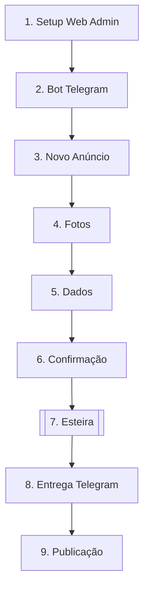

# Documento 001 — Product Vision

**Status:** Aprovado  
**Versão:** 1.0.0  

---

## 1. Resumo Executivo

O **AutoMedia AI** é uma plataforma automatizada de produção de anúncios automotivos concebida como uma **Esteira Autônoma de Mídia** (*Autonomous Media Pipeline*). O sistema transforma fotos brutas do celular e metadados informados pelo vendedor em um pacote padronizado de criativos visuais e descrições comerciais para publicação.

O cliente primário do MVP é a loja independente de seminovos. Essas revendas possuem equipes enxutas e usam canais digitais (WhatsApp, Instagram e Marketplace), mas carecem de equipe interna de design.

O problema central não é a edição fotográfica manual, mas a **disputa pela atenção visual** nos portais. A foto de capa desempenha papel decisivo na atração do comprador.

A entrada operacional do MVP ocorre **exclusivamente via Telegram**, hipótese selecionada para reduzir o atrito de adoção. A empresa configura sua identidade visual uma única vez em um painel web simplificado. O vendedor não interage com editores manuais: envia fotos e dados pelo Telegram e recebe o pacote final em uma meta experimental de tempo (P95 < 90s para lote padrão a definir no spike).

---

## 2. Problema de Mercado

A venda de seminovos no ambiente digital enfrenta entraves visuais e operacionais:

* **Baixa Diferenciação Visual:** Fotos sem tratamento passam despercebidas nos feeds, reduzindo a Taxa de Clique (CTR).
* **Ausência de Identidade:** Vendedores publicam fotos com estilos variados. O estoque da loja é exibido sem padrão institucional.
* **Processo Lento:** O ciclo entre a chegada do carro e a publicação envolve download, edição em apps genéricos, redação manual e redimensionamento.
* **Dependência Externa:** Pequenas lojas não possuem designers dedicados. Agências externas geram custos altos e lentidão.
* **Informações Incorretas:** A redação manual frequentemente introduz erros em especificações, preços ou opcionais.

---

## 3. Evidência Inicial de Validação

O direcionamento do produto baseia-se em sinais preliminares de mercado:

* **Percepção de Valor Visual:** Em demonstração com mídias padronizadas, a reação factual de um lojista ao ver a foto tratada de um veículo do pátio foi perguntar se a imagem fora produzida por uma agência externa, sinalizando percepção de valor.
* **Baixa Qualidade Média:** A análise de anúncios em redes sociais revela prevalência de fotos sem tratamento visual ou identificação institucional.
* **Segmento Denso:** Revendas independentes concentram-se em polos regionais e necessitam de agilidade no giro de estoque.

*Nota:* Sinais qualitativos que constituem hipóteses de trabalho, não comprovação estatística definitiva.

---

## 4. Cliente Inicial

O cliente primário do MVP é a **loja independente de veículos seminovos** (multimarcas de pequeno e médio porte).

### Perfil Organizacional
* **Porte da Loja:** Revendas independentes com pátio físico e rotatividade de estoque *(faixas de veículos e equipe serão validadas com as lojas piloto)*.
* **Estrutura de Design:** Ausente ou restrita.
* **Canais Atuais:** Uso de WhatsApp, Instagram e Facebook Marketplace para comunicação e divulgação.
* **Canal do MVP:** O **Telegram** é adotado como interface operacional do MVP, hipótese a validar.

### Papéis no Domínio
* **Cliente (Empresa):** A pessoa jurídica contratante, detentora da marca.
* **Administrador do Workspace:** O gestor responsável pelo cadastro inicial da identidade visual (logo, cores, marca d'água).
* **Operador / Vendedor:** O vendedor que captura fotos no pátio e interage com o bot do Telegram para gerar anúncios.

*(Nota: A cardinalidade técnica entre Tenant e Workspace permanece flexível no MVP).*

---

## 5. Jobs to Be Done (JTBD)

### Job 1: Publicação Rápida Padronizada
* **Situação:** Quando um veículo chega ao pátio para venda.
* **Motivação:** Quero transformar fotos do celular em anúncios padronizados em poucos minutos.
* **Resultado Esperado:** Pacote de mídias prontas para publicar nos canais digitais sem atraso.
* **Obstáculo Atual:** Falta de habilidade gráfica e lentidão na edição manual.

### Job 2: Identidade de Marca no Catalogo
* **Situação:** Quando clientes navegam pelos anúncios da loja nas redes sociais.
* **Motivação:** Quero que todos os veículos exibam o logotipo e a identidade da empresa.
* **Resultado Esperado:** Reconhecimento imediato da marca pelo comprador.
* **Obstáculo Atual:** Vendedores publicam fotos com estilos desordenados.

### Job 3: Eliminação de Redação Manual Repetitiva
* **Situação:** Quando é necessário elaborar o título e a descrição comercial do anúncio.
* **Motivação:** Quero gerar título e descrição comercial clara informando apenas dados confirmados.
* **Resultado Esperado:** Descrição legível, sem erros e alinhada às informações reais do veículo.
* **Obstáculo Atual:** Perda de tempo digitando descrições no celular.

---

## 6. Proposta de Valor

O AutoMedia AI entrega **Identidade Comercial e Velocidade** para revendas automotivas via esteira invisível de mídia.

### Pilares Fundamentais
* **Envio Simples:** Operação 100% via Telegram no MVP, sem instalação de apps complexos.
* **Produção Automatizada:** Processamento de imagem, arte e texto orientado a meta experimental (P95 < 90s em lote padrão).
* **Consistência Visual:** Aplicação dos elementos de marca da loja (logo, cores, grafismos) por código.
* **Preservação Fiel:** Tratamento de iluminação e enquadramento sem alterar características reais do carro.
* **Material Pronto:** Capa diagramada, fotos secundárias com marca d'água, título e descrição comercial clara.

### Posicionamento Curto
> *"A esteira autônoma que transforma fotos de pátio na Identidade Comercial da sua loja de veículos em segundos."*

---

## 7. Princípios de Produto

1. **No Editor:** Sem canvas ou ferramentas de edição manual drag-and-drop. Automação total.
2. **Single Setup:** A empresa cadastra seus ativos institucionais uma única vez no painel web.
3. **Brand Consistency:** Respeito aos tokens de marca prevalece sobre criações estéticas da IA.
4. **AI Never Invents:** A IA jamais supõe opcionais, versões ou dados não informados. Tolerância zero para dados inventados ou alterações materiais no veículo.
5. **Telegram First:** O Telegram é o canal operacional inicial escolhido para o MVP (hipótese a validar).
6. **Invisible Software:** Processamento em background sem menus complexos.
7. **Human Confirmation for Commercial Data:** Preço, ano e especificações exigem confirmação do operador.
8. **Temporary Storage:** Armazenamento efêmero dos arquivos enviados e gerados.
9. **Local-first for Development:** Validação inicial com simplicidade técnica local.
10. **Provider-Agnostic Architecture:** Motores de visão e IA tratados como dependências periféricas.
11. **MVP Before Platform Expansion:** Foco no nicho automotivo antes de expansões laterais.

---

## 8. Experiência Ideal do Usuário

### Fluxo Principal
1. **Setup Inicial:** O gestor cadastra logo, cores e contatos no painel web.
2. **Envio de Mídias:** O vendedor aciona o bot do Telegram e envia as fotos.
3. **Envio de Dados:** O vendedor informa dados básicos (fabricante, modelo, ano, preço, opcionais).
4. **Confirmação:** O bot exibe o resumo dos dados para validação do vendedor.
5. **Processamento Autônomo:** A esteira ajusta cor/enquadramento, oculta placa, aplica identidade na capa, insere marca d'água e gera título e descrição clara.
6. **Entrega:** O bot devolve imagens tratadas, textos formatados e arquivo ZIP opcional em meta experimental.

### Tratamento de Exceções e Validação Preventiva
* **Fotos Insuficientes:** O bot solicita fotos complementares se a resolução for inadequada.
* **Placa Não Detectada:** Notificação ao operador para validação rápida sem travar o fluxo.
* **Dados Incompletos:** Bloqueio preventivo antes da entrega, exigindo confirmação prévia.
* **Falhas de Qualidade / Alteração de Veículo:** Falhas detectadas antes da entrega bloqueiam o resultado e acionam opção de reprocessamento imediato.

---

## 9. Entrega Exata do MVP

| Etapa | Entrada | Processamento | Saída Mínima | Responsável | Critério de Aceite |
| :--- | :--- | :--- | :--- | :--- | :--- |
| **Setup** | Logo, cores, contatos, regras de placa | Persistência dos Design Tokens | Perfil de marca ativo | Web Admin | Tokens salvos e vinculados ao Telegram |
| **Ingestão** | Fotos brutas + Metadados básicos | Validação de formato e lote | Lote confirmado no fluxo | Telegram Bot | Fotos recebidas e dados confirmados |
| **Tratamento Visual** | Fotos brutas do lote | Ajuste de cor, enquadramento e placa | Fotos polidas com placa coberta | Image/Vision Engine | Placa oculta e veículo preservado sem alterações materiais |
| **Geração de Capa** | Foto principal + Brand Tokens | Diagramação da foto de capa | 1 Foto de Capa em alta qualidade | Layout Engine | Identidade aplicada sem cobrir o carro |
| **Fotos Secundárias**| Fotos do lote tratadas | Inserção de marca d'água | Galeria de fotos padronizadas | Layout Engine | Marca d'água aplicada nos cantos |
| **Copywriting** | Dados confirmados do veículo | Geração de título e descrição clara | Texto formatado com dados confirmados | Marketing Engine | Texto contendo estritamente dados confirmados |
| **Entrega** | Mídias + Textos gerados | Empacotamento dos artefatos | Mensagens organizadas + ZIP | Delivery Engine | Pacote entregue dentro da meta experimental |
| **Limpeza** | Ativos efêmeros em disco | Purga automática após TTL | Espaço em disco liberado | Infrastructure | Exclusão dos arquivos temporários |

---

## 10. Hipóteses de Produto

1. **Valor da Consistência Visual:** Padronização das fotos aumenta a credibilidade nos marketplaces.
   * *Teste:* Comparar anúncios padronizados e brutos em validação com lojistas.
   * *Critério de Aceitação:* > 70% dos lojistas preferem a versão padronizada.
2. **Atrito Mínimo via Telegram:** Telegram reduz a barreira de adoção inicial comparado a painéis web.
   * *Teste:* Medir tempo da primeira postagem via Telegram.
   * *Critério de Aceitação:* Envio de fotos e dados em < 2 minutos no primeiro uso.
3. **Preferência por Automação:** Lojista prefere resultado automático a controle manual de layout.
   * *Teste:* Oferecer fluxo 100% automático no piloto e avaliar pedidos por edição manual.
   * *Critério de Aceitação:* < 15% das interações solicitam ajustes manuais.
4. **Aceitação de Setup Único:** Empresas aceitam definir a identidade visual uma única vez.
   * *Teste:* Acompanhar onboarding de novas lojas no painel web.
   * *Critério de Aceitação:* Setup concluído em < 5 minutos.
5. **Suficiência de Processamento Local:** Processamento local é suficiente para validar os primeiros pilotos.
   * *Teste:* Executar testes usando infraestrutura simplificada de desenvolvimento.
   * *Critério de Aceitação:* SLAs de processamento estáveis no piloto.

---

## 11. Métricas de Validação

* **Lojas Piloto Ativas:** Meta inicial de 5 a 10 revendas automotivas no piloto.
* **Anúncios Processados:** Volume total de veículos processados durante a validação.
* **Taxa de Conclusão de Fluxo:** Sessões no Telegram que resultam na entrega do pacote (meta: > 85%).
* **Tempo Total de Produção (Meta Experimental):** P95 < 90s em lote padrão (a definir no spike; não configurando promessa comercial).
* **Taxa de Reprocessamento:** Solicitações de novo envio por insatisfação com capa ou texto (meta: < 10%).
* **Recorrência Semanal:** Retorno dos vendedores ao bot (meta: uso em ao menos 3 dias por semana).
* **Disposição para Pagar:** Avaliação qualitativa da intenção de assinatura mensal ao final do piloto.

---

## 12. Posicionamento Inicial

### O que o AutoMedia AI NÃO É:
* Não é editor de fotos ou retoque manual (Photoshop ou Canva).
* Não é ferramenta de geração sintética de veículos por IA.
* Não é CRM ou sistema de gestão de estoque.
* Não é agência de marketing tradicional.

### O que o AutoMedia AI É:
* É uma **Esteira Autônoma de Produção de Anúncios Automotivos**.
* É uma solução de **Padronização e Identidade Visual** para revendas.
* É um motor de **Produtividade Comercial** que elimina trabalho braçal do vendedor.

---

## 13. Modelo Comercial Inicial

* **Formato Predominante:** Assinatura mensal (SaaS) por loja/workspace.
* **Estrutura de Planos (Hipótese):** Plano Inicial (franquia mensal para pequenas revendas) e Plano Expansão (franquia ampliada para maior rotatividade).
* **Validação de Preço:** Assinatura percebida como marginal comparada ao custo de um designer ou comissão de um veículo vendido.

*(Nota: Marketplaces de identidades visuais ou cobrança por transação estão fora do escopo do MVP).*

---

## 14. Riscos e Mitigações

| Risco Identificado | Impacto | Mitigação Inicial no MVP |
| :--- | :--- | :--- |
| **Fotos de Baixa Qualidade:** Imagens com resolução muito baixa ou distorções. | Alto | Validação automatizada na entrada com alertas no Telegram solicitando novas fotos. |
| **Alteração Indevida do Veículo:** Filtros alterarem cor real ou lataria do carro. | Crítico | Restrição no pipeline: atuação na iluminação, preservando pixels. Bloqueio pré-entrega em caso de falha. |
| **IA Inventando Dados (Alucinação):** Descrição gerar dados não confirmados. | Crítico | Regra rígida: geração de texto consome exclusivamente metadados confirmados. Bloqueio pré-entrega em caso de inconsistência. |
| **Demora no Processamento:** Renderização ultrapassar a meta experimental. | Médio | Filas de processamento e simplificação dos componentes gráficos da capa no MVP. |
| **Cobertura Incorreta da Placa:** Tarja de placa aplicada fora da posição. | Alto | Detecção focada com opção de confirmação/ajuste simples no fluxo. |
| **Resistência ao Telegram:** Solicitarem uso de outros canais (ex: WhatsApp). | Médio | Comunicação clara no onboarding sobre o Telegram como escolha de atrito reduzido no MVP. |
| **Excesso de Escopo (Feature Creep):** Demandas por editores manuais ou integrações. | Alto | Manutenção firme dos limites do MVP documentados neste Product Vision. |

---

## 15. Critérios de “Go / No-Go”

### Critérios de Sucesso (GO):
1. Pelo menos 70% das lojas piloto utilizam a plataforma continuamente durante os testes.
2. A meta experimental de processamento (P95 < 90s em lote padrão) é mantida no ambiente de teste.
3. Nenhum pacote aprovado é entregue com dados comerciais não confirmados ou alteração material do veículo. Falhas detectadas durante o processamento são bloqueadas, registradas e encaminhadas para reprocessamento.
4. Pelo menos metade das lojas piloto expressa intenção de converter para plano pago ao fim do teste.

### Critérios de Ajuste ou Pausa (NO-GO / PIVOT):
1. Vendedores abandonam o fluxo do Telegram preferindo o processo manual anterior.
2. Alta taxa de reprocessamento (> 25%) por insatisfação constante com as capas.
3. Incapacidade de manter a fidelidade visual real do veículo durante o tratamento.
4. Custo operacional de processamento incompatível com o modelo comercial pretendido.

---

## 16. Próximas Entregas

Após a aprovação deste Documento 001 (Product Vision), as etapas subsequentes focarão no detalhamento executivo enxuto para o MVP:

1. **Requisitos Funcionais Essenciais do MVP:** Mapeamento dos comandos de entrada, campos obrigatórios e regras de validação.
2. **Arquitetura Técnica Mínima:** Definição dos contratos fundamentais das Engines locais.
3. **Spike Técnico Local:** Implementação experimental em ambiente de desenvolvimento para validação da esteira.
4. **Ajustes Baseados no Benchmark:** Refinamento dos componentes de imagem e texto a partir dos resultados do spike.
5. **Backlog da Primeira Implementação:** Divisão das tarefas de código para a versão executável inicial do MVP.

*(Nota: A execução do spike técnico local não exige a conclusão prévia dos documentos 005, 006, 007 e 008).*

---
*Fim do Documento 001 — Product Vision.*
