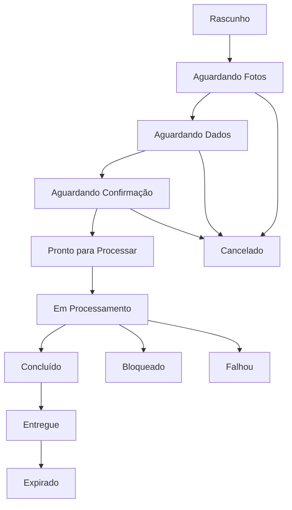

# Documento 004 — Requisitos Funcionais Essenciais do MVP

**Status:** Aprovado  
**Versão:** 1.0.0  

---

## 1. Objetivo do Documento

Este documento estabelece os **Requisitos Funcionais Essenciais** (RFs) e **Requisitos Não Funcionais Primários** (RNFs) do MVP do **AutoMedia AI**, operacionalizando os documentos `000`, `000A`, `000B` e `001`.

Ele atua em três frentes:
1. Orientar a arquitetura técnica mínima e contratos das Engines;
2. Delimitar o escopo do **Spike Técnico Local** (executado via pastas locais, configuração de teste e metadados);
3. Orientar a criação do backlog inicial (`015`).

---

## 2. Escopo Funcional do MVP

O MVP é limitado a uma esteira autônoma de mídia para veículos seminovos:

Configuração Web Admin → Conexão Telegram → Criar Anúncio → Fotos → Dados → Confirmação → Processamento → Materiais → Entrega Telegram → Purga TTL.

---

## 3. Atores do Sistema

* **Administrador do Workspace:** Gestor responsável pelas configurações de marca na Web Admin.
* **Operador (Vendedor):** Profissional de vendas que envia fotos e dados via Telegram.
* **Sistema (AutoMedia AI Core):** Motores lógicos (Engines) que orquestram a esteira autônoma.
* **Telegram (Interface Externa):** Aplicativo de mensageria para entrada e saída no MVP.
* **Serviço / Provider de Processamento:** Interfaces abstratas consumidas pelas Engines.

---

## 4. Estados do Anúncio

A máquina de estados funcional do anúncio compreende 12 estados:

### Detalhamento dos Estados

1. **Rascunho (Draft):** Iniciada via `/novo`. Entrada: `/novo`. Transição: `Aguardando Fotos`.
2. **Aguardando Fotos (WaitingPhotos):** Upload mídias. Entrada: Fotos. Transição: `Aguardando Dados`/`Cancelado`.
3. **Aguardando Dados (WaitingData):** Dados comerciais. Entrada: Texto. Transição: `Aguardando Confirmação`/`Cancelado`.
4. **Aguardando Confirmação (WaitingConfirmation):** Resumo. Entrada: Confirmação. Transição: `Pronto para Processar`/`Aguardando Dados`/`Cancelado`.
5. **Pronto para Processar (ReadyToProcess):** Job enfileirado. Entrada: Confirmação. Transição: `Em Processamento`.
6. **Em Processamento (Processing):** Execução Engines. Entrada: Insumos validados. Transição: `Concluído`/`Bloqueado`/`Falhou`.
7. **Bloqueado (Blocked):** Inconsistência. Entrada: Alerta de qualidade. Transição: `Aguardando Fotos`/`Aguardando Dados`/`Cancelado`.
8. **Concluído (Completed):** Artefatos gerados. Entrada: Mídias/textos prontos. Transição: `Entregue`.
9. **Entregue (Delivered):** Pacote entregue. Entrada: Envio de materiais. Transição: `Expirado`.
10. **Expirado (Expired):** Mídias purgadas. Entrada: Evento de cleanup. Transição: Nenhuma (estado final).
11. **Cancelado (Canceled):** Interrupção por comando. Entrada: `/cancelar`. Transição: Nenhuma (estado final).
12. **Falhou (Failed):** Erro não recuperável. Entrada: Exceção/timeout. Transição: Permite `/reprocessar`.

---

## 5. Requisitos de Configuração da Empresa

### RF-001: Cadastro do Perfil Institucional da Empresa
- **Descrição:** Cadastrar Nome da Empresa, Contato e CTA essenciais para o MVP (Dados fiscais como Razão Social e CNPJ/CPF ficam fora do MVP inicial; Ator: Administrador).
- **Pré-condições/Gatilho:** Autenticação Web Admin / Formulário de perfil.
- **Fluxos:** Principal: 1. Informa Nome, Contato, CTA; 2. Valida formatos; 3. Salva no Workspace. Alternativo: Alerta em tela.
- **I/O/Aceite:** Entrada: Nome, Contato, CTA -> Perfil salvo no workspace exclusivo.
- **Prio/Dep/Escopo:** P1 (MVP Piloto) | Dep: Nenhuma | Fora de Escopo: Dados fiscais (Razão Social, CNPJ/CPF).

### RF-002: Upload e Validação do Logotipo Institucional
- **Descrição:** Upload de logotipo em formatos de imagem compatíveis para os layouts (Ator: Administrador).
- **Pré-condições/Gatilho:** Perfil criado / Upload de imagem.
- **Fluxos:** Principal: 1. Envia logotipo; 2. Valida legibilidade; 3. Salva ativo. Alternativo: Formato/imagem ilegível rejeitado.
- **I/O/Aceite:** Entrada: Imagem (tamanho configurável) -> Logotipo salvo mantendo legibilidade (transparência preferencial, não obrigatória).
- **Prio/Dep/Escopo:** P1 no MVP Piloto (P0 no Spike com logo de teste) | Dep: RF-001 | Fora de Escopo: Vetorização/tratamento avançado.

### RF-003: Configuração de Tokens Visuais e Regras de Marca
- **Descrição:** Definir cores institucionais (#HEX), WhatsApp e CTA (Ator: Administrador).
- **Pré-condições/Gatilho:** Logotipo cadastrado / Formulário de marca.
- **Fluxos:** Principal: 1. Seleciona cores; 2. Informa WhatsApp e CTA; 3. Salva Tokens. Alternativo: Hexadecimal inválido bloqueado.
- **I/O/Aceite:** Entrada: Cores (#HEX), WhatsApp, CTA -> Design Tokens salvos aplicados conforme configurado.
- **Prio/Dep/Escopo:** P1 (MVP Piloto) | Dep: RF-002 | Fora de Escopo: Paletas por IA.

### RF-004: Vinculação e Validação de Conexão com Telegram
- **Descrição:** Conectar conta do workspace ao bot do Telegram (Ator: Administrador).
- **Pré-condições/Gatilho:** Marca configurada / Clique "Conectar Telegram".
- **Fluxos:** Principal: 1. Gera código temporário de verificação; 2. Envia no Telegram; 3. Bot associa Chat ID. Alternativo: Código expirado exige novo.
- **I/O/Aceite:** Entrada: Código temporário de verificação -> Chat ID vinculado. Apenas Chat ID vinculado inicia anúncios.
- **Prio/Dep/Escopo:** P1 (MVP Piloto) | Dep: RF-003 | Fora de Escopo: Múltiplos bots.

---

## 6. Requisitos do Fluxo pelo Telegram

### RF-005: Abertura e Gestão de Sessão de Anúncio
- **Descrição:** Iniciar nova sessão via `/novo` e validar Chat ID (Ator: Operador).
- **Pré-condições/Gatilho:** Chat ID vinculado / Comando `/novo`.
- **Fluxos:** Principal: 1. Envia `/novo`; 2. Bot valida Chat ID; 3. Cria sessão em `Aguardando Fotos`. Alternativo: Chat ID não vinculado alerta.
- **I/O/Aceite:** Entrada: Comando `/novo` -> Sessão criada isolada por UUID.
- **Prio/Dep/Escopo:** P1 (MVP Piloto) | Dep: RF-004 | Fora de Escopo: Sessões simultâneas.

### RF-006: Coleta Interativa de Fotos e Metadados do Veículo
- **Descrição:** Coletar lote de fotos e dados comerciais (marca, modelo, ano, preço) (Ator: Operador).
- **Pré-condições/Gatilho:** Sessão ativa / Envio de mídias ou texto.
- **Fluxos:** Principal: 1. Envia fotos; 2. Bot solicita dados; 3. Envia dados; 4. Salva na sessão. Alternativo: Texto antes solicita fotos.
- **I/O/Aceite:** Entrada: Fotos e texto -> Mídias e dados salvos com transição guiada pelo bot.
- **Prio/Dep/Escopo:** P1 (MVP Piloto) | Dep: RF-005 | Fora de Escopo: Preenchimento por voz.

### RF-007: Exibição de Resumo e Confirmação de Dados
- **Descrição:** Exibir resumo dos dados e exigir confirmação explícita (Ator: Operador).
- **Pré-condições/Gatilho:** Fotos e dados informados / Conclusão da coleta.
- **Fluxos:** Principal: 1. Bot exibe resumo; 2. Clica "Confirmar e Gerar"; 3. Avança para `Pronto para Processar`. Alternativo: Editar dados retorna.
- **I/O/Aceite:** Entrada: Clique em confirmar -> dados confirmados e bloqueados para processamento. Processamento proibido sem confirmação.
- **Prio/Dep/Escopo:** P1 (MVP Piloto) | Dep: RF-006 | Fora de Escopo: Edição de imagem na confirmação.

### RF-008: Cancelamento e Recuperação de Sessão
- **Descrição:** Permitir cancelar a sessão via `/cancelar` ou por inatividade configurável (Ator: Operador).
- **Pré-condições/Gatilho:** Sessão em andamento / `/cancelar` ou inatividade.
- **Fluxos:** Principal: 1. Envia `/cancelar`; 2. Altera para `Cancelado` e exclui arquivos temporários. Alternativo: Inatividade configurável cancela sessão.
- **I/O/Aceite:** Entrada: Comando `/cancelar` -> Purga dos arquivos efêmeros ao cancelar.
- **Prio/Dep/Escopo:** P1 (MVP Piloto) | Dep: RF-005 | Fora de Escopo: Histórico de rascunhos.

---

## 7. Requisitos de Recebimento e Validação de Fotos

### RF-009: Recepção e Validação do Lote de Fotografias
- **Descrição:** Validar formatos (JPEG, PNG, WEBP) e quantidade do lote configurável pendente de benchmark (Ator: Sistema).
- **Pré-condições/Gatilho:** Fotos enviadas / Upload no Telegram ou diretório local.
- **Fluxos:** Principal: 1. Checa extensão e MIME-type; 2. Valida quantidade; 3. Aceita lote. Alternativo: Formato inválido rejeita lote.
- **I/O/Aceite:** Entrada: Imagens brutas -> Lote aceito com rejeição de arquivos incompatíveis.
- **Prio/Dep/Escopo:** P0 (Spike Técnico Local) | Dep: Nenhuma (Local) / RF-006 (Piloto) | Fora de Escopo: Conversão RAW.

### RF-010: Verificação de Integridade e Detecção de Arquivos Inválidos
- **Descrição:** Decodificar imagens para descartar arquivos corrompidos ou abaixo da resolução mínima configurável pendente de benchmark (Ator: Sistema).
- **Pré-condições/Gatilho:** Lote aceito no RF-009 / Análise de integridade.
- **Fluxos:** Principal: 1. Decodifica arquivos; 2. Checa resolução mínima; 3. Verifica hashes; 4. Salva no storage. Alternativo: Reenvio pontual.
- **I/O/Aceite:** Entrada: Lote de mídias -> Fotos íntegras validadas sem avanço de mídias corrompidas.
- **Prio/Dep/Escopo:** P0 (Spike Técnico Local) | Dep: RF-009 | Fora de Escopo: Restauração de desfoque.

---

## 8. Requisitos de Análise Visual

### RF-011: Detecção Semântica de Veículo e Reconhecimento de Placa
- **Descrição:** Identificar Bounding Box do veículo e coordenadas da placa (Ator: Sistema - Vision Engine).
- **Pré-condições/Gatilho:** Fotos íntegras / Enfileiramento na Vision Engine.
- **Fluxos:** Principal: 1. Detecta Bounding Box e visão; 2. Identifica coordenadas da placa; 3. Retorna metadados. Alternativo: Flag de baixa confiança.
- **I/O/Aceite:** Entrada: Imagem processável -> Metadados estruturados sem alterar pixels da foto.
- **Prio/Dep/Escopo:** P0 (Spike Técnico Local) | Dep: RF-010 | Fora de Escopo: Leitura OCR da placa.

### RF-012: Classificação e Recomendação da Foto de Capa
- **Descrição:** Calcular Score de Qualidade Visual e sugerir a melhor foto para capa (Ator: Sistema - Vision Engine).
- **Pré-condições/Gatilho:** Metadados do RF-011 / Varredura visual.
- **Fluxos:** Principal: 1. Avalia enquadramento e iluminação; 2. Atribui Score; 3. Recomenda capa. Alternativo: Primeira foto com aviso.
- **I/O/Aceite:** Entrada: Scores das mídias -> Foto de capa recomendada por critérios objetivos.
- **Prio/Dep/Escopo:** P0 (Spike Técnico Local) | Dep: RF-011 | Fora de Escopo: Escolha manual de capa.

---

## 9. Requisitos de Processamento das Fotos

### RF-013: Tratamento Digital e Ajustes Fotográficos Básicos
- **Descrição:** Aplicar correções de iluminação, enquadramento e cor preservando a fidelidade real (Ator: Sistema - Image Engine).
- **Pré-condições/Gatilho:** Fotos analisadas / Execução da Image Engine.
- **Fluxos:** Principal: 1. Ajusta exposição e cor; 2. Aplica redução de ruído; 3. Realiza crop; 4. Preserva cor da pintura. Alternativo: Reverte ao estado limpo.
- **I/O/Aceite:** Entrada: Imagem bruta + Metadados -> Fotos polidas com tolerância zero para alteração da cor da pintura.
- **Prio/Dep/Escopo:** P0 (Spike Técnico Local) | Dep: RF-011 | Fora de Escopo: Substituição de fundo por IA.

### RF-014: Ocultação da Placa do Veículo
- **Descrição:** Aplicar tarja sólida ou cobertura configurada sobre a placa (Ator: Sistema - Image Engine).
- **Pré-condições/Gatilho:** Coordenadas da placa e Tokens / Censura de placa.
- **Fluxos:** Principal: 1. Recupera Bounding Box; 2. Aplica tarja ou logo; 3. Funde cobertura. Alternativo: Desfoque em baixa confiança.
- **I/O/Aceite:** Entrada: Coordenadas da placa + Tokens -> Placa oculta com cobertura restrita à área da placa.
- **Prio/Dep/Escopo:** P0 (Spike Técnico Local) | Dep: RF-011 (Local) / RF-003 (Piloto) | Fora de Escopo: Ajuste manual de posição.

### RF-015: Aplicação de Marca d'Água Institucional
- **Descrição:** Aplicar marca d'água institucional discreta nas fotos secundárias (Ator: Sistema - Layout Engine). Aceita logotipo local no Spike.
- **Pré-condições/Gatilho:** Logotipo/Marca configurada / Tratamento das fotos.
- **Fluxos:** Principal: 1. Recupera logo/marca; 2. Aplica no canto; 3. Valida sobreposição. Alternativo: Reposiciona para canto oposto.
- **I/O/Aceite:** Entrada: Foto tratada + Logo/Marca -> Foto com marca d'água legível sem cobrir o veículo.
- **Prio/Dep/Escopo:** P0 (Spike Técnico Local) | Dep: RF-013 (Local) / RF-003 (Piloto) | Fora de Escopo: Marca d'água em vídeos.

---

## 10. Requisitos da Capa Principal

### RF-016: Diagramação Autônoma da Foto de Capa Institucional
- **Descrição:** Combinar foto principal, Design Tokens e dados confirmados no `RenderRequestDTO` (Ator: Sistema - Layout Engine). Aceita logo, cores e dados locais no Spike.
- **Pré-condições/Gatilho:** `RenderRequestDTO` montado / Chamada da Layout Engine.
- **Fluxos:** Principal: 1. Recebe DTO; 2. Renderiza moldura; 3. Aplica logo, marca d'água e tipografia; 4. Exporta Capa. Alternativo: Variação geométrica segura.
- **I/O/Aceite:** Entrada: `RenderRequestDTO` fechado -> Capa profissional com dados 100% confirmados sem alterar pixels do carro.
- **Prio/Dep/Escopo:** P0 (Spike Técnico Local) | Dep: RF-012, RF-013 (Local) / RF-003, RF-007 (Piloto) | Fora de Escopo: Escolha manual de templates.

---

## 11. Requisitos das Fotos Secundárias

### RF-017: Padronização da Galeria de Fotos Secundárias
- **Descrição:** Processar, aplicar marca d'água e redimensionar fotografias secundárias (Ator: Sistema - Layout Engine).
- **Pré-condições/Gatilho:** Fotos secundárias tratadas / Término da capa.
- **Fluxos:** Principal: 1. Aplica marca d'água (RF-015); 2. Redimensiona para feed; 3. Ordena galeria; 4. Exporta mídias. Alternativo: Mídias irrecuperáveis isoladas.
- **I/O/Aceite:** Entrada: Fotos tratadas -> Galeria padronizada com mesma dimensão, placa coberta e marca d'água.
- **Prio/Dep/Escopo:** P0 (Spike Técnico Local) | Dep: RF-014, RF-015 | Fora de Escopo: Capas secundárias.

---

## 12. Requisitos de Geração de Texto

### RF-018: Geração de Título e Descrição Comercial Clara
- **Descrição:** Gerar título objetivo e descrição comercial legível com dados confirmados (Ator: Sistema - Marketing Engine). Aceita metadados locais no Spike.
- **Pré-condições/Gatilho:** Metadados validados / Execução da Marketing Engine.
- **Fluxos:** Principal: 1. Recebe dados confirmados; 2. Formata Título; 3. Estrutura Descrição por seções; 4. Bloqueia dados não informados. Alternativo: Omite seções ausentes.
- **I/O/Aceite:** Entrada: DTO de dados confirmados -> Texto de anúncio 100% verdadeiro com tolerância zero para alucinações.
- **Prio/Dep/Escopo:** P0 (Spike Técnico Local) | Dep: Nenhuma (Local) / RF-007 (Piloto) | Fora de Escopo: Promessas falsas de vendas.

---

## 13. Requisitos de Exportação

### RF-019: Empacotamento dos Artefatos Visuais e Textuais
- **Descrição:** Consolidar capa, galeria, texto e manifesto em arquivo ZIP ou diretório de saída (Ator: Sistema - Delivery Engine).
- **Pré-condições/Gatilho:** Artefatos prontos / Fim da geração.
- **Fluxos:** Principal: 1. Coleta artefatos; 2. Organiza nomenclatura; 3. Cria `manifest.json`; 4. Gera `.zip`/saída local. Alternativo: Capa falhada interrompe.
- **I/O/Aceite:** Entrada: Arquivos visuais e textuais -> Pacote gerado na pasta de saída local exigindo presença da capa.
- **Prio/Dep/Escopo:** P0 (Spike Técnico Local) | Dep: RF-016, RF-017, RF-018 | Fora de Escopo: Exportação FTP.

---

## 14. Requisitos de Entrega pelo Telegram

### RF-020: Notificação de Status e Entrega do Pacote no Telegram
- **Descrição:** Notificar conclusão e entregar mídias, texto copiável e arquivo ZIP no Telegram (Ator: Sistema - Delivery Engine / Bot).
- **Pré-condições/Gatilho:** Pacote ZIP e mídias prontas / Fim do empacotamento.
- **Fluxos:** Principal: 1. Notifica conclusão; 2. Envia mídias; 3. Envia texto copiável; 4. Envia `.zip`; 5. Estado para `Entregue`. Alternativo: Fotos avulsas se ZIP pesado.
- **I/O/Aceite:** Entrada: Artefatos + Chat ID -> Materiais entregues restritos ao Chat ID autenticado da sessão.
- **Prio/Dep/Escopo:** P1 (MVP Piloto) | Dep: RF-019, RF-005 | Fora de Escopo: Redes sociais.

---

## 15. Requisitos de Armazenamento Temporário

### RF-021: Expiração e Exclusão de Arquivos Efêmeros (TTL)
- **Descrição:** Purga automática de fotos originais, intermediárias e ZIPs após o TTL (Ator: Sistema - Cleanup Service).
- **Pré-condições/Gatilho:** Job em `Entregue`, `Cancelado` ou `Expirado` / Cron ou temporizador de TTL.
- **Fluxos:** Principal: 1. Identifica pastas expiradas; 2. Apaga arquivos físicos; 3. Retém apenas logs com UUID. Alternativo: Log WARN se falhar.
- **I/O/Aceite:** Entrada: Pastas + Timestamp TTL -> Purga completa sob o dogma *Customer Owns Data*.
- **Prio/Dep/Escopo:** P1 (MVP Piloto) | Dep: RF-019, RF-020 | Fora de Escopo: Armazenamento permanente.

---

## 16. Requisitos de Erros e Reprocessamento

### RF-022: Tratamento de Exceções e Reprocessamento de Anúncio
- **Descrição:** Tratar falhas com avisos e permitir reprocessar via botão ou comando com limite configurável de tentativas em caso de erro (Ator: Operador / Sistema).
- **Pré-condições/Gatilho:** Exceção ou `/reprocessar` / Falha no pipeline ou acionamento pelo operador.
- **Fluxos:** Principal: 1. Interrompe a esteira; 2. Envia aviso; 3. Exibe botão "Reprocessar"; 4. Re-executa com mesmo lote e dados. Alternativo: Excesso de falhas altera para `Falhou`.
- **I/O/Aceite:** Entrada: Comando ou exceção -> Resiliência com idempotência funcional na re-execução.
- **Prio/Dep/Escopo:** P1 (MVP Piloto) | Dep: RF-007, RF-020 | Fora de Escopo: Suporte humano.

---

## 17. Requisitos do Painel Administrativo Mínimo

### RF-023: Autenticação e Gestão Simplificada do Workspace
- **Descrição:** Interface Web Admin simples para login do gestor e configurações (Ator: Administrador).
- **Pré-condições/Gatilho:** Navegador web / Acesso ao painel.
- **Fluxos:** Principal: 1. Efetua login; 2. Exibe tela única de configurações; 3. Atualiza perfil, logo, cores, contatos e Telegram; 4. Salva dados. Alternativo: Login inválido bloqueia.
- **I/O/Aceite:** Entrada: Credenciais + Formulário -> Painel de tela única funcional e responsivo.
- **Prio/Dep/Escopo:** P1 (MVP Piloto) | Dep: RF-001, RF-002, RF-003, RF-004 | Fora de Escopo: Dashboards analíticos.

---

## 18. Requisitos Não Funcionais Essenciais

### RNF-001: Isolamento Multitenancy de Dados e Sessões
* **Categoria:** Segurança e Arquitetura | **Prioridade:** P1 (MVP Piloto)
* **Descrição:** Garantir isolamento de mídias e sessões por Workspace ID.
* **Critério de Aceite:** Requisições vinculadas ao Workspace ID; acesso não autorizado gera exceção.

### RNF-002: Armazenamento Efêmero com TTL Automático
* **Categoria:** Privacidade e Infraestrutura | **Prioridade:** P1 (MVP Piloto)
* **Descrição:** Purgar fotos e pacotes do storage efêmero após o TTL.
* **Critério de Aceite:** Ausência de mídias de clientes no storage após execução da purga de TTL.

### RNF-003: Rastreabilidade por Correlation ID e Logs Estruturados
* **Categoria:** Observabilidade | **Prioridade:** P1 (MVP Piloto)
* **Descrição:** Injetar Correlation ID em todas as etapas e registrar logs em JSON. No Spike Técnico, manter logs simples (início, fim, duração, erro e ID local do job).
* **Critério de Aceite:** Rastreabilidade via Correlation ID no MVP Piloto e logs simples no Spike.

### RNF-004: Idempotência Funcional e Tolerância a Falhas
* **Categoria:** Resiliência | **Prioridade:** P1 (MVP Piloto)
* **Descrição:** Garantir equivalência funcional na re-execução de jobs no MVP Piloto sem exigir idempotência distribuída no spike.
* **Critério de Aceite:** Reprocessar job mantém integridade funcional no MVP Piloto sem exigir idempotência no spike.

### RNF-005: Arquitetura Agnóstica de Provedores de IA/Visão
* **Categoria:** Arquitetura | **Prioridade:** P0 (Spike Técnico)
* **Descrição:** Integrar motores de visão e IA via Ports & Adapters.
* **Critério de Aceite:** Substituição de provedor por adapter local sem alterar a lógica de negócio central.

### RNF-006: Execução e Compatibilidade em Ambiente Local (Local-First)
* **Categoria:** Portabilidade | **Prioridade:** P0 (Spike Técnico)
* **Descrição:** Execução integral da esteira do spike em ambiente local.
* **Critério de Aceite:** Execução com sucesso do fluxo de ponta a ponta em máquina dev local via diretório local de entrada, arquivo simples de configuração da marca, metadados de teste e diretório local de saída.

### RNF-007: Desempenho Mensurável Orientado a Meta Experimental
* **Categoria:** Performance | **Prioridade:** P1 (Medição experimental no Spike Técnico)
* **Descrição:** Meta experimental de benchmark: P95 inferior a 90 segundos para lote padrão ainda a definir.
* **Critério de Aceite:** Registro de tempo em logs estruturados para medição experimental do benchmark.

### RNF-008: Preservação da Integridade Visual Real do Veículo
* **Categoria:** Confiabilidade | **Prioridade:** P0 (Spike Técnico)
* **Descrição:** Proibir alteração da cor, lataria, rodas ou geometria real do veículo.
* **Critério de Aceite:** Nenhuma alteração material do veículo identificada na amostra de validação humana do spike.

---

## 19. Critérios de Aceite do Spike Técnico

O **Spike Técnico Local** visa comprovar a viabilidade técnica da esteira em ambiente local de desenvolvimento via diretório de entrada local, arquivo simples de configuração da marca, metadados de teste e diretório local de saída, devendo atender aos 12 critérios objetivos:

1. **Recepção de Lote Local:** Receber lote local de fotos brutas a partir de diretório de entrada local.
2. **Validação de Imagens:** Validar integridade e formato dos arquivos de imagem sem falhas de decodificação.
3. **Seleção da Capa:** Detectar e recomendar automaticamente a foto para a capa principal (RF-012).
4. **Ocultação de Placa:** Detectar e cobrir ao menos uma placa veicular visível no lote (RF-011, RF-014).
5. **Correção Fotográfica Básica:** Aplicar correções de iluminação, enquadramento e cor preservando a pintura real (RF-013).
6. **Injeção de Brand Tokens:** Aplicar logotipo de teste e marca d'água a partir de arquivo de configuração local (RF-002, RF-015).
7. **Diagramação da Capa:** Gerar imagem de capa diagramada com a Identidade Comercial da marca (RF-016).
8. **Exportação de Formatos:** Exportar a capa e fotos secundárias padronizadas no diretório local de saída (RF-017).
9. **Geração de Texto Comercial:** Gerar título e descrição comercial clara a partir de metadados de teste (RF-018).
10. **Empacotamento Local:** Consolidar artefatos gerados no diretório local de saída e gerar arquivo `.zip`/manifesto (RF-019).
11. **Telemetria Experimental:** Registrar em log simples tempo de execução para medição experimental do benchmark (RNF-007).
12. **Validação de Integridade Real:** Confirmar via amostragem humana que nenhuma alteração material do veículo foi identificada (RNF-008).

---

## 20. Matriz de Prioridade e Rastreabilidade

| ID | Nome Requisito / Doc 001 | Prioridade | Fase Alvo | Aceite Principal |
| :--- | :--- | :--- | :--- | :--- |
| **RF-001** | Perfil Institucional (Sec 4) | **P1** | MVP Piloto | Perfil salvo |
| **RF-002** | Upload Logotipo (Sec 6) | **P1 (P0 Spike)** | Spike / MVP | Logo de teste |
| **RF-003** | Tokens Visuais (Sec 7) | **P1** | MVP Piloto | Tokens salvos |
| **RF-004** | Vinculação Telegram (Sec 8) | **P1** | MVP Piloto | Chat ID vinculado |
| **RF-005** | Abertura Sessão (Sec 8) | **P1** | MVP Piloto | Sessão com UUID |
| **RF-006** | Coleta Fotos/Dados (Sec 9) | **P1** | MVP Piloto | Coleta no chat |
| **RF-007** | Resumo e Confirmação (Sec 7) | **P1** | MVP Piloto | Dados confirmados |
| **RF-008** | Cancelamento Sessão (Sec 8) | **P1** | MVP Piloto | Purga temporários |
| **RF-009** | Recepção Lote Fotos (Sec 9) | **P0** | Spike Técnico | Lote aceito |
| **RF-010** | Verificação Integridade (Sec 14)| **P0** | Spike Técnico | Imagens íntegras |
| **RF-011** | Detecção Semântica/Placa (Sec 9)| **P0** | Spike Técnico | Bounding box gerada |
| **RF-012** | Recomendação Capa (Sec 9) | **P0** | Spike Técnico | Capa por score |
| **RF-013** | Tratamento Digital (Sec 6) | **P0** | Spike Técnico | Cor real mantida |
| **RF-014** | Ocultação Placa (Sec 9) | **P0** | Spike Técnico | Placa oculta |
| **RF-015** | Marca d'Água (Sec 9) | **P0** | Spike Técnico | Marca d'água aplicada |
| **RF-016** | Diagramação Capa (Sec 6) | **P0** | Spike Técnico | Capa diagramada |
| **RF-017** | Padronização Galeria (Sec 9) | **P0** | Spike Técnico | Galeria padronizada |
| **RF-018** | Geração Texto (Sec 6) | **P0** | Spike Técnico | Texto sem alucinação |
| **RF-019** | Empacotamento ZIP (Sec 9) | **P0** | Spike Técnico | Empacotamento local |
| **RF-020** | Entrega Telegram (Sec 8) | **P1** | MVP Piloto | Entrega Telegram |
| **RF-021** | Expiração e Exclusão TTL (Sec 7)| **P1** | MVP Piloto | Purga TTL |
| **RF-022** | Reprocessamento Job (Sec 8) | **P1** | MVP Piloto | Reprocessamento com limite |
| **RF-023** | Gestão Workspace Web (Sec 7) | **P1** | MVP Piloto | Painel Web Admin |
| **RNF-001**| Isolamento Multitenancy | **P1** | MVP Piloto | Isolamento por Workspace |
| **RNF-002**| Armazenamento Efêmero TTL | **P1** | MVP Piloto | Purga após TTL |
| **RNF-003**| Rastreabilidade Correlation ID | **P1** | MVP Piloto | Logs por UUID |
| **RNF-004**| Idempotência e Resiliência | **P1** | MVP Piloto | Integridade de estado |
| **RNF-005**| Arquitetura Agnóstica IA/Visão | **P0** | Spike Técnico | Ports & Adapters |
| **RNF-006**| Compatibilidade Local-First | **P0** | Spike Técnico | Execução local |
| **RNF-007**| Meta Experimental Benchmark | **P1 (Medição)** | Spike / MVP | Medição de tempo |
| **RNF-008**| Preservação Integridade Real | **P0** | Spike Técnico | Validação visual |

---

## 21. Pendências para Benchmark

Parâmetros quantitativos a serem definidos empiricamente no **Spike Técnico Local**:

1. **Quantidade Padrão do Lote de Fotos:** Mínimo e máximo de fotos por anúncio (configurável).
2. **Tamanho Máximo do Lote em MB:** Limite de upload suportado (configurável).
3. **Resolução Mínima Aceitável:** Resolução em pixels abaixo da qual a foto é recusada (configurável).
4. **Formatos de Saída Secundários:** Inclusão do formato vertical (9:16).
5. **Tempo Alvo Real por Etapa:** Tempo da meta experimental (P95 < 90s).
6. **TTL de Retenção Efêmera:** Prazo em horas para purga automática de mídias (configurável).
7. **Limite de Concorrência de Jobs:** Anúncios simultâneos em ambiente local.
8. **Threshold de Qualidade da Capa:** Score mínimo para recomendação da capa.
9. **Tolerância e Limite de Tentativas:** Retentativas em falhas.
10. **Custo Estimado por Anúncio:** Custo computacional para o modelo comercial.

---
*Fim do Documento 004 — Requisitos Funcionais Essenciais do MVP.*
