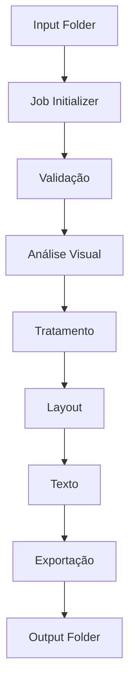

# Documento 007 — Arquitetura Técnica Mínima do Spike Local

**Status:** Aprovado  
**Versão:** 1.0.0  

---

## 1. Objetivo

Este documento especifica a **Arquitetura Técnica Mínima do Spike Local** do **AutoMedia AI**, operacionalizando os requisitos do **Spike Técnico Local (P0)** estabelecidos no Documento `004`. Ele fornece o blueprint arquitetural necessário para validar a viabilidade técnica da esteira autônoma de mídia veicular em ambiente local de desenvolvimento.

Esta arquitetura **não representa a arquitetura de produção** da plataforma. Não aborda escalabilidade distribuída, multitenancy cloud, bancos de dados ou mensageria externa. Seu propósito único é viabilizar o primeiro experimento prático local e controlado, servindo como ambiente de medição de desempenho e prova de conceito dos motores lógicos do sistema.

---

## 2. Visão Geral

O Spike Técnico Local opera como uma esteira de lote em ambiente isolado local-first. O fluxo de execução é sequencial e orientado a arquivos locais, sem dependências de rede externa ou serviços distribuídos. Cada módulo comunica-se apenas pela sua entrada e saída lógica, sem acessar diretamente responsabilidades de módulos vizinhos, evitando acoplamento precoce.

O processamento inicia com a disponibilização de fotos brutas no diretório de entrada local, prossegue pela criação e execução de um job através dos módulos do pipeline, e encerra com a gravação dos materiais finais no diretório de saída local.



---

## 3. Pipeline

O pipeline local possui 8 módulos especializados. Cada módulo atua de forma desacoplada, recebendo entradas estruturadas e gerando saídas para a etapa seguinte.

### 3.1. Input Loader
- **Responsabilidade:** Varrer a pasta de entrada local, identificar as fotos brutas e instanciar o contexto local do job.
- **Entrada:** Caminho do diretório local de entrada contendo as imagens brutas.
- **Saída:** Contexto do job com lista de caminhos locais e identificador de execução (UUID).
- **Falha Possível:** Diretório de entrada inacessível, vazio ou sem permissão de leitura.

### 3.2. Validator
- **Responsabilidade:** Verificar a integridade dos arquivos de imagem, checando extensões e decodificação básica, descartando mídias corrompidas ou com resolução abaixo do mínimo.
- **Entrada:** Contexto do job com caminhos dos arquivos brutos.
- **Saída:** Lista de mídias íntegras validadas no contexto do job.
- **Falha Possível:** Lote contendo apenas arquivos corrompidos ou em formatos inválidos.

### 3.3. Vision
- **Responsabilidade:** Analisar semanticamente o lote validado para identificar a Bounding Box do veículo, localizar coordenadas da placa e calcular o Score de Qualidade Visual para recomendação da foto de capa.
- **Entrada:** Arquivos de imagem validados e descompactados em memória/disco efêmero.
- **Saída:** Metadados visuais estruturados com delimitadores do veículo, Bounding Boxes das placas e scores das fotos.
- **Falha Possível:** Erro na identificação do veículo ou falha no motor visual abstrato.

### 3.4. Image Processor
- **Responsabilidade:** Aplicar correções fotográficas básicas de iluminação, enquadramento e contraste (preservando a cor real do veículo) e cobrir as coordenadas da placa.
- **Entrada:** Imagens validadas e metadados visuais do módulo Vision.
- **Saída:** Fotos tratadas com ajustes aplicados e área da placa coberta.
- **Falha Possível:** Falha na manipulação gráfica ou distorção da imagem original.

### 3.5. Brand Composer
- **Responsabilidade:** Diagramar a foto de capa selecionada fundindo a Identidade Comercial da marca (logotipo de teste e Design Tokens) e aplicar marca d'água discreta nas fotos secundárias.
- **Entrada:** Foto de capa recomendada, fotos secundárias tratadas e arquivo local `brand.json`.
- **Saída:** Capa principal diagramada e galeria de fotos secundárias com marca d'água.
- **Falha Possível:** Arquivo de marca ausente, logotipo ilegível ou erro de sobreposição geométrica.

### 3.6. Text Generator
- **Responsabilidade:** Formatar o título comercial e a descrição detalhada do veículo com base nos metadados comerciais fornecidos localmente.
- **Entrada:** Arquivo local de metadados do veículo (`vehicle.json`).
- **Saída:** Título formatado e corpo da descrição comercial em texto simples.
- **Falha Possível:** Ausência de campos obrigatórios no arquivo de metadados.

### 3.7. Exporter
- **Responsabilidade:** Consolidar os artefatos visuais e textuais, organizando a estrutura de arquivos na pasta de saída local e gerando o manifesto (`manifest.json`) e pacote ZIP.
- **Entrada:** Capa diagramada, galeria tratada, texto comercial e metadados de execução.
- **Saída:** Pasta de saída local populada com mídias, texto, manifesto e pacote ZIP.
- **Falha Possível:** Erro de escrita em disco ou ausência da capa obrigatória.

### 3.8. Benchmark
- **Responsabilidade:** Coletar métricas de telemetria da execução local, registrando tempos e consumo de recursos em log estruturado.
- **Entrada:** Eventos de início/fim de cada módulo e telemetria do sistema local.
- **Saída:** Relatório de benchmark em arquivo JSON no diretório de logs/benchmark.
- **Falha Possível:** Erro na leitura de recursos do sistema ou na gravação do relatório.

---

## 4. Estrutura de Pastas

A estrutura de diretórios do Spike Técnico Local mantém isolamento entre insumos, configurações, temporários e resultados finais, sem acoplamento a linguagens ou frameworks específicos.

```text
automedia-spike-local/
├── input/
├── output/
├── config/
├── logs/
├── temp/
├── benchmark/
└── samples/
```

### Detalhamento das Pastas

- `input/`: Armazena o lote de fotografias brutas do veículo a ser processado.
- `output/`: Armazena o pacote final consolidado (capa, galeria, texto comercial, manifesto e ZIP).
- `config/`: Armazena arquivos JSON de configuração da marca, do veículo e do pipeline.
- `logs/`: Contém arquivos de log estruturados e registros simples da execução local.
- `temp/`: Espaço efêmero para processamento intermediário (purgado ao final do job).
- `benchmark/`: Registra relatórios de desempenho, tempos por etapa e consumo de recursos.
- `samples/`: Contém amostras de teste pré-configuradas para validação rápida do ambiente.

---

## 5. Arquivos de Configuração

O funcionamento do Spike Técnico Local é controlado por três arquivos de configuração declarativos em formato JSON na pasta `config/`:

### 5.1. `brand.json`
Define os parâmetros de marca da empresa de teste para injeção visual.
- **Finalidade:** Fornecer caminho do logotipo de teste, cores institucionais (#HEX), WhatsApp e CTA para diagramação da capa e marca d'água.

### 5.2. `vehicle.json`
Armazena os metadados comerciais do veículo do teste local.
- **Finalidade:** Fornecer dados do veículo (marca, modelo, ano, preço, opcionais) para alimentar a geração de texto e injeção de dados na capa.

### 5.3. `pipeline.json`
Define os parâmetros operacionais e limites de execução do pipeline local.
- **Finalidade:** Configurar limites quantitativos do lote (quantidade de fotos, MB máximo, resolução mínima), opções gráficas (estilo de tarja, marca d'água) e flags de telemetria.

---

## 6. Pipeline de Processamento

O ciclo de vida de uma execução no Spike Técnico Local ocorre em 7 passos sequenciais:

1. **Inicialização do Job:** O comando é acionado apontando para pastas locais. O `Input Loader` lê `input/`, carrega `config/` e cria uma sessão local com ID de job (UUID).
2. **Validação de Insumos:** O `Validator` inspeciona as imagens em `input/`. Arquivos ilegíveis, corrompidos ou fora dos limites de `pipeline.json` são descartados.
3. **Análise Semântica Visual:** O módulo `Vision` mapeia Bounding Boxes do veículo e placas, calcula scores visuais e recomenda a melhor foto para a capa.
4. **Tratamento de Imagem e Censura:** O `Image Processor` aplica correções de contraste e nitidez (mantendo a cor real da pintura) e cobre as coordenadas da placa.
5. **Composição da Marca e Layout:** O `Brand Composer` consome `brand.json`, aplica logo e moldura na capa principal e insere marca d'água nas fotos secundárias.
6. **Geração do Texto Comercial:** O `Text Generator` lê `vehicle.json` e gera o título e a descrição comercial formatada do anúncio.
7. **Empacotamento e Telemetria:** O `Exporter` grava em `output/` a capa, galeria, texto, `manifest.json` e pacote ZIP. O `Benchmark` grava o relatório em `benchmark/`.

---

## 7. Providers

A arquitetura do Spike Técnico Local adota o padrão **Ports & Adapters (Arquitetura Hexagonal)** conforme o Documento `000A`. Todos os serviços são consumidos por interfaces abstratas (Ports), permitindo substituição de provedores (Adapters) sem alterar regras de negócio.

| Porta (Interface Abstrata) | Papel no Pipeline | Implementação Local no Spike | Provedores Futuros Elegíveis |
| :--- | :--- | :--- | :--- |
| **Vision Provider** | Detecção de placa, Bounding Box e score de capa | Adapter Local / Algoritmo Simples | Provedores Cloud de Visão Computacional |
| **Image Provider** | Crop, ajuste de iluminação e fusão de coberturas | Adapter Local de Manipulação Gráfica | Serviços/Bibliotecas de Processamento Gráfico |
| **LLM / Text Provider** | Formatação e estruturação do texto comercial | Adapter Local de Template / Regras | Modelos de Linguagem Generativa (LLM) |
| **Storage Provider** | Leitura e escrita de arquivos de mídia e pacotes | Adapter de Sistema de Arquivos Local | Object Storage em Nuvem / S3 |

O Spike usa implementações locais (adapters locais em disco), garantindo execução desconectada e sem custos operacionais externos.

---

## 8. Benchmark

O Spike Técnico Local estabelece as métricas base de desempenho para subsidiar as metas operacionais do produto (RNF-007). Cada execução registra os seguintes indicadores no relatório de benchmark:

1. **Tempo Total de Processamento:** Duração em milissegundos da execução completa do job.
2. **Tempo por Etapa:** Latência individual dos 8 módulos do pipeline.
3. **Tempo Médio por Imagem:** Latência média por foto processada, permitindo avaliar se a curva de processamento é linear conforme a escala do lote (5, 10, 20 ou 30 fotos).
4. **Consumo de CPU:** Percentual de uso de processador durante a execução.
5. **Consumo de RAM:** Pico de memória RAM em megabytes (MB).
6. **Volume do Lote:** Número de fotos processadas no lote.
7. **Tamanho Final dos Artefatos:** Peso total em MB dos arquivos gerados em `output/` e do ZIP final.
8. **Taxa de Falhas:** Alertas, rejeições de imagens ou exceções capturadas.

---

## 9. Artefatos

Uma execução bem-sucedida gera no diretório `output/` os seguintes artefatos padronizados:

1. **Foto de Capa Diagramada (`cover_main.jpg`):** Imagem selecionada por score visual, tratada, com placa coberta e moldura/logotipo de `brand.json`.
2. **Galeria de Fotos Secundárias (`gallery_01.jpg`, `gallery_02.jpg`, ...):** Fotografias do lote tratadas, com placa coberta e marca d'água aplicada.
3. **Texto do Anúncio (`ad_text.txt`):** Arquivo de texto com título e descrição comercial gerados a partir de `vehicle.json`.
4. **Manifesto do Pacote (`manifest.json`):** Arquivo simples de metadados do job (não atua como banco de dados, registrando apenas parâmetros de entrada, arquivos de saída, tempo total, falhas, provedores utilizados e versão do pipeline).
5. **Pacote Compactado (`vehicle_media_package.zip`):** Arquivo ZIP com a capa, galeria, texto e manifesto.
6. **Logs de Execução (`logs/execution_[UUID].log`):** Registro simples contendo início, fim, duração e avisos do job.
7. **Relatório de Benchmark (`benchmark/metric_[UUID].json`):** Mapeamento do desempenho computacional, tempo médio por imagem e latência da execução.

---

## 10. Fora do Spike

Estão expressamente fora do escopo do Spike Técnico Local:

- **Interface de Mensageria:** Integração com bots ou APIs do Telegram;
- **Persistência de Dados:** Bancos de dados relacionais ou NoSQL;
- **Serviços de Nuvem:** Cloud Providers, Serverless e Object Storage remoto;
- **Fila e Mensageria Distribuída:** Message Brokers, Filas AMQP ou Pub/Sub;
- **Painel Administrativo:** Web Admin, dashboards ou gestão de usuários;
- **Autenticação e Autorização:** OAuth, JWT ou gestão de credenciais;
- **Arquitetura Multitenant:** Isolamento lógico ou físico por múltiplos clientes em nuvem;
- **Orquestração e Deploy:** Containers, Kubernetes, CI/CD e ambientes de staging.

---
*Fim do Documento 007 — Arquitetura Técnica Mínima do Spike Local.*
